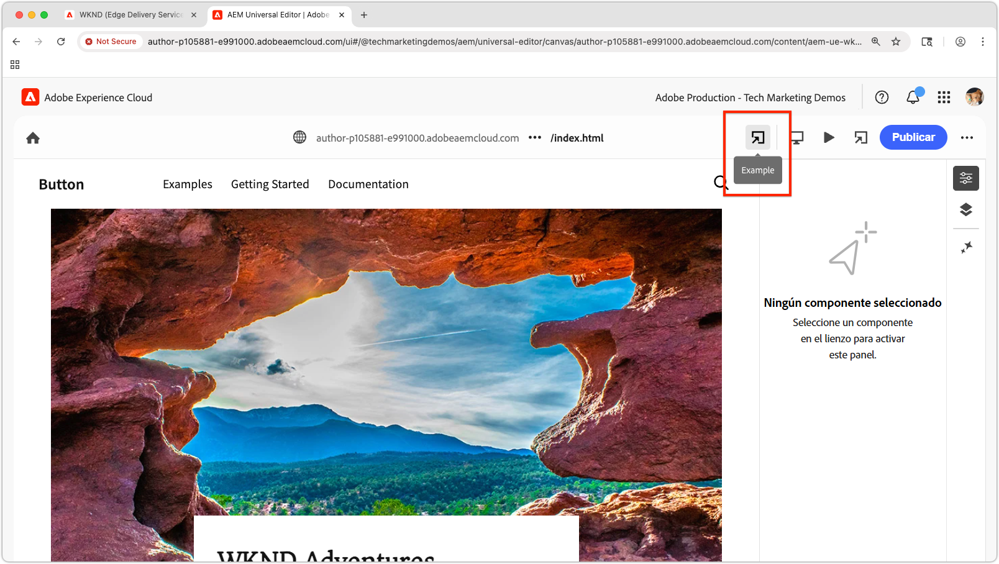

# Previsualización de una extensión local de Universal Editor

>[!TIP]
> Aprenda a [crear una extensión de editor universal](https://developer.adobe.com/uix/docs/services/aem-universal-editor/).

Para obtener una vista previa de una extensión de editor universal durante el desarrollo, debe:

1. Ejecute la extensión localmente.
2. Acepte el certificado autofirmado.
3. Abra una página en el Editor universal.
4. Actualice la dirección URL de ubicación para cargar la extensión local.

## Ejecutar la extensión localmente

Se supone que ya ha creado una [extensión de editor universal](https://developer.adobe.com/uix/docs/services/aem-universal-editor/) y que desea previsualizarla mientras realiza pruebas y desarrolla tareas de desarrollo a nivel local.

Inicie la extensión de Universal Editor con:

```bash
$ aio app run
```

Verá resultados como los siguientes:

```
To view your local application:
  -> https://localhost:9080
To view your deployed application in the Experience Cloud shell:
  -> https://experience.adobe.com/?devMode=true#/custom-apps/?localDevUrl=https://localhost:9080
```

Esto ejecuta su extensión en `https://localhost:9080` de manera predeterminada.


## Aceptar el certificado firmado automáticamente

El editor universal requiere HTTPS para cargar extensiones. Dado que el desarrollo local utiliza un certificado autofirmado, el explorador debe confiar explícitamente en él.

Abra una nueva pestaña del explorador y vaya al resultado de la URL de la extensión local mediante el comando `aio app run`:

```
https://localhost:9080
```

El explorador mostrará una advertencia de certificado. Acepte el certificado para continuar.


Una vez aceptado, verá la página del marcador de posición de la extensión local:


## Abrir una página en el editor universal

Abra el Editor universal a través de la [consola del Editor universal](https://experience.adobe.com/#/@myOrg/aem/editor/canvas/) o editando una página en AEM Sites que use el Editor universal:


## Carga de la extensión

En el Editor universal, ubique el campo **Ubicación** en la parte superior central de la interfaz. Expanda la dirección URL **en el campo Ubicación**, **no en la barra de direcciones del explorador**.

Anexe los siguientes parámetros de consulta:

* `devMode=true`: habilita el modo de desarrollo para el editor universal.
* `ext=https://localhost:9080`: carga la extensión que se está ejecutando localmente.

Ejemplo:

```
https://author-pXXX-eXXX.adobeaemcloud.com/content/aem-ue-wknd/index.html?devMode=true&ext=https://localhost:9080
```


## Previsualización de la extensión

Realice una **recarga brusca** del explorador para asegurarse de que se utiliza la dirección URL actualizada.

El editor universal ahora cargará la extensión local, solo en la sesión del explorador.

Cualquier cambio de código que realice localmente se reflejará inmediatamente.



