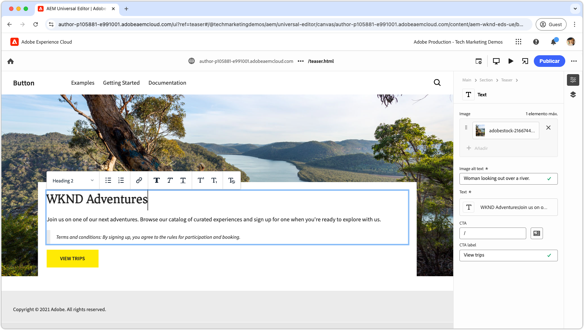

# Vídeos de Edge Delivery Services

Aprenda a crear sitios web rápidamente con Edge Delivery Services.

>[!VIDEO](https://video.tv.adobe.com/v/3427989/?learn=on)

Consulte la [documentación](https://experienceleague.adobe.com/es/docs/experience-manager-cloud-service/content/edge-delivery/overview) para obtener información detallada acerca de Edge Delivery Services y sus funcionalidades.

## Tutoriales para desarrolladores de Edge Delivery Services

<!-- CARDS 

* https://experienceleague.adobe.com/en/docs/experience-manager-cloud-service/content/edge-delivery/build/tutorial
  {title = Document-based authoring and Edge Delivery Services tutorial}
  {description = Learn how to create Edge Delivery Services web sites authored using Document-based authoring.}
  {cta = Start the tutorial}

* ./developing/universal-editor/0-overview.md
  {title = Universal Editor and Edge Delivery Services tutorial}
  {description = Learn the basics of creating an Edge Delivery Services web sites authored with Universal Editor.}
  {cta = Start the tutorial}

-->
<!-- START CARDS HTML - DO NOT MODIFY BY HAND -->

    

        

            

                <figure class="image x-is-16by9">
                    
                </figure>
            

            

                

                    

                        <a href="https://experienceleague.adobe.com/en/docs/experience-manager-cloud-service/content/edge-delivery/build/tutorial" target="_blank" rel="referrer" title="Tutorial de Edge Delivery Services y creación basada en documentos">Tutorial de Edge Delivery Services y creación basada en documentos</a>
                    

                    
Obtenga información sobre cómo crear sitios web de Edge Delivery Services creados mediante la creación basada en documentos.

                

                <a href="https://experienceleague.adobe.com/en/docs/experience-manager-cloud-service/content/edge-delivery/build/tutorial" target="_blank" rel="referrer" class="spectrum-Button spectrum-Button--outline spectrum-Button--primary spectrum-Button--sizeM" style="align-self: flex-start; margin-top: 1rem;">
                    Iniciar el tutorial
                </a>
            

        

    

    

        

            

                <figure class="image x-is-16by9">
                    
                </figure>
            

            

                

                    

                        <a href="./developing/universal-editor/0-overview.md" target="_blank" rel="referrer" title="Tutorial de Universal Editor y Edge Delivery Services">Tutorial del editor universal y Edge Delivery Services</a>
                    

                    
Conozca los conceptos básicos de la creación de sitios web de Edge Delivery Services creados con Universal Editor.

                

                <a href="./developing/universal-editor/0-overview.md" target="_blank" rel="referrer" class="spectrum-Button spectrum-Button--outline spectrum-Button--primary spectrum-Button--sizeM" style="align-self: flex-start; margin-top: 1rem;">
                    Iniciar el tutorial
                </a>
            

        

    

<!-- END CARDS HTML - DO NOT MODIFY BY HAND -->

## Introducción a Edge Delivery Services

    <!-- Prerequisites -->
    

      

        

          <figure class="image is-16by9">
            
          </figure>
        

        

          

            
5 minutos

            

              <a href="./developing/prerequisites.md" title="Requisitos previos">Requisitos previos para desarrolladores</a>
            

            
Lo que necesita para empezar a desarrollar con Edge Delivery Services.

            <a href="./developing/prerequisites.md" class="spectrum-Button
              spectrum-Button--outline spectrum-Button--primary
              spectrum-Button--sizeM">
              Vea el vídeo
            </a>
          

        

      

    
 
    <!-- Setting up your Repository-->
    

      

        

          <figure class="image is-16by9">
            
          </figure>
        

        

          

            
1 minuto

            

              <a href="./developing/aem-boilerplate.md" title="Usar plantilla de plantillas">Plantilla de AEM</a>
            

            
Utilice la plantilla de plantillas de AEM para configurar el repositorio de código.

            <a href="./developing/aem-boilerplate.md" class="spectrum-Button
              spectrum-Button--outline spectrum-Button--primary
              spectrum-Button--sizeM">
              Vea el vídeo
            </a>
          

        

      

    

    <!-- Linking Google Drive -->
    

      

        

          <figure class="image is-16by9">
            
          </figure>
        

        

          

            
1 minuto

            

              <a href="./developing/content-repository.md" title="Vincular unidad Google">Vincular unidad Google</a>
            

            
Utilice Google Drive como repositorio para todo el contenido.

            <a href="./developing/content-repository.md" class="spectrum-Button
              spectrum-Button--outline spectrum-Button--primary
              spectrum-Button--sizeM">
              Vea el vídeo
            </a>
          

        

      

    

    <!-- Link Sharepoint --->
    

      

        

          <figure class="image is-16by9">
            
          </figure>
        

        

          

            
1 minuto

            

              <a href="./developing/content-repository.md" title="Vincular a SharePoint">Vincular SharePoint</a>
            

            
Utilice SharePoint como repositorio para todo el contenido.

            <a href="./developing/content-repository.md"
              class="spectrum-Button spectrum-Button--outline
              spectrum-Button--primary spectrum-Button--sizeM">
              Vea el vídeo
            </a>
          

        

      

    

    <!-- Previewing and Publishing Content -->
    

      

        

          <figure class="image is-16by9">
            
          </figure>
        

        

          

            
1 minuto

            

              <a href="./developing/preview-and-publish.md" title="Previsualizar y publicar contenido">Previsualizar y publicar contenido</a>
            

            
Vista previa y publicación de contenido con AEM Sidekick.

            <a href="./developing/preview-and-publish.md" class="spectrum-Button
              spectrum-Button--outline spectrum-Button--primary
              spectrum-Button--sizeM">
              Vea el vídeo
            </a>
          

        

      

    

    <!-- Using the Sidekick -->
    

      

        

          <figure class="image is-16by9">
            
          </figure>
        

        

          

            
1 minuto

            

              <a href="./developing/sidekick.md" title="Uso de Sidekick">Usar AEM Sidekick</a>
            

            
Aprenda a utilizar AEM Sidekick.

            <a href="./developing/sidekick.md" class="spectrum-Button
              spectrum-Button--outline spectrum-Button--primary
              spectrum-Button--sizeM">
              Vea el vídeo
            </a>
          

        

      

    

 <!-- Document Structure -->
    

      

        

          <figure class="image is-16by9">
            
          </figure>
        

        

          

            
1 minuto

            

              <a href="./developing/document-structure.md" title="Estructura del documento">Estructura de documento</a>
            

            
Explore la estructura del documento, incluido el contenido, las secciones y los bloques predeterminados 

            <a href="./developing/document-structure.md" class="spectrum-Button
              spectrum-Button--outline spectrum-Button--primary
              spectrum-Button--sizeM">
              Vea el vídeo
            </a>
          

        

      

    
  
     <!--Local Development -->
    

      

        

          <figure class="image is-16by9">
            
          </figure>
        

        

          

            
2 minutos

            

              <a href="./developing/local-development.md" title="Desarrollo local">Desarrollo local</a>
            

            
Configure su entorno de desarrollo local.

            <a href="./developing/local-development.md" class="spectrum-Button
              spectrum-Button--outline spectrum-Button--primary
              spectrum-Button--sizeM">
              Vea el vídeo
            </a>
          

        

      

    

    <!--Integrate with Git -->
    

      

        

          <figure class="image is-16by9">
            
          </figure>
        

        

          

            
2 minutos

            

              <a href="./developing/git.md" title="Integrarse con Git">Integrar con Git</a>
            

            
Configure Git y Edge Delivery Services.

            <a href="./developing/git.md" class="spectrum-Button
              spectrum-Button--outline spectrum-Button--primary
              spectrum-Button--sizeM">
              Vea el vídeo
            </a>
          

        

      

    

## Vídeos de presentación

    <!--Create RSS Feeds -->
    

      

        

          <figure class="image is-16by9">
            
          </figure>
        

        

          

            
2 minutos

            

              <a href="./how-to/rss.md" title="Crear fuentes RSS">Crear fuentes RSS</a>
            

            
Aprenda a crear fuentes RSS.

            <a href="./how-to/rss.md" class="spectrum-Button
              spectrum-Button--outline spectrum-Button--primary
              spectrum-Button--sizeM">
              Vea el vídeo
            </a>
          

        

      

    

    <!--Social Media Sharing -->
    

      

        

          <figure class="image is-16by9">
            
          </figure>
        

        

          

            
2 minutos

            

              <a href="./how-to/social-media-sharing.md" title="Compartir en redes sociales">Compartir en medios sociales</a>
            

            
Aprenda a optimizar el contenido para compartirlo en las redes sociales.

            <a href="./how-to/social-media-sharing.md" class="spectrum-Button
              spectrum-Button--outline spectrum-Button--primary
              spectrum-Button--sizeM">
              Vea el vídeo
            </a>
          

        

      

    

    <!--Delete a Page -->
    

      

        

          <figure class="image is-16by9">
            
          </figure>
        

        

          

            
2 minutos

            

              <a href="./how-to/delete-page.md" title="Eliminación de páginas">Eliminando páginas</a>
            

            
Obtenga información sobre cómo eliminar páginas.

            <a href="./how-to/delete-page.md" class="spectrum-Button
              spectrum-Button--outline spectrum-Button--primary
              spectrum-Button--sizeM">
              Vea el vídeo
            </a>
          

        

      

    
    
  

