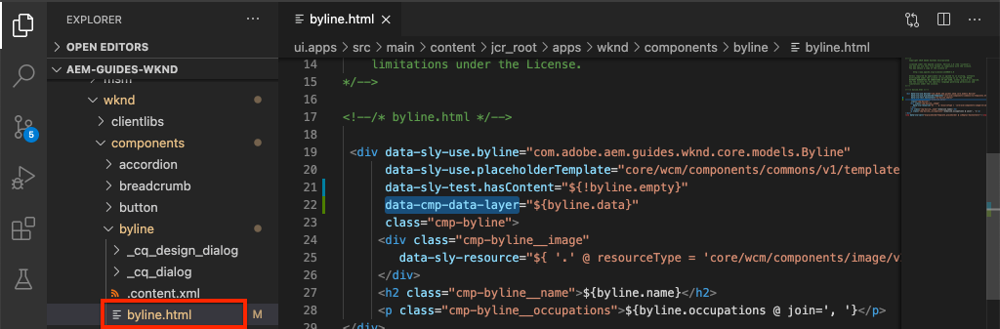

# Personalización de la capa de datos del cliente de Adobe AEM con componentes de {#customize-data-layer}

Obtenga información sobre cómo personalizar la capa de datos del cliente de Adobe AEM con contenido de componentes de personalizados. Aprenda a utilizar las API proporcionadas por [AEM Componentes principales que se van a ampliar](https://experienceleague.adobe.com/docs/experience-manager-core-components/using/developing/data-layer/extending.html) y personalizar la capa de datos.

## Lo que va a generar


En este tutorial, vamos a explorar varias opciones para ampliar la capa de datos del cliente de Adobe actualizando WKND [Componente Firma](https://experienceleague.adobe.com/docs/experience-manager-learn/getting-started-wknd-tutorial-develop/project-archetype/custom-component.html). El _Firma_ el componente es un **componente personalizado** y las lecciones aprendidas en este tutorial se pueden aplicar a otros componentes personalizados.

### Objetivos {#objective}

1. Inserte datos de componente en la capa de datos ampliando un modelo Sling y un componente HTL
1. Utilice las utilidades de capa de datos del componente principal para reducir el esfuerzo
1. Utilice los atributos de datos del componente principal para vincularlos a eventos de capa de datos existentes

## Requisitos previos {#prerequisites}

A **entorno de desarrollo local** es necesario para completar este tutorial. AEM Las capturas de pantalla y los vídeos se capturan mediante el SDK as a Cloud Service de que se ejecuta en un macOS. Los comandos y el código son independientes del sistema operativo local a menos que se indique lo contrario.

**¿Es novato en el uso de AEM as a Cloud Service?** Consulte la [siguiente guía para configurar un entorno de desarrollo local con el SDK de AEM as a Cloud Service](https://experienceleague.adobe.com/docs/experience-manager-learn/cloud-service/local-development-environment-set-up/overview.html?lang=es).

**AEM ¿Nuevo en la versión 6.5 de?** Consulte la [siguiente guía para configurar un entorno de desarrollo local](https://experienceleague.adobe.com/docs/experience-manager-learn/foundation/development/set-up-a-local-aem-development-environment.html?lang=es).

## Descargar e implementar el sitio de referencia de WKND {#set-up-wknd-site}

Este tutorial amplía el componente Byline en el sitio de referencia de WKND. Clone e instale el código WKND base en su entorno local.

1. Iniciar un inicio rápido local **autor** AEM instancia de la ejecución de la en [http://localhost:4502](http://localhost:4502).
1. Abra una ventana de terminal y clone el código base de WKND con Git:

   ```shell
   $ git clone git@github.com:adobe/aem-guides-wknd.git
   ```

1. AEM Implemente la base de código WKND en una instancia local de, como se indica a continuación

   ```shell
   $ cd aem-guides-wknd
   $ mvn clean install -PautoInstallSinglePackage
   ```

   >[!NOTE]
   >
   > AEM Para la versión 6.5 y el paquete de servicio más reciente, añada la variable `classic` de perfil al comando Maven:
   >
   > `mvn clean install -PautoInstallSinglePackage -Pclassic`

1. AEM Abra una nueva ventana del explorador e inicie sesión para acceder a la. Abra un **Revista** página como: [http://localhost:4502/content/wknd/us/en/magazine/guide-la-skateparks.html](http://localhost:4502/content/wknd/us/en/magazine/guide-la-skateparks.html).

   

   Debería ver un ejemplo del componente Firma que se ha agregado a la página como parte de un Fragmento de experiencia. Puede ver el fragmento de experiencia en [http://localhost:4502/editor.html/content/experience-fragments/wknd/language-masters/en/contributors/stacey-roswells/byline.html](http://localhost:4502/editor.html/content/experience-fragments/wknd/language-masters/en/contributors/stacey-roswells/byline.html)
1. Abra las herramientas para desarrolladores e introduzca el siguiente comando en la **Consola**:

   ```js
   window.adobeDataLayer.getState();
   ```

   AEM Para ver el estado actual de la capa de datos en un sitio de datos, compruebe la respuesta de un sitio de datos en el que se haya realizado una inspección. Debería ver información sobre la página y los componentes individuales.

   

   Observe que el componente Firma no aparece en la capa de datos.

## Actualización del modelo Sling de firma {#sling-model}

Para insertar datos sobre el componente en la capa de datos, primero vamos a actualizar el modelo Sling del componente. A continuación, actualice la interfaz Java™ y la implementación del modelo Sling de Byline para tener un nuevo método `getData()`. Este método contiene las propiedades que se van a insertar en la capa de datos.

1. Abra el `aem-guides-wknd` proyecto en el IDE que elija. Vaya a `core` módulo.
1. Abra el archivo `Byline.java` en `core/src/main/java/com/adobe/aem/guides/wknd/core/models/Byline.java`.

   

1. Añada el método siguiente a la interfaz:

   ```java
   public interface Byline {
       ...
       /***
        * Return data about the Byline Component to populate the data layer
        * @return String
        */
       String getData();
   }
   ```

1. Abra el archivo `BylineImpl.java` en `core/src/main/java/com/adobe/aem/guides/wknd/core/models/impl/BylineImpl.java`. Es la implementación de la `Byline` y se implementa como un modelo Sling.

1. Agregue las siguientes instrucciones de importación al principio del archivo:

   ```java
   import java.util.HashMap;
   import java.util.Map;
   import org.apache.sling.api.resource.Resource;
   import com.fasterxml.jackson.core.JsonProcessingException;
   import com.fasterxml.jackson.databind.ObjectMapper;
   import com.adobe.cq.wcm.core.components.util.ComponentUtils;
   ```

   El `fasterxml.jackson` Las API se utilizan para serializar los datos que se van a exponer como JSON. El `ComponentUtils` AEM Los componentes principales se utilizan para comprobar si la capa de datos está habilitada.

1. Añadir el método no implementado `getData()` hasta `BylineImple.java`:

   ```java
   public class BylineImpl implements Byline {
       ...
       @Override
       public String getData() {
           Resource bylineResource = this.request.getResource();
           // Use ComponentUtils to verify if the DataLayer is enabled
           if (ComponentUtils.isDataLayerEnabled(bylineResource)) {
   
               //Create a map of properties we want to expose
               Map<String, Object> bylineProperties = new HashMap<String,Object>();
               bylineProperties.put("@type", bylineResource.getResourceType());
               bylineProperties.put("name", this.getName());
               bylineProperties.put("occupation", this.getOccupations());
               bylineProperties.put("fileReference", image.getFileReference());
   
               //Use AEM Core Component utils to get a unique identifier for the Byline component (in case multiple are on the page)
               String bylineComponentID = ComponentUtils.getId(bylineResource, this.currentPage, this.componentContext);
   
               // Return the bylineProperties as a JSON String with a key of the bylineResource's ID
               try {
                   return String.format("{\"%s\":%s}",
                       bylineComponentID,
                       // Use the ObjectMapper to serialize the bylineProperties to a JSON string
                       new ObjectMapper().writeValueAsString(bylineProperties));
               } catch (JsonProcessingException e) {
   
                   LOGGER.error("Unable to generate dataLayer JSON string", e);
               }
   
           }
           // return null if the Data Layer is not enabled
           return null;
       }
   }
   ```

   En el método anterior, una nueva `HashMap` se utiliza para recopilar las propiedades que se van a exponer como JSON. Observe que los métodos existentes como `getName()` y `getOccupations()` se utilizan. El `@type` representa el tipo de recurso único del componente y permite a un cliente identificar fácilmente eventos o déclencheur en función del tipo de componente.

   El `ObjectMapper` se utiliza para serializar las propiedades y devolver una cadena JSON. A continuación, esta cadena JSON se puede insertar en la capa de datos.

1. Abra una ventana de terminal. Genere e implemente solo el `core` con sus habilidades con Maven:

   ```shell
   $ cd aem-guides-wknd/core
   $ mvn clean install -PautoInstallBundle
   ```

## Actualizar el HTL de firma {#htl}

A continuación, actualice el `Byline` [HTL](https://experienceleague.adobe.com/docs/experience-manager-htl/content/specification.html?lang=en). HTL (lenguaje de plantilla de HTML) es la plantilla utilizada para procesar el HTML del componente.

Un atributo de datos especial `data-cmp-data-layer` AEM en cada componente de la se utiliza para exponer su capa de datos. AEM El JavaScript proporcionado por los componentes principales de la aplicación busca este atributo de datos. El valor de este atributo de datos se rellena con la cadena JSON devuelta por el modelo de Sling de firma `getData()` y se inserta en la capa de datos del cliente de Adobe.

1. Abra el `aem-guides-wknd` proyecto en el IDE. Vaya a `ui.apps` módulo.
1. Abra el archivo `byline.html` en `ui.apps/src/main/content/jcr_root/apps/wknd/components/byline/byline.html`.

   

1. Actualizar `byline.html` para incluir el `data-cmp-data-layer` atributo:

   ```diff
     <div data-sly-use.byline="com.adobe.aem.guides.wknd.core.models.Byline"
       data-sly-use.placeholderTemplate="core/wcm/components/commons/v1/templates.html"
       data-sly-test.hasContent="${!byline.empty}"
   +   data-cmp-data-layer="${byline.data}"
       class="cmp-byline">
       ...
   ```

   El valor de `data-cmp-data-layer` se ha establecido en `"${byline.data}"` donde `byline` es el modelo Sling actualizado anteriormente. `.data` es la notación estándar para llamar a un método Java™ Getter en HTL de `getData()` implementado en el ejercicio anterior.

1. Abra una ventana de terminal. Genere e implemente solo el `ui.apps` con sus habilidades con Maven:

   ```shell
   $ cd aem-guides-wknd/ui.apps
   $ mvn clean install -PautoInstallPackage
   ```

1. Vuelva al explorador y vuelva a abrir la página con un componente Firma: [http://localhost:4502/content/wknd/us/en/magazine/guide-la-skateparks.html](http://localhost:4502/content/wknd/us/en/magazine/guide-la-skateparks.html).

1. Abra las herramientas para desarrolladores e inspeccione el origen de HTML de la página para el componente Firma:

   

   Debería ver que la variable `data-cmp-data-layer` se ha rellenado con la cadena JSON del modelo Sling.

1. Abra las herramientas para desarrolladores del explorador e introduzca el siguiente comando en la **Consola**:

   ```js
   window.adobeDataLayer.getState();
   ```

1. Vaya debajo de la respuesta en `component` para encontrar la instancia de `byline` se ha añadido el componente a la capa de datos:

   

   Debería ver una entrada como la siguiente:

   ```json
   byline-136073cfcb:
       @type: "wknd/components/byline"
       fileReference: "/content/dam/wknd/en/contributors/stacey-roswells.jpg"
       name: "Stacey Roswells"
       occupation: (3) ["Artist", "Photographer", "Traveler"]
       parentId: "page-30d989b3f8"
   ```

   Observe que las propiedades expuestas son las mismas agregadas en la variable `HashMap` en el modelo Sling.

## Agregar un evento de clic {#click-event}

La capa de datos del cliente de Adobe se basa en eventos y uno de los eventos más comunes para almacenar en déclencheur una acción es el `cmp:click` evento. AEM Los componentes principales hacen que sea fácil registrar su componente con la ayuda del elemento de datos: `data-cmp-clickable`.

Los elementos en los que se puede hacer clic suelen ser un botón CTA o un vínculo de navegación. Desafortunadamente, el componente Firma no tiene ninguno de estos, pero vamos a registrarlo de todas formas, ya que esto podría ser común para otros componentes personalizados.

1. Abra el `ui.apps` en el IDE
1. Abra el archivo `byline.html` en `ui.apps/src/main/content/jcr_root/apps/wknd/components/byline/byline.html`.

1. Actualizar `byline.html` para incluir el `data-cmp-clickable` en el Byline&#39;s **name** elemento:

   ```diff
     <h2 class="cmp-byline__name" 
   +    data-cmp-clickable="${byline.data ? true : false}">
        ${byline.name}
     </h2>
   ```

1. Abra un terminal nuevo. Genere e implemente solo el `ui.apps` con sus habilidades con Maven:

   ```shell
   $ cd aem-guides-wknd/ui.apps
   $ mvn clean install -PautoInstallPackage
   ```

1. Vuelva al explorador y vuelva a abrir la página con el componente Firma añadido: [http://localhost:4502/content/wknd/us/en/magazine/guide-la-skateparks.html](http://localhost:4502/content/wknd/us/en/magazine/guide-la-skateparks.html).

   Para probar el evento, añadiremos manualmente JavaScript a través de la consola para desarrolladores. Consulte [Uso de la capa de datos del cliente de Adobe AEM con los componentes principales de](data-layer-overview.md) para ver un vídeo sobre cómo hacerlo.

1. Abra las herramientas para desarrolladores del explorador e introduzca el siguiente método en la **Consola**:

   ```javascript
   function bylineClickHandler(event) {
       var dataObject = window.adobeDataLayer.getState(event.eventInfo.path);
       if (dataObject != null && dataObject['@type'] === 'wknd/components/byline') {
           console.log("Byline Clicked!");
           console.log("Byline name: " + dataObject['name']);
       }
   }
   ```

   Este método simple debe controlar el clic del nombre del componente Byline.

1. Introduzca el siguiente método en la **Consola**:

   ```javascript
   window.adobeDataLayer.push(function (dl) {
        dl.addEventListener("cmp:click", bylineClickHandler);
   });
   ```

   El método anterior inserta un detector de eventos en la capa de datos para detectar el `cmp:click` y llama al `bylineClickHandler`.

   >[!CAUTION]
   >
   > Es importante **no** para actualizar el explorador durante este ejercicio; de lo contrario, se pierde el JavaScript de la consola.

1. En el explorador, con la variable **Consola** Para abrirlo, haga clic en el nombre del autor en el componente Firma:

   

   Debería ver el mensaje de la consola `Byline Clicked!` y el nombre de la firma.

   El `cmp:click` es el más fácil de conectar con. Para componentes más complejos y para rastrear otros comportamientos, es posible añadir JavaScript personalizado para añadir y registrar nuevos eventos. Un buen ejemplo es el Componente de carrusel, que déclencheur un `cmp:show` cada vez que se cambia una diapositiva. Consulte la [código fuente para obtener más información](https://github.com/adobe/aem-core-wcm-components/blob/main/content/src/content/jcr_root/apps/core/wcm/components/carousel/v1/carousel/clientlibs/site/js/carousel.js).

## Uso de la utilidad DataLayerBuilder {#data-layer-builder}

Cuando el modelo Sling era [actualizado](#sling-model) anteriormente en el capítulo, optamos por crear la cadena JSON mediante una `HashMap` y configurando cada una de las propiedades manualmente. AEM Este método funciona bien para componentes únicos pequeños, pero para los componentes que amplían los componentes principales esto podría dar como resultado mucho código adicional.

Una clase de utilidad, `DataLayerBuilder`, existe para realizar la mayor parte del trabajo pesado. Esto permite que las implementaciones amplíen únicamente las propiedades que desean. Actualicemos el modelo Sling para utilizar la variable `DataLayerBuilder`.

1. Vuelva al IDE y vaya al `core` módulo.
1. Abra el archivo `Byline.java` en `core/src/main/java/com/adobe/aem/guides/wknd/core/models/Byline.java`.
1. Modifique la `getData()` método para devolver un tipo de `ComponentData`

   ```java
   import com.adobe.cq.wcm.core.components.models.datalayer.ComponentData;
   ...
   public interface Byline {
       ...
       /***
        * Return data about the Byline Component to populate the data layer
        * @return ComponentData
        */
       ComponentData getData();
   }
   ```

   `ComponentData` AEM es un objeto proporcionado por los componentes principales de la. Da como resultado una cadena JSON, igual que en el ejemplo anterior, pero también realiza mucho trabajo adicional.

1. Abra el archivo `BylineImpl.java` en `core/src/main/java/com/adobe/aem/guides/wknd/core/models/impl/BylineImpl.java`.

1. Añada las siguientes instrucciones de importación:

   ```java
   import com.adobe.cq.wcm.core.components.models.datalayer.ComponentData;
   import com.adobe.cq.wcm.core.components.models.datalayer.builder.DataLayerBuilder;
   ```

1. Reemplace el `getData()` con lo siguiente:

   ```java
   @Override
   public ComponentData getData() {
       Resource bylineResource = this.request.getResource();
       // Use ComponentUtils to verify if the DataLayer is enabled
       if (ComponentUtils.isDataLayerEnabled(bylineResource)) {
   
           return DataLayerBuilder.extending(getImage().getData()).asImageComponent()
               .withTitle(this::getName)
               .build();
   
       }
       // return null if the Data Layer is not enabled
       return null;
   }
   ```

   El componente Firma vuelve a utilizar partes del componente principal de imagen para mostrar una imagen que representa al autor. En el fragmento anterior, la variable [DataLayerBuilder](https://javadoc.io/doc/com.adobe.cq/core.wcm.components.core/latest/com/adobe/cq/wcm/core/components/models/datalayer/builder/ComponentDataBuilder.html) se utiliza para ampliar la capa de datos del `Image` componente. Esto rellena previamente el objeto JSON con todos los datos sobre la imagen utilizada. También realiza algunas de las funciones de rutina, como configurar la variable `@type` y el identificador único del componente. Observe que el método es pequeño.

   La única propiedad amplió el `withTitle` que se sustituye por el valor `getName()`.

1. Abra una ventana de terminal. Genere e implemente solo el `core` con sus habilidades con Maven:

   ```shell
   $ cd aem-guides-wknd/core
   $ mvn clean install -PautoInstallBundle
   ```

1. Vuelva al IDE y abra `byline.html` archivo en `ui.apps`
1. Actualizar HTL para usar `byline.data.json` para rellenar el `data-cmp-data-layer` atributo:

   ```diff
     <div data-sly-use.byline="com.adobe.aem.guides.wknd.core.models.Byline"
       data-sly-use.placeholderTemplate="core/wcm/components/commons/v1/templates.html"
       data-sly-test.hasContent="${!byline.empty}"
   -   data-cmp-data-layer="${byline.data}"
   +   data-cmp-data-layer="${byline.data.json}"
   ```

   Recuerde que ahora se devuelve un objeto del tipo `ComponentData`. Este objeto incluye un método de captador `getJson()` y se usa para rellenar el `data-cmp-data-layer` atributo.

1. Abra una ventana de terminal. Genere e implemente solo el `ui.apps` con sus habilidades con Maven:

   ```shell
   $ cd aem-guides-wknd/ui.apps
   $ mvn clean install -PautoInstallPackage
   ```

1. Vuelva al explorador y vuelva a abrir la página con el componente Firma añadido: [http://localhost:4502/content/wknd/us/en/magazine/guide-la-skateparks.html](http://localhost:4502/content/wknd/us/en/magazine/guide-la-skateparks.html).
1. Abra las herramientas para desarrolladores del explorador e introduzca el siguiente comando en la **Consola**:

   ```js
   window.adobeDataLayer.getState();
   ```

1. Vaya debajo de la respuesta en `component` para encontrar la instancia de `byline` componente:

   

   Debería ver una entrada como la siguiente:

   ```json
   byline-136073cfcb:
       @type: "wknd/components/byline"
       dc:title: "Stacey Roswells"
       image:
           @type: "image/jpeg"
           repo:id: "142658f8-4029-4299-9cd6-51afd52345c0"
           repo:modifyDate: "2019-10-25T23:49:51Z"
           repo:path: "/content/dam/wknd/en/contributors/stacey-roswells.jpg"
           xdm:tags: []
       parentId: "page-30d989b3f8"
       repo:modifyDate: "2019-10-18T20:17:24Z"
   ```

   Observe que ahora hay un `image` objeto dentro de `byline` entrada de componente. Tiene mucha más información sobre el recurso en DAM. Observe también que la variable `@type` y el id único (en este caso, ) `byline-136073cfcb`) se han rellenado automáticamente, y la variable `repo:modifyDate` que indica cuándo se modificó el componente.

## Ejemplos adicionales {#additional-examples}

1. Otro ejemplo de ampliación de la capa de datos se puede ver inspeccionando la `ImageList` en la base de código WKND:
   * `ImageList.java` - Interfaz de Java en `core` módulo.
   * `ImageListImpl.java` - Modelo Sling en `core` módulo.
   * `image-list.html` - Plantilla HTL en el `ui.apps` módulo.

   >[!NOTE]
   >
   > Es un poco más difícil incluir propiedades personalizadas como `occupation` al usar el [DataLayerBuilder](https://javadoc.io/doc/com.adobe.cq/core.wcm.components.core/latest/com/adobe/cq/wcm/core/components/models/datalayer/builder/ComponentDataBuilder.html). Sin embargo, si amplía un componente principal que incluye una imagen o una página, la utilidad ahorra mucho tiempo.

   >[!NOTE]
   >
   > Si se crea una capa de datos avanzada para objetos reutilizados a lo largo de una implementación, se recomienda extraer los elementos de la capa de datos en sus propios objetos Java™ específicos de la capa de datos. Por ejemplo, los componentes principales de Commerce tienen interfaces añadidas para `ProductData` y `CategoryData` ya que estos se pueden utilizar en muchos componentes de una implementación de Commerce. Revisar [el código en el repositorio aem-cif-core-components](https://github.com/adobe/aem-core-cif-components/tree/master/bundles/core/src/main/java/com/adobe/cq/commerce/core/components/datalayer) para obtener más información.

## Enhorabuena. {#congratulations}

Acaba de explorar algunas formas de ampliar y personalizar la capa de datos del cliente de Adobe AEM con componentes de la interfaz de usuario de la interfaz de usuario de la interfaz de usuario de.

## Recursos adicionales {#additional-resources}

* [Documentación de capa de datos del cliente de Adobe](https://github.com/adobe/adobe-client-data-layer/wiki)
* [Integración de la capa de datos con los componentes principales](https://github.com/adobe/aem-core-wcm-components/blob/main/DATA_LAYER_INTEGRATION.md)
* [Uso de la capa de datos del cliente de Adobe y la documentación de componentes principales](https://experienceleague.adobe.com/docs/experience-manager-core-components/using/developing/data-layer/overview.html?lang=es)
