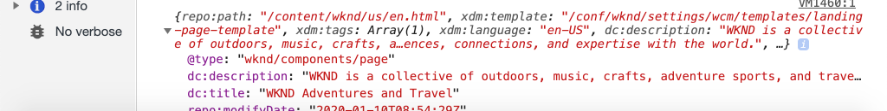

# Uso de la capa de datos del cliente de Adobe con AEM componentes principales {#overview}

La capa de datos del cliente de Adobe presenta un método estándar para recopilar y almacenar datos sobre una experiencia de visitante en una página web y, a continuación, facilitar el acceso a estos datos. La capa de datos del cliente de Adobe no depende de la plataforma, pero está completamente integrada en los componentes principales para su uso con AEM.

>[!VIDEO](https://video.tv.adobe.com/v/41195?quality=12&learn=on)

>[!NOTE]
>
> ¿Desea habilitar la capa de datos del cliente de Adobe en su sitio AEM? [Consulte las instrucciones aquí](https://docs.adobe.com/content/help/en/experience-manager-core-components/using/developing/data-layer/overview.html#installation-activation).

## Explorar la capa de datos

Puede hacerse una idea de la funcionalidad integrada de la capa de datos del cliente de Adobe utilizando las herramientas de desarrollo de su navegador y el [sitio de referencia de WKND](https://wknd.site/) activo.

>[!NOTE]
>
> Capturas de pantalla tomadas del navegador Chrome.

1. Vaya a [https://wknd.site](https://wknd.site)
1. Abra las herramientas de desarrollador e introduzca el siguiente comando en la **Consola**:

   ```js
   window.adobeDataLayer.getState();
   ```

   Inspect responde para ver el estado actual de la capa de datos en un sitio AEM. Debe ver información sobre la página y los componentes individuales.

   

1. Inserte un objeto de datos en la capa de datos introduciendo lo siguiente en la consola:

   ```js
   window.adobeDataLayer.push({
       "component": {
           "training-data": {
               "title": "Learn More",
               "link": "learn-more.html"
           }
       }
   });
   ```

1. Vuelva a ejecutar el comando `adobeDataLayer.getState()` y busque la entrada para `training-data`.
1. A continuación, agregue un parámetro de ruta para devolver solo el estado específico de un componente:

   ```js
   window.adobeDataLayer.getState('component.training-data');
   ```

   

## Uso de Eventos

Se recomienda activar cualquier código personalizado basado en un evento de la capa de datos. A continuación, explore la posibilidad de registrar y escuchar diferentes eventos.

1. Introduzca el siguiente método de ayuda en la consola:

   ```js
   function getDataObjectHelper(event, filter) {
       if (event.hasOwnProperty("eventInfo") && event.eventInfo.hasOwnProperty("path")) {
           var dataObject = window.adobeDataLayer.getState(event.eventInfo.path);
           if (dataObject != null) {
               for (var property in filter) {
                   if (!dataObject.hasOwnProperty(property) || (filter[property] !== null && filter[property] !== dataObject[property])) {
                       return;
                   }
                   return dataObject;
               }
           }
       }
       return;
   }
   ```

   El código anterior inspeccionará el objeto `event` y utilizará el método `adobeDataLayer.getState` para obtener el estado actual del objeto que activó el evento. El método de ayuda inspeccionará los criterios `filter` y solo se devolverá si el `dataObject` actual cumple el filtro.

   >[!CAUTION]
   >
   > Será importante **no** actualizar el explorador a lo largo de este ejercicio; de lo contrario, se perderá JavaScript de la consola.

1. A continuación, introduzca un controlador de evento al que se llamará cuando se muestre un componente **Teaser** dentro de un **Carrusel**.

   ```js
   function teaserShownHandler(event) {
       var dataObject = getDataObjectHelper(event, {"@type": "wknd/components/teaser"});
       if(dataObject != null) {
           console.log("Teaser Shown: " + dataObject['dc:title']);
           console.log(dataObject);
       }
   }
   ```

   El `teaserShownHandler` llamará al método `getDataObjectHelper` y pasará un filtro de `wknd/components/teaser` como `@type` para filtrar los eventos activados por otros componentes.

1. A continuación, inserte un detector de evento en la capa de datos para escuchar el evento `cmp:show`.

   ```js
   window.adobeDataLayer.push(function (dl) {
        dl.addEventListener("cmp:show", teaserShownHandler);
   });
   ```

   El evento `cmp:show` se desencadena con muchos componentes diferentes, como cuando se muestra una nueva diapositiva en el **Carrusel** o cuando se selecciona una nueva ficha en el componente **Tab**.

1. En la página, alterne las diapositivas de carrusel y observe las instrucciones de la consola:

   

1. Quite el detector de evento de la capa de datos para dejar de escuchar el evento `cmp:show`:

   ```js
   window.adobeDataLayer = window.adobeDataLayer || [];
   window.adobeDataLayer.push(function(dl) {
       dl.removeEventListener("cmp:show", teaserShownHandler);
   });
   ```

1. Vuelva a la página y active las diapositivas de carrusel. Observe que no se registran más sentencias y que no se escucha el evento.

1. A continuación, introduzca un controlador de evento al que se llamará cuando se active el evento mostrado en la página:

   ```js
   function pageShownHandler(event) {
       var dataObject = getDataObjectHelper(event, {"@type": "wknd/components/page"});
       if(dataObject != null) {
           console.log("Page Shown: " + dataObject['dc:title']);
           console.log(dataObject);
       }
   }
   ```

   Observe que el tipo de recurso `wknd/components/page` se utiliza para filtrar el evento.

1. A continuación, inserte un detector de evento en la capa de datos para escuchar el evento `cmp:show`, llamando a `pageShownHandler`.

   ```js
   window.adobeDataLayer = window.adobeDataLayer || [];
   window.adobeDataLayer.push(function (dl) {
        dl.addEventListener("cmp:show", pageShownHandler);
   });
   ```

1. Debe ver inmediatamente una sentencia de consola activada con los datos de la página:

   

   El evento `cmp:show` de la página se activa en cada carga de página en la parte superior de la página. Podría preguntar, ¿por qué se activó el controlador de evento cuando la página ya se ha cargado claramente?

   Esta es una de las características únicas de la capa de datos del cliente de Adobe, en la que puede registrar oyentes de evento **antes** o **después de** que se inicialice la capa de datos. Esta es una característica fundamental para evitar las condiciones de carrera.

   La capa de datos mantiene una matriz de cola de todos los eventos que se han producido en secuencia. De forma predeterminada, la capa de datos activará rellamadas de evento para eventos que se produjeron en **pasado**, así como eventos en **futuro**. Es posible filtrar los eventos al pasado o al futuro. [Puede encontrar más información en la documentación](https://github.com/adobe/adobe-client-data-layer/wiki#addeventlistener).


## Próximos pasos

Consulte el siguiente tutorial para aprender a utilizar la capa de datos del cliente de Adobe controlada por evento para [recopilar datos de página y enviarlos a Adobe Analytics](../analytics/collect-data-analytics.md).

O aprenda a [personalizar la capa de datos del cliente de Adobe con componentes de AEM](./data-layer-customize.md)


## Recursos adicionales {#additional-resources}

* [Documentación de la capa de datos del cliente de Adobe](https://github.com/adobe/adobe-client-data-layer/wiki)
* [Uso de la capa de datos del cliente de Adobe y de la documentación de componentes principales](https://docs.adobe.com/content/help/en/experience-manager-core-components/using/developing/data-layer/overview.html)
