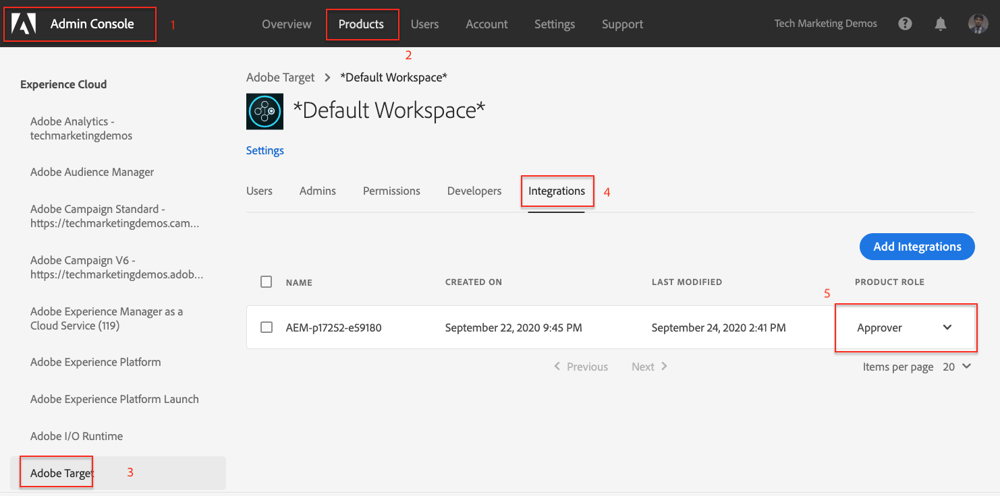

# Exportar fragmento de experiencia a Adobe Target {#experience-fragment-target}

Obtenga información sobre cómo exportar AEM fragmento de experiencia como ofertas de Adobe Target.

>[!VIDEO](https://video.tv.adobe.com/v/41245?quality=12&learn=on)

## Pasos siguientes

+ [Crear una actividad de Target mediante ofertas de fragmentos de experiencias](./create-target-activity.md)

## Solución de problemas

### Error al exportar fragmentos de experiencias a Target

#### Error

Al exportar fragmento de experiencia a Adobe Target sin los permisos correctos en Adobe Admin Console, se produce el siguiente error en el servicio Autor de AEM:

    

... y los siguientes mensajes de registro en el registro `aemerror`:

    

#### Resolución

1. Inicie sesión en [Admin Console](https://adminconsole.adobe.com/) con derechos administrativos para el perfil de producto de Adobe Target utilizado pero la integración AEM
2. Seleccione __Productos > Adobe Target > Perfil de producto__
3. En la pestaña __Integrations__ , seleccione la integración de su AEM como entorno de Cloud Service (el mismo nombre que el proyecto de Adobe I/O)
4. Asignar la función __Editor__ o __Aprobador__

   

Añadir el permiso correcto a la integración de Adobe Target debería resolver este error.

## Compatibilidad con vínculos

+ [Adobe Experience Cloud Debugger: Chrome](https://chrome.google.com/webstore/detail/adobe-experience-cloud-de/ocdmogmohccmeicdhlhhgepeaijenapj)
+ [Adobe Experience Cloud Debugger: Firefox](https://addons.mozilla.org/en-US/firefox/addon/adobe-experience-platform-dbg/)