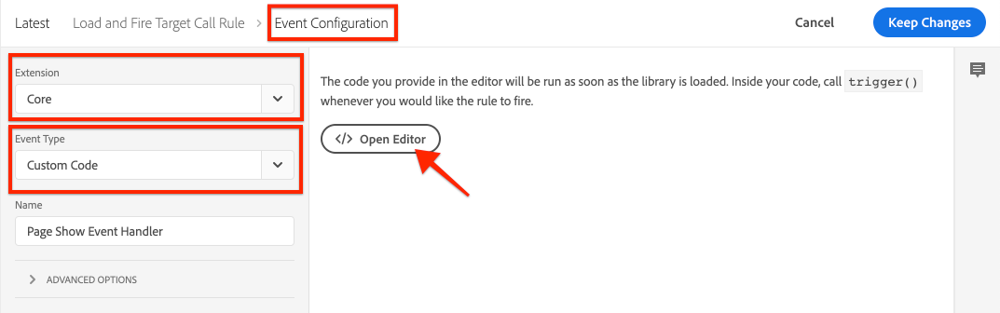

# Cargue y active una llamada de Destinatario {#load-fire-target}

Obtenga información sobre cómo cargar, pasar parámetros a una solicitud de página y activar una llamada de Destinatario desde la página del sitio mediante una regla de inicio. La información de la página web se recupera y pasa como parámetros mediante la capa de datos del cliente de Adobe, que permite recopilar y almacenar datos sobre la experiencia de los visitantes en una página web y, a continuación, facilitar el acceso a estos datos.

>[!VIDEO](https://video.tv.adobe.com/v/41243?quality=12&learn=on)

## Regla de carga de página

La capa de datos del cliente de Adobe es una capa de datos controlada por eventos. Cuando se carga la capa de datos de la página de AEM, se activará un evento `cmp:show`. En el vídeo, la regla `Launch Library Loaded` se invoca mediante un evento personalizado. A continuación, puede encontrar los fragmentos de código utilizados en el vídeo para el evento personalizado, así como para los elementos de datos.

### Página personalizada Muestra el Evento{#page-event}



En la propiedad Launch, agregue un nuevo **Evento** a la **regla**

+ __Extensión:__ Core
+ __tipo de evento:Código__ personalizado
+ __Nombre:__ Page Show Evento Handler (o algo descriptivo)

Toque el botón __Abrir editor__ y pegue el siguiente fragmento de código. Este código __debe__ agregarse a la __Configuración de Evento__ y a una __Acción__ subsiguiente.

```javascript
// Define the event handler function
var pageShownEventHandler = function(coreComponentEvent) {

    // Check to ensure event trigger via AEM Core Components is shaped correctly
    if (coreComponentEvent.hasOwnProperty("eventInfo") && 
        coreComponentEvent.eventInfo.hasOwnProperty("path")) {
    
        // Debug the AEM Component path the show event is associated with
        console.debug("cmp:show event: " + coreComponentEvent.eventInfo.path);

        // Create the Launch Event object
        var launchEvent = {
            // Include the ID of the AEM Component that triggered the event
            id: coreComponentEvent.eventInfo.path,
            // Get the state of the AEM Component that triggered the event           
            component: window.adobeDataLayer.getState(coreComponentEvent.eventInfo.path)
        };

        //Trigger the Launch Rule, passing in the new `event` object
        // the `event` obj can now be referenced by the reserved name `event` by other Launch data elements
        // i.e `event.component['someKey']`
        trigger(launchEvent);
   }
}

// With the AEM Core Component event handler, that proxies the event and relevant information to Adobe Launch, defined above...

// Initialize the adobeDataLayer global object in a safe way
window.adobeDataLayer = window.adobeDataLayer || [];

// Push the event custom listener onto the Adobe Data Layer
window.adobeDataLayer.push(function (dataLayer) {
   // Add event listener for the `cmp:show` event, and the custom `pageShownEventHandler` function as the callback
   dataLayer.addEventListener("cmp:show", pageShownEventHandler);
});
```

Una función personalizada define el `pageShownEventHandler` y escucha los eventos emitidos por AEM componentes principales, obtiene la información relevante del componente principal, lo empaqueta en un objeto evento y activa el Evento Launch con la información de evento derivada en su carga útil.

La regla de inicio se activa mediante la función `trigger(...)` de Launch, que __sólo__ está disponible desde la definición de fragmento de código personalizado del Evento de una regla.

La función `trigger(...)` toma un objeto evento como parámetro que, a su vez, se expone en Launch Data Elements, con otro nombre reservado en Launch denominado `event`. Los elementos de datos de Launch ahora pueden hacer referencia a datos de este objeto de evento desde el objeto `event` mediante sintaxis como `event.component['someKey']`.

Si `trigger(...)` se utiliza fuera del contexto del tipo de evento de código personalizado de un Evento (por ejemplo, en una acción), el error de JavaScript `trigger is undefined` se genera en el sitio Web integrado con la propiedad Launch.


### Elementos de datos


Los elementos de datos de inicio de Adobe asignan los datos del objeto de evento [activado en el evento personalizado Página mostrada](#page-event) a las variables disponibles en Adobe Target, a través del tipo de elemento de datos de código personalizado de la extensión Core.

#### Elemento de datos de ID de página

```
if (event && event.id) {
    return event.id;
}
```

Este código devuelve el identificador exclusivo de generación del componente principal.


### Elemento de datos de ruta de página

```
if (event && event.component && event.component.hasOwnProperty('repo:path')) {
    return event.component['repo:path'];
}
```

Este código devuelve la ruta de la página AEM.


### Elemento de datos de título de página

```
if (event && event.component && event.component.hasOwnProperty('dc:title')) {
    return event.component['dc:title'];
}
```

Este código devuelve el título de la página de AEM.


## Solución de problemas

### ¿Por qué mis mboxes no se activan en mis páginas web?

#### Mensaje de error cuando la cookie mboxDisable no está configurada**


#### Solución

A veces, los clientes de destinatario utilizan instancias basadas en la nube con Destinatario para realizar pruebas o con fines sencillos de prueba del concepto. Estos dominios, y muchos otros, son parte de la Lista de Sufijo Público .
Los navegadores modernos no guardarán las cookies si utiliza estos dominios a menos que personalice la configuración `cookieDomain` mediante `targetGlobalSettings()`.

```
window.targetGlobalSettings = {  
   cookieDomain: 'your-domain' //set the cookie directly on this subdomain, for example: 'publish-p1234-e5678.adobeaemcloud.com'
};
```

## Próximos pasos

+ [Exportar fragmento de experiencia a Adobe Target](./export-experience-fragment-target.md)

## Vínculos de soporte

+ [Documentación de la capa de datos del cliente de Adobe](https://github.com/adobe/adobe-client-data-layer/wiki)
+ [Adobe Experience Cloud Debugger - Chrome](https://chrome.google.com/webstore/detail/adobe-experience-cloud-de/ocdmogmohccmeicdhlhhgepeaijenapj)
+ [Adobe Experience Cloud Debugger - Firefox](https://addons.mozilla.org/en-US/firefox/addon/adobe-experience-platform-dbg/)
+ [Uso de la capa de datos del cliente de Adobe y de la documentación de componentes principales](https://docs.adobe.com/content/help/es-ES/experience-manager-core-components/using/developing/data-layer/overview.html)
+ [Introducción a Adobe Experience Platform Debugger](https://docs.adobe.com/content/help/en/platform-learn/tutorials/data-ingestion/web-sdk/introduction-to-the-experience-platform-debugger.html)