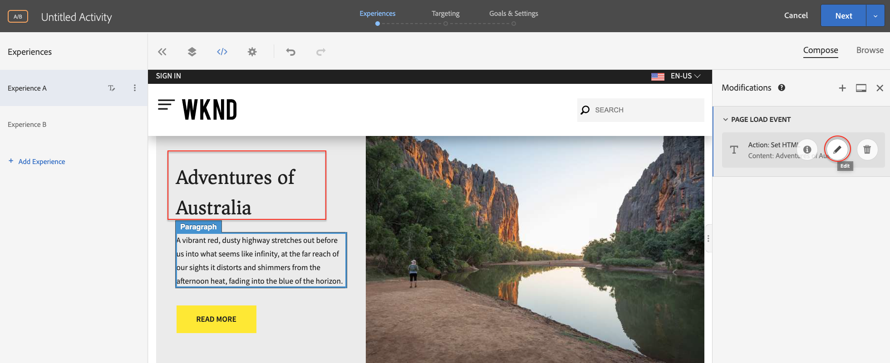

# Personalización mediante el Compositor de experiencias visuales {#personalization-vec}

Obtenga información sobre cómo crear una Actividad de Destinatario de prueba A/B mediante el Compositor de experiencias visuales (VEC).

## Información general del escenario

La página de inicio del sitio WKND muestra actividades locales o lo mejor que se puede hacer en una ciudad en forma de tarjetas informativas. Como especialista en mercadotecnia, se le ha asignado la tarea de modificar la página de inicio, realizando cambios de texto en el teaser de la sección de aventuras y comprendiendo cómo mejora la conversión.

## Pasos para crear una prueba A/B con el Compositor de experiencias visuales (VEC)

1. Inicie sesión en Adobe Target y vaya a la ficha Actividades
2. Haga clic en el botón **Crear Actividad** y, a continuación, elija actividad de prueba **** A/B

   

3. Seleccione la opción Compositor **de experiencias** visuales, proporcione la dirección URL de la Actividad y, a continuación, haga clic en **Siguiente**

   

4. El Compositor de experiencias visuales muestra dos fichas en el lado izquierdo después de crear una nueva actividad: *Experiencia A* y *experiencia B*. Seleccione una experiencia de la lista. Puede agregar nuevas experiencias a la lista mediante el botón **Añadir experiencia** .

   

5. Seleccione una imagen o texto en la página para realizar modificaciones en el inicio o utilice el editor de código para elegir y el elemento HTML.

   

6. Cambiar el texto de *Camping en Australia* Occidental a *Adventures of Australia*. Se mostrará una lista de los cambios agregados a una experiencia en Modificaciones. Puede hacer clic y editar el elemento modificado para vista de su selector CSS y el nuevo contenido que se le ha agregado.

   

7. Cambiar el nombre de *la experiencia A* a *aventura*
8. Del mismo modo, actualice el texto sobre la *Experiencia B* de *Camping en Australia* Occidental para *Explorar el Territorio Salvaje* Australiano.

   

9. Haga clic en **Siguiente** para pasar a Objetivo y mantengamos una asignación manual de tráfico de 50 a 50 entre las dos experiencias.

   

10. En Objetivos y configuración, elija la fuente de Sistema de informes como Adobe Target y seleccione la métrica Objetivo como Conversión con una acción de vista de página.

   

11. Proporcione un nombre para la actividad y guarde.
12. Active la actividad guardada para activar los cambios.

   

13. Abra la página del sitio (URL de Actividad del paso 3) en una nueva ficha y debería poder realizar la vista de cualquiera de las experiencias (Aventura o Explorar) desde nuestra actividad de prueba A/B.

   

## Resumen

En este capítulo, un especialista en marketing pudo crear una experiencia con el Compositor de experiencias visuales arrastrando y soltando, intercambiando y modificando el diseño y el contenido de una página web sin cambiar ningún código para ejecutar una prueba.

## Vínculos de soporte

* [Adobe Experience Cloud Debugger - Chrome](https://chrome.google.com/webstore/detail/adobe-experience-cloud-de/ocdmogmohccmeicdhlhhgepeaijenapj)
* [Adobe Experience Cloud Debugger - Firefox](https://addons.mozilla.org/en-US/firefox/addon/adobe-experience-platform-dbg/)