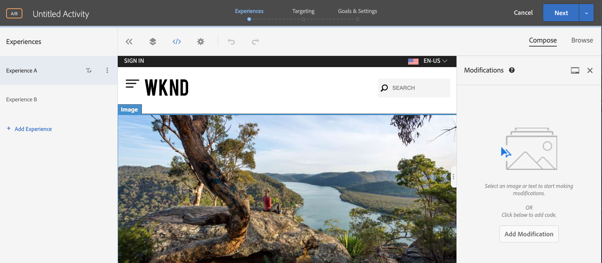
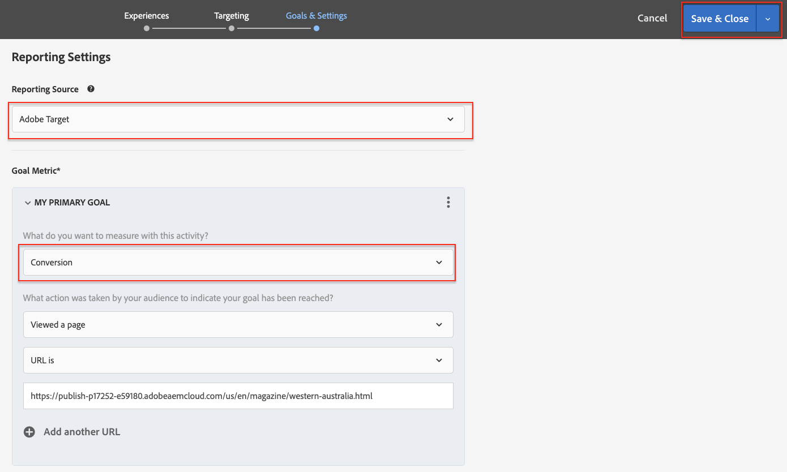

# Personalización de la experiencia de página web completa {#personalization-fpe}

Obtenga información sobre cómo crear una actividad para redirigir las páginas del sitio alojadas en AEM a una nueva página mediante Adobe Target.

## Requisitos previos

Para personalizar páginas completas de un sitio Web AEM, se debe completar la siguiente configuración:

1. [Añadir Adobe Target a su sitio Web AEM](./add-target-launch-extension.md)
1. [Déclencheur de una llamada de Adobe Target desde Launch](./load-and-fire-target.md)

## Información general del escenario

El sitio WKND rediseñó su página de inicio y quisiera redirigir sus visitantes de página de inicio actuales a la nueva página de inicio. Al mismo tiempo, comprenda también cómo la página de inicio rediseñada ayuda a mejorar la participación y los ingresos de los usuarios. Como especialista en marketing, se le ha asignado la tarea para crear una actividad que redirija los visitantes a la nueva página de inicio. Exploremos la página de inicio del sitio WKND y aprendamos a crear una actividad con Adobe Target.

## Pasos para crear una prueba A/B con el Compositor de experiencias visuales (VEC)

1. Inicie sesión en Adobe Target y vaya a la ficha Actividades
1. Haga clic en el botón **Crear Actividad** y luego elija la actividad **Prueba A/B**

   

1. Seleccione la opción **Compositor de experiencias visuales**, proporcione la dirección URL de la Actividad y haga clic en **Siguiente**

   

1. El Compositor de experiencias visuales muestra dos fichas en el lado izquierdo después de crear una nueva actividad: *Experiencia A* y *Experiencia B*. Seleccione una experiencia de la lista. Puede agregar nuevas experiencias a la lista mediante el botón **Añadir experiencia**.

   

1. Opciones de vista disponibles para la Experiencia A y, a continuación, seleccione la opción **Redireccionar a URL** y proporcione una dirección URL para la nueva página de inicio del sitio WKND.

   

1. Cambiar el nombre de *Experiencia A* a *Nueva Página de inicio WKND* y *Experiencia B* a *Página de inicio WKND*

   

1. Haga clic en **Siguiente** para pasar a Objetivo y mantener una asignación manual de tráfico de 50-50 entre las dos experiencias.

   

1. En Objetivos y configuración, elija la fuente de Sistema de informes como Adobe Target y seleccione la métrica Objetivo como Conversión con una acción de vista de página.

   

1. Proporcione un nombre para la actividad y guarde.
1. Active la actividad guardada para activar los cambios.

   

1. Abra la página de su sitio (URL de Actividad del paso 3) en una nueva ficha y debería poder realizar la vista de cualquiera de las experiencias (Página de inicio WKND o Página de inicio WKND nueva) desde nuestra actividad de prueba A/B. `us/en.html` redirige a  `us/home.html`.

   

## Resumen

Como especialista en mercadotecnia, pudo crear una actividad para redirigir las páginas del sitio que están alojadas en AEM a una nueva página mediante Adobe Target.

## Vínculos de soporte

* [Adobe Experience Cloud Debugger - Chrome](https://chrome.google.com/webstore/detail/adobe-experience-cloud-de/ocdmogmohccmeicdhlhhgepeaijenapj)
* [Adobe Experience Cloud Debugger - Firefox](https://addons.mozilla.org/en-US/firefox/addon/adobe-experience-platform-dbg/)

