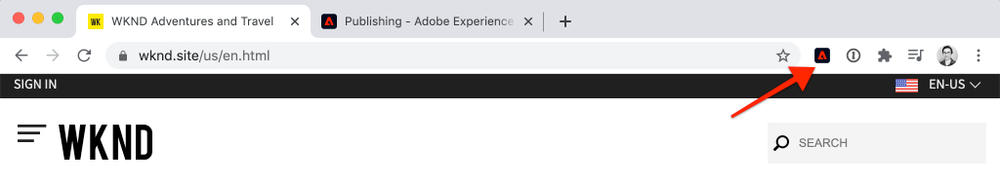
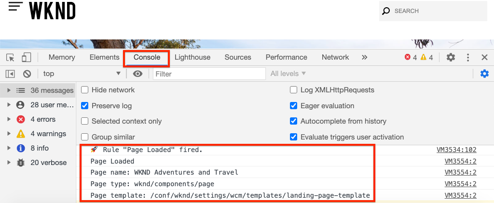

# Recopilación de datos de página con Adobe Analytics

Aprenda a utilizar las funciones integradas de la [capa de datos del cliente de Adobe con AEM componentes principales](https://docs.adobe.com/content/help/es-ES/experience-manager-core-components/using/developing/data-layer/overview.html) para recopilar datos sobre una página en Adobe Experience Manager Sites. [Experience Platform ](https://www.adobe.com/experience-platform/launch.html) Launchand the  [Adobe Analytics ](https://docs.adobe.com/content/help/en/launch/using/extensions-ref/adobe-extension/analytics-extension/overview.html) Extension se utilizará para crear reglas para enviar datos de página a Adobe Analytics.

## Qué va a generar


En este tutorial, activará una regla de inicio basada en un evento de la capa de datos del cliente de Adobe, agregará condiciones para cuándo se debe activar la regla y enviará a Adobe Analytics los **nombres de página** y **plantillas de página** de una página de AEM.

### Objetivos {#objective}

1. Cree una regla basada en eventos en Launch en función de los cambios en la capa de datos
1. Asignación de propiedades de capa de datos de página a elementos de datos en Launch
1. Recopilar datos de página y enviarlos a Adobe Analytics con la señalización de vista de página

## Requisitos previos

Se requiere lo siguiente:

* **Experience Platform** LaunchProperty
* **Adobe** Analytics, ID del grupo de informes y servidor de seguimiento. Consulte la siguiente documentación para [crear un nuevo grupo de informes](https://docs.adobe.com/content/help/en/analytics/admin/manage-report-suites/new-report-suite/new-report-suite.html).
* [Experience Platform ](https://docs.adobe.com/content/help/en/platform-learn/tutorials/data-ingestion/web-sdk/introduction-to-the-experience-platform-debugger.html) Debuggerextensión del explorador. Capturas de pantalla de este tutorial capturadas en el navegador Chrome.
* (Opcional) AEM sitio con la [capa de datos del cliente de Adobe habilitada](https://docs.adobe.com/content/help/en/experience-manager-core-components/using/developing/data-layer/overview.html#installation-activation). Este tutorial usará el sitio público [https://wknd.site/us/en.html](https://wknd.site/us/en.html) pero le recomendamos que utilice su propio sitio.

>[!NOTE]
>
> ¿Necesita ayuda para integrar Launch y su sitio AEM? [Consulte esta serie](../experience-platform-launch/overview.md) de vídeos.

## Cambiar Entornos de inicio para el sitio WKND

[https://wknd.](https://wknd.site) site es un sitio público creado en base a  [un ](https://github.com/adobe/aem-guides-wknd) proyecto de código abierto diseñado como referencia y  [](https://docs.adobe.com/content/help/en/experience-manager-learn/getting-started-wknd-tutorial-develop/overview.html) tutorial para implementaciones de AEM.

En lugar de configurar un entorno AEM e instalar la base de código WKND, puede utilizar el depurador de Experience Platform para **cambiar** la [https://wknd.site/](https://wknd.site/) activa a *su* Propiedad de inicio. Por supuesto, puede usar su propio sitio AEM si ya tiene habilitada la [capa de datos del cliente de Adobe](https://docs.adobe.com/content/help/en/experience-manager-core-components/using/developing/data-layer/overview.html#installation-activation)

1. Inicie sesión en Experience Platform Launch y [cree una propiedad de inicio](https://docs.adobe.com/content/help/en/core-services-learn/implementing-in-websites-with-launch/configure-launch/launch.html) (si aún no lo ha hecho).
1. Asegúrese de que se haya creado una biblioteca de inicio [inicial](https://docs.adobe.com/content/help/en/launch/using/reference/publish/libraries.html#create-a-library) y se haya promocionado a un entorno de inicio [a3/>.](https://docs.adobe.com/content/help/en/launch/using/reference/publish/environments.html)
1. Copie el código incrustado de lanzamiento del entorno en el que se ha publicado la biblioteca.

   

1. En el explorador, abra una nueva ficha y vaya a [https://wknd.site/](https://wknd.site/)
1. Abrir la extensión del explorador Experience Platform Debugger

   

1. Vaya a **Iniciar** > **Configuración** y debajo de **Códigos incrustados insertados** reemplazar el código incrustado de lanzamiento existente por *su* código incrustado copiado del paso 3.

   

1. Habilite **Registro de consola** y **Bloquear** el depurador en la ficha WKND.

   

## Verificar la capa de datos del cliente Adobe en el sitio WKND

El [proyecto de referencia WKND](https://github.com/adobe/aem-guides-wknd) se ha creado con AEM componentes principales y tiene la [capa de datos del cliente de Adobe habilitada](https://docs.adobe.com/content/help/en/experience-manager-core-components/using/developing/data-layer/overview.html#installation-activation) de forma predeterminada. A continuación, compruebe que la capa de datos del cliente de Adobe está habilitada.

1. Vaya a [https://wknd.site](https://wknd.site).
1. Abra las herramientas de desarrollador del explorador y vaya a la **Consola**. Ejecute el siguiente comando:

   ```js
   adobeDataLayer.getState();
   ```

   Esto devuelve el estado actual de la capa de datos del cliente de Adobe.

   

1. Expanda la respuesta e inspeccione la entrada `page`. Debería ver un esquema de datos como el siguiente:

   ```json
   page-2eee4f8914:
       @type: "wknd/components/page"
       dc:description: "WKND is a collective of outdoors, music, crafts, adventure sports, and travel enthusiasts that want to share our experiences, connections, and expertise with the world."
       dc:title: "WKND Adventures and Travel"
       repo:modifyDate: "2020-08-31T21:02:21Z"
       repo:path: "/content/wknd/us/en.html"
       xdm:language: "en-US"
       xdm:tags: ["Attract"]
       xdm:template: "/conf/wknd/settings/wcm/templates/landing-page-template"
   ```

   Utilizaremos propiedades estándar derivadas del [esquema de página](https://docs.adobe.com/content/help/en/experience-manager-core-components/using/developing/data-layer/overview.html#page), `dc:title`, `xdm:language` y `xdm:template` de la capa de datos para enviar datos de página a Adobe Analytics.

   >[!NOTE]
   >
   > ¿No ve el objeto `adobeDataLayer` javascript? Asegúrese de que la [capa de datos del cliente de Adobe esté habilitada](https://docs.adobe.com/content/help/en/experience-manager-core-components/using/developing/data-layer/overview.html#installation-activation) en su sitio.

## Crear una regla de página cargada

La capa de datos del cliente de Adobe es una capa de datos controlada por **evento**. Cuando se carga la capa de datos AEM **Page**, se desencadena un evento `cmp:show`. Cree una regla que se activará según el evento `cmp:show`.

1. Vaya al Experience Platform Launch y a la propiedad Web integrada con el sitio AEM.
1. Vaya a la sección **Reglas** en la interfaz de usuario de Launch y, a continuación, haga clic en **Crear nueva regla**.

   

1. Asigne un nombre a la regla **Página cargada**.
1. Haga clic en **Eventos** **Añadir** para abrir el asistente para **Configuración de Evento**.
1. En **Tipo de evento** seleccione **Código personalizado**.

   

1. Haga clic en **Abrir editor** en el panel principal e introduzca el siguiente fragmento de código:

   ```js
   var pageShownEventHandler = function(evt) {
      // defensive coding to avoid a null pointer exception
      if(evt.hasOwnProperty("eventInfo") && evt.eventInfo.hasOwnProperty("path")) {
         //trigger Launch Rule and pass event
         console.debug("cmp:show event: " + evt.eventInfo.path);
         var event = {
            //include the path of the component that triggered the event
            path: evt.eventInfo.path,
            //get the state of the component that triggered the event
            component: window.adobeDataLayer.getState(evt.eventInfo.path)
         };
   
         //Trigger the Launch Rule, passing in the new `event` object
         // the `event` obj can now be referenced by the reserved name `event` by other Launch data elements
         // i.e `event.component['someKey']`
         trigger(event);
      }
   }
   
   //set the namespace to avoid a potential race condition
   window.adobeDataLayer = window.adobeDataLayer || [];
   //push the event listener for cmp:show into the data layer
   window.adobeDataLayer.push(function (dl) {
      //add event listener for `cmp:show` and callback to the `pageShownEventHandler` function
      dl.addEventListener("cmp:show", pageShownEventHandler);
   });
   ```

   El fragmento de código anterior agregará un detector de eventos [insertando una función](https://github.com/adobe/adobe-client-data-layer/wiki#pushing-a-function) en la capa de datos. Cuando se activa el evento `cmp:show`, se llama a la función `pageShownEventHandler`. En esta función se agregan algunas comprobaciones de integridad y se construye un nuevo `event` con el estado más reciente [de la capa de datos](https://github.com/adobe/adobe-client-data-layer/wiki#getstate) para el componente que activó el evento.

   Después de llamar a `trigger(event)`. `trigger()` es un nombre reservado en Launch y &quot;activará&quot; la regla de inicio. Pasamos el objeto `event` como parámetro que, a su vez, será expuesto por otro nombre reservado en Launch denominado `event`. Los elementos de datos de Launch ahora pueden hacer referencia a varias propiedades como, por ejemplo: `event.component['someKey']`.

1. Guarde los cambios.
1. A continuación, en **Acciones** haga clic en **Añadir** para abrir el asistente para **Configuración de acción**.
1. En **Tipo de acción** elija **Código personalizado**.

   

1. Haga clic en **Abrir editor** en el panel principal e introduzca el siguiente fragmento de código:

   ```js
   console.debug("Page Loaded ");
   console.debug("Page name: " + event.component['dc:title']);
   console.debug("Page type: " + event.component['@type']);
   console.debug("Page template: " + event.component['xdm:template']);
   ```

   El objeto `event` se pasa desde el método `trigger()` al que se llama en el evento personalizado. `component` es la página actual derivada de la capa de datos  `getState` en el evento personalizado. Recuerde desde antes el [esquema de página](https://docs.adobe.com/content/help/en/experience-manager-core-components/using/developing/data-layer/overview.html#page) expuesto por la capa de datos para ver las distintas claves expuestas fuera del cuadro.

1. Guarde los cambios y ejecute una [compilación](https://docs.adobe.com/content/help/en/launch/using/reference/publish/builds.html) en Launch para promocionar el código al [entorno](https://docs.adobe.com/content/help/en/launch/using/reference/publish/environments.html) utilizado en el sitio AEM.

   >[!NOTE]
   >
   > Puede resultar muy útil utilizar el [Adobe Experience Platform Debugger](https://docs.adobe.com/content/help/en/platform-learn/tutorials/data-ingestion/web-sdk/introduction-to-the-experience-platform-debugger.html) para cambiar el código incrustado a un entorno **Development**.

1. Vaya a su sitio AEM y abra las herramientas para desarrolladores para realizar la vista de la consola. Actualice la página y debe ver que se han registrado los mensajes de la consola:

   

## Crear elementos de datos

A continuación, cree varios elementos de datos para capturar diferentes valores de la capa de datos del cliente de Adobe. Como se vio en el ejercicio anterior, se puede acceder directamente a las propiedades de la capa de datos a través de código personalizado. La ventaja de utilizar elementos de datos es que se pueden reutilizar en las reglas de lanzamiento.

Recuerde desde antes el [esquema de página](https://docs.adobe.com/content/help/en/experience-manager-core-components/using/developing/data-layer/overview.html#page) expuesto por la capa de datos:

Los elementos de datos se asignarán a las propiedades `@type`, `dc:title` y `xdm:template`.

### Tipo de recurso de componente

1. Vaya al Experience Platform Launch y a la propiedad Web integrada con el sitio AEM.
1. Vaya a la sección **Elementos de datos** y haga clic en **Crear nuevo elemento de datos**.
1. Para **Nombre** ingrese **Tipo de recurso de componente**.
1. Para **Tipo de elemento de datos** seleccione **Código personalizado**.

   

1. Haga clic en **Abrir editor** e introduzca lo siguiente en el editor de código personalizado:

   ```js
   if(event && event.component && event.component.hasOwnProperty('@type')) {
       return event.component['@type'];
   }
   ```

   Guarde los cambios.

   >[!NOTE]
   >
   > Recuerde que el objeto `event` está disponible y tiene un ámbito basado en el evento que activó la **Regla** en Launch. El valor de un elemento de datos no se establece hasta que el elemento de datos se *hace referencia a* dentro de una regla. Por lo tanto, es seguro utilizar este elemento de datos dentro de una regla como la regla **Página cargada** creada en el paso anterior *pero* no sería seguro usar en otros contextos.

### Nombre de página

1. Haga clic en **Añadir elemento de datos**.
1. Para **Nombre** escriba **Nombre de la página**.
1. Para **Tipo de elemento de datos** seleccione **Código personalizado**.
1. Haga clic en **Abrir editor** e introduzca lo siguiente en el editor de código personalizado:

   ```js
   if(event && event.component && event.component.hasOwnProperty('dc:title')) {
       return event.component['dc:title'];
   }
   ```

   Guarde los cambios.

### Plantilla de la página

1. Haga clic en **Añadir elemento de datos**.
1. Para **Nombre** ingrese **Plantilla de página**.
1. Para **Tipo de elemento de datos** seleccione **Código personalizado**.
1. Haga clic en **Abrir editor** e introduzca lo siguiente en el editor de código personalizado:

   ```js
   if(event && event.component && event.component.hasOwnProperty('xdm:template')) {
       return event.component['xdm:template'];
   }
   ```

   Guarde los cambios.

1. Ahora debe tener tres elementos de datos como parte de la regla:

   

## Añadir la extensión de Analytics

A continuación, agregue la extensión de Analytics a la propiedad Launch. ¡Necesitamos enviar estos datos a algún lugar!

1. Vaya al Experience Platform Launch y a la propiedad Web integrada con el sitio AEM.
1. Vaya a **Extensiones** > **Catálogo**
1. Busque la extensión **Adobe Analytics** y haga clic en **Instalar**

   

1. En **Administración de biblioteca** > **Grupos de informes**, introduzca los ID de grupo de informes que desee utilizar con cada entorno de inicio.

   

   >[!NOTE]
   >
   > Está bien utilizar un grupo de informes para todos los entornos de este tutorial, pero en la vida real desea utilizar grupos de informes separados, como se muestra en la imagen siguiente

   >[!TIP]
   >
   >Se recomienda utilizar la opción *Administrar la biblioteca para mí* como configuración de Administración de biblioteca, ya que facilita la actualización de la biblioteca `AppMeasurement.js`.

1. Marque la casilla para habilitar **Usar Activity Map**.

   

1. En **General** > **Servidor de seguimiento**, ingrese su servidor de seguimiento, por ejemplo: `tmd.sc.omtrdc.net`. Especifique el servidor de seguimiento SSL si su sitio admite `https://`

   

1. Haga clic en **Guardar** para guardar los cambios.

## Añadir una condición en la regla de página cargada

A continuación, actualice la regla **Página cargada** para utilizar el elemento de datos **Tipo de recurso de componente** a fin de garantizar que la regla se active únicamente cuando el evento `cmp:show` sea para la **Página**. Otros componentes pueden activar el evento `cmp:show`; por ejemplo, el componente Carrusel lo activará cuando cambien las diapositivas. Por lo tanto, es importante agregar una condición para esta regla.

1. En la interfaz de usuario de Launch, vaya a la regla **Página cargada** creada anteriormente.
1. En **Condiciones** haga clic en **Añadir** para abrir el asistente para **Configuración de condición**.
1. Para **Tipo de condición** seleccione **Comparación de valores**.
1. Establezca el primer valor del campo de formulario en `%Component Resource Type%`. Puede utilizar el icono del elemento de datos  para seleccionar el elemento de datos **Tipo de recurso de componente**. Deje el comparador establecido en `Equals`.
1. Establezca el segundo valor en `wknd/components/page`.

   

   >[!NOTE]
   >
   > Es posible agregar esta condición dentro de la función de código personalizado que escucha el evento `cmp:show` creado anteriormente en el tutorial. Sin embargo, agregarla dentro de la interfaz de usuario proporciona más visibilidad a los usuarios adicionales que podrían necesitar realizar cambios en la regla. Además, podemos usar nuestro elemento de datos.

1. Guarde los cambios.

## Establecer variables de Analytics y activar la señalización de Vista de página

Actualmente, la regla **Página cargada** simplemente genera una sentencia de consola. A continuación, utilice los elementos de datos y la extensión de Analytics para establecer las variables de Analytics como una **acción** en la regla **Página cargada**. También configuraremos una acción adicional para activar la **señalización de Vista de página** y enviar los datos recopilados a Adobe Analytics.

1. En la regla **Página cargada** **eliminar** la acción **Core - Custom Code** (las sentencias de la consola):

   

1. En Acciones, haga clic en **Añadir** para agregar una nueva acción.
1. Configure el tipo **Extension** en **Adobe Analytics** y establezca el **Tipo de acción** en **Establecer variables**

   

1. En el panel principal, seleccione un **eVar** disponible y defina como el valor del elemento de datos **Plantilla de página**. Utilice el icono Elementos de datos  para seleccionar el elemento **Plantilla de página**.

   

1. Desplácese hacia abajo, en **Configuración adicional** establezca **Nombre de página** en el elemento de datos **Nombre de página**:

   

   Guarde los cambios.

1. A continuación, agregue una acción adicional a la derecha del icono **Adobe Analytics - Establecer variables** tocando el icono **más**:

   

1. Establezca el tipo **Extension** en **Adobe Analytics** y establezca el **Tipo de acción** en **Send Beacon**. Dado que esto se considera una vista de página, deje el seguimiento predeterminado establecido en **`s.t()`**.

   

1. Guarde los cambios. La regla **Página cargada** ahora debe tener la siguiente configuración:

   

   * **1.** Escucha el  `cmp:show` evento.
   * **2.** Compruebe que la página activó el evento.
   * **3.** Establecer variables de Analytics para el nombre  **de** página y la plantilla  **de página**
   * **4.** Envío de la señalización de Vista de página de Analytics
1. Guarde todos los cambios y cree su biblioteca de Launch, promocionándola al Entorno adecuado.

## Validar la señalización de Vista de página y la llamada de Analytics

Ahora que la regla **Página cargada** envía la señalización de Analytics, debería poder ver las variables de seguimiento de Analytics mediante el depurador de Experience Platform.

1. Abra el [sitio WKND](https://wknd.site/us/en.html) en su explorador.
1. Haga clic en el icono del depurador  para abrir el depurador de Experience Platform.
1. Asegúrese de que el depurador está asignando la propiedad Launch a *el entorno de desarrollo*, como se ha descrito anteriormente, y **Registro de consola** está marcado.
1. Abra el menú Análisis y compruebe que el grupo de informes esté establecido en *su grupo de informes*. El nombre de la página también debe rellenarse:

   

1. Desplácese hacia abajo y expanda **Solicitudes de red**. Debería poder encontrar el **conjunto evar** para la **Plantilla de página**:

   

1. Vuelva al explorador y abra la consola de desarrollador. Haga clic en el **Carrusel** en la parte superior de la página.

   

1. Observe en la consola del navegador la sentencia console:

   

   Esto se debe a que el Carrusel activa un evento `cmp:show` *pero* debido a la comprobación del **Tipo de recurso de componente**, no se activa ningún evento.

   >[!NOTE]
   >
   > Si no ve ningún registro de consola, asegúrese de que **Registro de consola** está marcado en **Iniciar** en el depurador de Experience Platform.

1. Vaya a una página de artículos como [Australia Occidental](https://wknd.site/us/en/magazine/western-australia.html). Observe el cambio de Nombre de página y Tipo de plantilla.

## Felicitaciones!

Usted acaba de utilizar la capa de datos y el Experience Platform Launch de Adobe Client y el nivel de datos de evento para recopilar datos de páginas de datos de un sitio AEM y enviarlos a Adobe Analytics.

### Próximos pasos

Consulte el siguiente tutorial para aprender a utilizar la capa de datos del cliente de Adobe controlada por eventos para [rastrear clics de componentes específicos en un sitio de Adobe Experience Manager](track-clicked-component.md).
