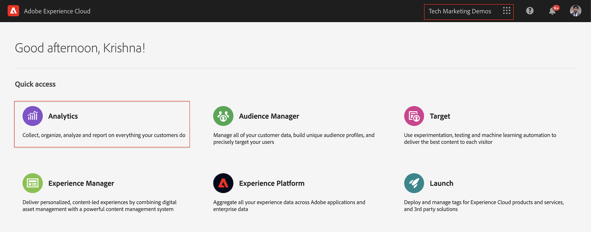

# Analizar datos con Analysis Workspace

Obtenga información sobre cómo asignar datos capturados desde un sitio de Adobe Experience Manager a métricas y dimensiones en grupos de informes de Adobe Analytics. Aprenda a crear un panel de sistema de informes detallado con la función Analysis Workspace de Adobe Analytics.

## Qué va a generar

El equipo de mercadotecnia de WKND desea saber qué botones de Llamada a acción (CTA) funcionan mejor en la página de inicio. En este tutorial, crearemos un nuevo proyecto en Analysis Workspace para visualizar el rendimiento de los distintos botones de llamada a acción y comprender el comportamiento del usuario en el sitio. La siguiente información se captura mediante Adobe Analytics cuando un usuario hace clic en un botón Llamada a acción (CTA) en la página de inicio WKND.

**Variables de Analytics**

A continuación se muestran las variables de Analytics que se están rastreando actualmente:

* `eVar5` -  `Page template`
* `eVar6` - `Page Id`
* `eVar7` - `Page last modified date`
* `eVar8` - `CTA Button Id`
* `eVar9` - `Page Name`
* `event8` - `CTA Button Click event`
* `prop8` - `CTA Button Id`

### Objetivos {#objective}

1. Cree un nuevo grupo de informes o utilice uno existente.
1. Configure las variables [de conversión (eVars)](https://docs.adobe.com/content/help/en/analytics/admin/admin-tools/conversion-variables/conversion-var-admin.html) y los Eventos de [éxito (Eventos)](https://docs.adobe.com/help/en/analytics/admin/admin-tools/success-events/success-event.html) en el grupo de informes.
1. Cree un proyecto [de](https://docs.adobe.com/content/help/en/analytics/analyze/analysis-workspace/home.html) Analysis Workspace para analizar los datos con la ayuda de herramientas que le permitan generar, analizar y compartir perspectivas rápidamente.
1. Comparta el proyecto de Analysis Workspace con otros integrantes del equipo.

## Requisitos previos

Este tutorial es una continuación del componente en el que se hace clic en [Seguimiento con Adobe Analytics](./track-clicked-component.md) y supone que:

* Una propiedad **** Launch con la extensión  Adobe Analytics activada
* **ID del grupo de informes de prueba/desarrollo de Adobe Analytics** y servidor de seguimiento. Consulte la siguiente documentación para [crear un nuevo grupo](https://docs.adobe.com/content/help/en/analytics/admin/manage-report-suites/new-report-suite/new-report-suite.html)de informes.
* [Extensión del navegador Experience Platform Debugger](https://docs.adobe.com/content/help/en/platform-learn/tutorials/data-ingestion/web-sdk/introduction-to-the-experience-platform-debugger.html) configurada con la propiedad Launch cargada en [https://wknd.site/us/en.html](https://wknd.site/us/en.html) o un sitio AEM con la capa de datos de Adobe activada.

## Variables de conversión (eVars) y Eventos de éxito (Evento)

La variable de conversión de Custom Insight (o eVar) se coloca en el código de Adobe de las páginas web seleccionadas del sitio. Su principal propósito es segmentar las métricas de éxito de conversión en los informes de marketing personalizados. Un eVar puede basarse en visitas y funcionar de manera similar a las cookies. Los valores pasados a variables de eVar siguen al usuario durante un período predeterminado.

Cuando un eVar se establece en el valor de un visitante, Adobe recuerda automáticamente ese valor hasta que caduque. Los eventos de éxito que un visitante encuentra mientras el valor de eVar está activo se cuentan en el valor de eVar.

Las eVars se utilizan mejor para medir la causa y el efecto, como por ejemplo:

* Qué campañas internas influyeron en los ingresos
* ¿Qué publicidades de titular resultaron en definitiva en un registro?
* El número de veces que se utilizó una búsqueda interna antes de realizar un pedido

Los eventos de éxito son acciones que se pueden rastrear. Usted determina qué es un evento de éxito. Por ejemplo, si un visitante hace clic en un botón de llamada a acción, el evento de clic podría considerarse un evento de éxito.

### Configurar eVars

1. En la página de inicio de Adobe Experience Cloud, seleccione su organización e inicie Adobe Analytics.

   

1. En la barra de herramientas de Analytics, haga clic en **Administración** > Grupos **de** informes y busque el grupo de informes.

   

1. Seleccione Grupo de informes > **Editar configuración** > **Conversión** > Variables **de conversión**

   

1. Con la opción **Añadir nuevo** , creemos variables de conversión para asignar el esquema como se muestra a continuación:

   * `eVar5` -  `Page Template`
   * `eVar6` - `Page ID`
   * `eVar7` - `Last Modified Date`
   * `eVar8` - `Button Id`
   * `eVar9` - `Page Name`

   

1. Proporcione un nombre y una descripción adecuados para cada eVar y **guarde** los cambios. Utilizaremos estas eVars para crear un proyecto de Analysis Workspace en la siguiente sección. Por lo tanto, un nombre sencillo hace que las variables se puedan descubrir fácilmente.

   

### Configurar Eventos de éxito

A continuación, crearemos un evento para rastrear el clic del botón de llamada a acción.

1. En la ventana Administrador **de grupos de** informes, seleccione la ID **de grupo de** informes y haga clic en **Editar configuración**.
1. Haga clic en **Conversión** > Eventos **de éxito**
1. Con la opción **Añadir nuevo** , cree un nuevo evento de éxito personalizado para rastrear el clic del botón de llamada a acción y luego **Guardar** los cambios.
   * `Event` : `event8`
   * `Name`:`CTA Click`
   * `Type`:`Counter`

   

## Crear un nuevo proyecto en Analysis Workspace {#workspace-project}

Analysis Workspace es una herramienta de navegador flexible que le permite crear análisis y compartir perspectivas rápidamente. Mediante la interfaz de arrastrar y soltar, puede crear su análisis, agregar visualizaciones para dar vida a los datos, depurar un conjunto de datos, compartir y programar proyectos con cualquier persona de su organización.

A continuación, cree un nuevo [proyecto](https://docs.adobe.com/content/help/en/analytics/analyze/analysis-workspace/build-workspace-project/t-freeform-project.html) para crear un panel que analice el rendimiento de los botones de llamada a acción en todo el sitio.

1. En la barra de herramientas de Analytics, seleccione **Espacio de trabajo** y haga clic para **crear un nuevo proyecto**.

   

1. Elija si desea realizar el inicio de un proyecto **en** blanco o seleccione una de las plantillas prediseñadas, ya sea proporcionadas por Adobes o plantillas personalizadas creadas por su organización. Hay varias plantillas disponibles, según la análisis o el caso de uso que tenga en mente. [Obtenga más](https://docs.adobe.com/content/help/en/analytics/analyze/analysis-workspace/build-workspace-project/starter-projects.html) información sobre las distintas opciones de plantilla disponibles.

   En el proyecto de Workspace, se accede a los paneles, tablas, visualizaciones y componentes desde el carril izquierdo. Estos son los componentes básicos del proyecto.

   * **[Componentes](https://docs.adobe.com/content/help/en/analytics/analyze/analysis-workspace/components/analysis-workspace-components.html)** : Los componentes son dimensiones, métricas, segmentos o intervalos de fechas, todos los cuales se pueden combinar en una tabla improvisada para responder en inicio a la pregunta comercial. Asegúrese de familiarizarse con cada tipo de componente antes de sumergirse en su análisis. Una vez que haya dominado la terminología de los componentes, puede empezar a arrastrar y soltar para crear la análisis en una tabla improvisada.
   * **[Visualizaciones](https://docs.adobe.com/content/help/en/analytics/analyze/analysis-workspace/visualizations/freeform-analysis-visualizations.html)** : las visualizaciones, como una barra o un gráfico de líneas, se agregan a continuación sobre los datos para darle vida visual. En el carril del extremo izquierdo, seleccione el icono Visualizaciones del medio para ver la lista completa de visualizaciones disponibles.
   * **[Paneles](https://docs.adobe.com/content/help/en/analytics/analyze/analysis-workspace/panels/panels.html)** : un panel es una colección de tablas y visualizaciones. Puede acceder a los paneles desde el icono superior izquierdo del espacio de trabajo. Los paneles son útiles cuando desea organizar sus proyectos según períodos de tiempo, grupos de informes o casos de uso de análisis. Los siguientes tipos de panel están disponibles en Analysis Workspace:

   

### Añadir visualización de datos con Analysis Workspace

A continuación, cree una tabla para crear una representación visual de cómo interactúan los usuarios con los botones Llamada a acción (CTA) en la página de inicio del sitio WKND. Para crear una representación de este tipo, usemos los datos recopilados en el componente [Rastrear en el que se hizo clic con Adobe Analytics](./track-clicked-component.md). A continuación se ofrece un resumen rápido de los datos rastreados para las interacciones del usuario con los botones Llamada a acción del sitio WKND.

* `eVar5` -  `Page template`
* `eVar6` - `Page Id`
* `eVar7` - `Page last modified date`
* `eVar8` - `CTA Button Id`
* `eVar9` - `Page Name`
* `event8` - `CTA Button Click event`
* `prop8` - `CTA Button Id`

1. Arrastre y suelte el componente de dimensión **Página** en la tabla improvisada. Ahora debería poder realizar la vista de una visualización que muestre el Nombre de la página (eVar9) y las Vistas de la página correspondientes (Ocurrencias) mostradas en la tabla.

   

1. Arrastre y suelte la métrica **Llamada a acción: Clic** (evento8) en la métrica ocurrencias y sustitúyala. Ahora puede vista una visualización que muestre el Nombre de la página (eVar9) y el recuento correspondiente de eventos de clics de llamada a acción en una página.

   

1. Desglosemos la página por el tipo de plantilla. Seleccione la métrica de plantilla de página de los componentes y arrastre y suelte la métrica Plantilla de página en la dimensión Nombre de página. Ahora puede realizar la vista del nombre de página desglosado por el tipo de plantilla.

   * **Antes**

      

   * **Después**

      

1. Para comprender cómo los usuarios interactúan con los botones de llamada a acción cuando están en las páginas del sitio WKND, debemos desglosar aún más la métrica Plantilla de página agregando la métrica ID del botón (eVar8).

   

1. A continuación se muestra una representación visual del sitio WKND desglosada por su plantilla de página y desglosada por la interacción del usuario con los botones de acción de clics en el sitio WKND (CTA).

   

1. Puede reemplazar el valor de ID de botón por un nombre más sencillo de usar con las clasificaciones de Adobe Analytics. Puede obtener más información sobre cómo crear una clasificación para una métrica específica [aquí](https://docs.adobe.com/content/help/en/analytics/components/classifications/c-classifications.html). En este caso, tenemos una configuración de métrica de clasificación `Button Section (Button ID)` para `eVar8` que asigna la identificación del botón a un nombre práctico.

   

## Añadir clasificación a una variable analítica

### Clasificaciones de conversión

La clasificación de Analytics es una forma de categorizar los datos de variables de Analytics y, a continuación, mostrar los datos de diferentes maneras cuando se generan informes. Para mejorar la forma en que se muestra el ID de botón en el informe Espacio de trabajo de Analytics, creemos una variable de clasificación para el Id de botón (eVar8). Al clasificar, se establece una relación entre la variable y los metadatos relacionados con esa variable.

A continuación, crearemos una variable Clasificación para Analytics.

1. En el menú de la barra de herramientas **Administración** , seleccione Grupos **de informes**
1. Seleccione la ID **del grupo de** informes en la ventana Administrador **de grupos de** informes y haga clic en **Editar configuración** > **Conversión** > Clasificaciones **de conversión**

   

1. En la lista desplegable **Seleccionar tipo** de clasificación, seleccione la variable (ID de botón de eVar8) para agregar una clasificación.
1. Haga clic en la flecha situada junto a la variable Clasificación que aparece en la sección Clasificaciones para agregar una nueva clasificación.

   

1. En el cuadro de diálogo **Editar una clasificación** , proporcione un nombre adecuado para la clasificación de texto. Se crea un componente de dimensión con el nombre Clasificación de texto.

   

1. **Guarde** los cambios.

### Importador de clasificaciones

Utilice el importador para cargar clasificaciones en Adobe Analytics. También puede exportar los datos para actualizarlos antes de realizar una importación. Los datos que se importan con la herramienta de importación deben tener un formato específico. Adobe le ofrece la opción de descargar una plantilla de datos con todos los detalles de encabezado adecuados en un archivo de datos delimitado por tabuladores. Puede agregar los nuevos datos a esta plantilla y luego importar el archivo de datos en el explorador mediante FTP.

#### Plantilla de clasificación

Antes de importar las clasificaciones a los informes de marketing, puede descargar una plantilla que le ayude a crear un archivo de datos de clasificaciones. El archivo de datos utiliza las clasificaciones deseadas como encabezados de columna y, a continuación, organiza el conjunto de datos de sistema de informes bajo los encabezados de clasificación correspondientes.

A continuación, descarguemos la plantilla de clasificación para la variable de ID de botón (eVar8)

1. Vaya a **Administración** > Importador **de clasificaciones**
1. Vamos a descargar una plantilla de clasificación para la variable de conversión desde la ficha **Descargar plantilla** .
   

1. En la ficha Descargar plantilla, especifique la configuración de la plantilla de datos.
   * **Seleccionar grupo** de informes: Seleccione el grupo de informes que desee utilizar en la plantilla. El grupo de informes y el conjunto de datos deben coincidir.
   * **Conjunto de datos para clasificar** : Seleccione el tipo de datos para el archivo de datos. El menú incluye todos los informes de los grupos de informes configurados para las clasificaciones.
   * **Codificación** : Seleccione la codificación de caracteres para el archivo de datos. El formato de codificación predeterminado es UTF-8.

1. Haga clic en **Descargar** y guarde el archivo de plantilla en el sistema local. El archivo de plantilla es un archivo de datos delimitado por tabuladores (extensión de nombre de archivo .tab) que admite la mayoría de las aplicaciones de hoja de cálculo.
1. Abra el archivo de datos delimitado por tabuladores con un editor de su elección.
1. Añada la ID del botón (eVar9) y el nombre del botón correspondiente al archivo delimitado por tabuladores para cada valor de eVar9 del paso 9 de la sección.

   

1. **Guarde** el archivo delimitado por tabuladores.
1. Vaya a la ficha **Importar archivo** .
1. Configure el destino para la importación de archivos.
   * **Seleccionar grupo** de informes: AEM del sitio WKND (grupo de informes)
   * **Conjunto de datos para clasificar** : Id De Botón (eVar De La Variable De Conversión8)
1. Haga clic en la opción **Elegir archivo** para cargar el archivo delimitado por tabuladores del sistema y, a continuación, haga clic en **Importar archivo**

   

   >[!NOTE]
   >
   > Una importación correcta muestra inmediatamente los cambios correspondientes en una exportación. Sin embargo, los cambios de datos en los informes tardan hasta cuatro horas cuando se utiliza una importación mediante explorador y hasta 24 horas cuando se utiliza una importación mediante FTP.

#### Reemplazar la variable de conversión con la variable de clasificación

1. En la barra de herramientas de Analytics, seleccione **Espacio de trabajo** y abra el espacio de trabajo que hemos creado en la sección [Crear un nuevo proyecto en Analysis Workspace](#workspace-project) de este tutorial.

   

1. A continuación, reemplace la métrica **Id** de botón en su espacio de trabajo que muestra el ID de un botón Llamada a acción (CTA) por el nombre de clasificación creado en el paso anterior.

1. Desde el buscador de componentes, busque los botones **** WKND CTA y arrastre y suelte la dimensión **WKND CTA Buttons (Button Id)** en la métrica Button Id y sustitúyala.

   * **Antes**

      
   * **Después**

      

1. Puede observar que la métrica Id. de botón que contenía la identificación de botón de un botón Llamada a acción (CTA) ahora se reemplaza por un nombre correspondiente proporcionado en la Plantilla de clasificación.
1. Comparemos la tabla Espacio de trabajo de Analytics con la Página de inicio WKND y comprendamos el recuento de clics del botón CTA y su análisis. Según los datos de la tabla improvisada del espacio de trabajo, es evidente que 22 veces los usuarios han hecho clic en el botón **SKI NOW** y cuatro veces en el botón WKND Página de inicio Camping en el oeste de Australia **Leer más** .

   

1. Asegúrese de guardar el proyecto de Adobe Analytics Workspace y proporcione un nombre y una descripción adecuados. Opcionalmente, puede agregar etiquetas a un proyecto de área de trabajo.

   

1. Después de guardar correctamente el proyecto, puede compartir el proyecto del área de trabajo con otros compañeros de trabajo o compañeros de equipo mediante la opción Compartir.

   

## Felicitaciones!

Acaba de aprender a asignar datos capturados desde un sitio de Adobe Experience Manager a métricas y dimensiones en grupos de informes de Adobe Analytics, a realizar una clasificación para las métricas y a crear un panel de sistema de informes detallado mediante la función Analysis Workspace de Adobe Analytics.

