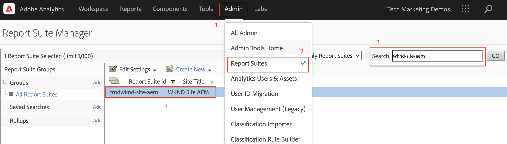

# Analizar datos con Analysis Workspace

Obtenga información sobre cómo asignar datos capturados desde un sitio de Adobe Experience Manager a métricas y dimensiones en grupos de informes de Adobe Analytics. Obtenga información sobre cómo crear un tablero de informes detallado mediante la función Analysis Workspace de Adobe Analytics.

## Qué va a generar

El equipo de marketing de WKND desea saber qué botones de Llamada a acción (CTA) funcionan mejor en la página principal. En este tutorial, crearemos un nuevo proyecto en Analysis Workspace para visualizar el rendimiento de diferentes botones de llamada a acción y comprender el comportamiento del usuario en el sitio. La siguiente información se captura mediante Adobe Analytics cuando un usuario hace clic en un botón de Llamada a acción (CTA) de la página principal de WKND.

**Variables de Analytics**

A continuación se muestran las variables de Analytics de las que se está realizando un seguimiento:

* `eVar5` -  `Page template`
* `eVar6` - `Page Id`
* `eVar7` -  `Page last modified date`
* `eVar8` -  `CTA Button Id`
* `eVar9` -  `Page Name`
* `event8` -  `CTA Button Click event`
* `prop8` -  `CTA Button Id`

### Objetivos {#objective}

1. Cree un nuevo grupo de informes o utilice uno existente.
1. Configure [Variables de conversión (eVars)](https://docs.adobe.com/content/help/en/analytics/admin/admin-tools/conversion-variables/conversion-var-admin.html) y [Eventos de éxito (eventos)](https://docs.adobe.com/help/en/analytics/admin/admin-tools/success-events/success-event.html) en el grupo de informes.
1. Cree un [proyecto de Analysis Workspace](https://docs.adobe.com/content/help/en/analytics/analyze/analysis-workspace/home.html) para analizar los datos con las herramientas que le permiten crear, analizar y compartir perspectivas rápidamente.
1. Comparta el proyecto de Analysis Workspace con otros integrantes del equipo.

## Requisitos previos

Este tutorial es una continuación del componente [Seguimiento en el que se hizo clic con Adobe Analytics](./track-clicked-component.md) y supone que:

* Una **propiedad de Launch** con la [extensión de Adobe Analytics](https://docs.adobe.com/content/help/en/launch/using/extensions-ref/adobe-extension/analytics-extension/overview.html) habilitada
* **ID del grupo de informes y servidor de seguimiento de Adobe** Analytics/dev. Consulte la siguiente documentación para [crear un nuevo grupo de informes](https://docs.adobe.com/content/help/en/analytics/admin/manage-report-suites/new-report-suite/new-report-suite.html).
* [Extensión de explorador de Experience Platform ](https://docs.adobe.com/content/help/en/platform-learn/tutorials/data-ingestion/web-sdk/introduction-to-the-experience-platform-debugger.html) Debugger configurada con la propiedad de Launch cargada en  [https://wknd.site/us/en.](https://wknd.site/us/en.html) htmlor, un sitio de AEM con la capa de datos de Adobe habilitada.

## Variables de conversión (eVars) y eventos de éxito (evento)

La variable de conversión de perspectiva personalizada (o eVar) se coloca en el código de Adobe en las páginas web seleccionadas del sitio. Su principal propósito es segmentar las métricas de éxito de conversión en los informes de marketing personalizados. Una eVar puede basarse en visitas y funcionar de manera similar a las cookies. Los valores convertidos en variables eVar siguen al usuario durante un período predeterminado.

Cuando una eVar está establecida en el valor de un visitante, Adobe recuerda automáticamente ese valor hasta que caduque. Cualquier evento de éxito que encuentra un visitante mientras la eVar está activa se cuenta hacia el valor eVar.

La mejor manera de usar las eVars es medir causa y efecto, como:

* Qué campañas internas influyeron en los ingresos
* Qué anuncios de banner tuvieron como resultado final un registro
* El número de veces que se usó una búsqueda interna antes de realizar un pedido

Los eventos de éxito son acciones de las que se puede realizar un seguimiento. Usted determina qué es un evento de éxito. Por ejemplo, si un visitante hace clic en un botón de llamada a acción, el evento de clic podría considerarse un evento de éxito.

### Configurar eVars

1. En la página de inicio de Adobe Experience Cloud, seleccione su organización e inicie Adobe Analytics.

   

1. En la barra de herramientas de Analytics, haga clic en **Administración** > **Grupos de informes** y busque su grupo de informes.

   

1. Seleccione Grupo de informes > **Editar configuración** > **Conversión** > **Variables de conversión**

   

1. Con la opción **Add new**, creemos variables de conversión para asignar el esquema como se muestra a continuación:

   * `eVar5` -   `Page Template`
   * `eVar6` -  `Page ID`
   * `eVar7` -  `Last Modified Date`
   * `eVar8` -  `Button Id`
   * `eVar9` -  `Page Name`

   

1. Proporcione un nombre y una descripción adecuados para cada eVar y **Guarde** los cambios. Se utilizarán estas eVars para crear un proyecto de Analysis Workspace en la siguiente sección. Por lo tanto, un nombre descriptivo facilita el descubrimiento de las variables.

   

### Configurar eventos de éxito

A continuación, vamos a crear un evento para rastrear el clic en el botón de llamada a acción.

1. En la ventana **Administrador del grupo de informes**, seleccione **Report Suite Id** y haga clic en **Editar configuración**.
1. Haga clic en **Conversión** > **Eventos de éxito**
1. Con la opción **Agregar nuevo**, cree un nuevo evento de éxito personalizado para rastrear el clic del botón de llamada a acción y luego **Guardar** los cambios.
   * `Event` : `event8`
   * `Name`:`CTA Click`
   * `Type`:`Counter`

   

## Crear un nuevo proyecto en Analysis Workspace {#workspace-project}

Analysis Workspace es una herramienta de navegador flexible que le permite crear análisis y compartir perspectivas rápidamente. Con la interfaz de arrastrar y soltar, puede crear su análisis, agregar visualizaciones para dar vida a los datos, depurar un conjunto de datos, compartir y programar proyectos con cualquier persona de su organización.

A continuación, cree un nuevo [proyecto](https://docs.adobe.com/content/help/en/analytics/analyze/analysis-workspace/build-workspace-project/t-freeform-project.html) para crear un tablero que analice el rendimiento de los botones de llamada a acción en todo el sitio.

1. En la barra de herramientas de Analytics, seleccione **Workspace** y haga clic en **Crear un nuevo proyecto**.

   

1. Elija comenzar desde un **proyecto en blanco** o seleccionar una de las plantillas creadas previamente, proporcionadas por Adobe o plantillas personalizadas creadas por su organización. Hay varias plantillas disponibles, según el análisis o el caso de uso que tenga en mente. [Obtenga ](https://docs.adobe.com/content/help/en/analytics/analyze/analysis-workspace/build-workspace-project/starter-projects.html) más información sobre las distintas opciones de plantilla disponibles.

   En el proyecto de Workspace, se accede a paneles, tablas, visualizaciones y componentes desde el carril izquierdo. Estos son los componentes básicos del proyecto.

   * **[Componentes](https://docs.adobe.com/content/help/en/analytics/analyze/analysis-workspace/components/analysis-workspace-components.html)** : los componentes son dimensiones, métricas, segmentos o intervalos de fechas, todos los cuales se pueden combinar en una tabla improvisada para responder en inicio a sus preguntas comerciales. Asegúrese de familiarizarse con cada tipo de componente antes de sumergirse en su análisis. Una vez dominada la terminología de los componentes, puede empezar a arrastrar y soltar para crear el análisis en una tabla improvisada.
   * **[Visualizaciones](https://docs.adobe.com/content/help/en/analytics/analyze/analysis-workspace/visualizations/freeform-analysis-visualizations.html)** : las visualizaciones, como una barra o un gráfico de líneas, se agregan a continuación sobre los datos para darle vida visualmente. En el carril del extremo izquierdo, seleccione el icono Visualizaciones del medio para ver la lista completa de visualizaciones disponibles.
   * **[Paneles](https://docs.adobe.com/content/help/en/analytics/analyze/analysis-workspace/panels/panels.html)** : un panel es una colección de tablas y visualizaciones. Puede acceder a los paneles desde el icono superior izquierdo de Workspace. Los paneles son útiles cuando desea organizar sus proyectos según períodos de tiempo, grupos de informes o casos de uso de análisis. Los siguientes tipos de panel están disponibles en Analysis Workspace:

   

### Añadir visualización de datos con Analysis Workspace

A continuación, cree una tabla para crear una representación visual de cómo interactúan los usuarios con los botones de Llamada a acción (CTA) en la página de inicio del sitio WKND. Para crear una representación de este tipo, usemos los datos recopilados en el componente [Seguimiento en el que se hizo clic con Adobe Analytics](./track-clicked-component.md). A continuación se ofrece un resumen rápido de los datos rastreados para las interacciones del usuario con los botones de Llamada a acción del sitio WKND.

* `eVar5` -   `Page template`
* `eVar6` -  `Page Id`
* `eVar7` -  `Page last modified date`
* `eVar8` -  `CTA Button Id`
* `eVar9` -  `Page Name`
* `event8` -  `CTA Button Click event`
* `prop8` -  `CTA Button Id`

1. Arrastre y suelte el componente de dimensión **Página** en la tabla improvisada. Ahora debería poder ver una visualización que muestre el Nombre de página (eVar9) y las Vistas de página correspondientes (Ocurrencias) que se muestran dentro de la tabla.

   

1. Arrastre y suelte la métrica **CTA Click** (event8) en la métrica ocurrencias y sustitúyala. Ahora puede ver una visualización que muestre el Nombre de página (eVar9) y un recuento correspondiente de eventos de clics de llamada a acción en una página.

   

1. Desglosemos la página por página según su tipo de plantilla. Seleccione la métrica de plantilla de página de los componentes y arrastre y suelte la métrica Plantilla de página en la dimensión Nombre de página . Ahora puede ver el nombre de la página desglosado por su tipo de plantilla.

   * **Antes**

      

   * **Después**

      

1. Para comprender cómo interactúan los usuarios con los botones de llamada a acción cuando se encuentran en las páginas del sitio WKND, es necesario desglosar aún más la métrica Plantilla de página añadiendo la métrica ID de botón (eVar8).

   

1. A continuación, se muestra una representación visual del sitio WKND desglosada por su plantilla de página y desglosada por la interacción del usuario con los botones de acción clic (CTA) del sitio WKND.

   

1. Puede reemplazar el valor de ID de botón con un nombre más descriptivo mediante las clasificaciones de Adobe Analytics. Puede obtener más información sobre cómo crear una clasificación para una métrica específica [aquí](https://docs.adobe.com/content/help/en/analytics/components/classifications/c-classifications.html). En este caso, tenemos una configuración de métrica de clasificación `Button Section (Button ID)` para `eVar8` que asigna el id de botón a un nombre descriptivo.

   

## Agregar clasificación a una variable analítica

### Clasificaciones de conversión

La clasificación de Analytics permite aplicar categorías a los datos de variables de Analytics y mostrarlos de diferentes maneras cuando se generan los informes. Para mejorar el modo en que se muestra el ID de botón en el informe de Analysis Workspace, creemos una variable de clasificación para el Id de botón (eVar8). Al clasificar, se establece una relación entre la variable y los metadatos relacionados con ella.

A continuación, vamos a crear una clasificación para la variable de Analytics.

1. En el menú de la barra de herramientas **Administración**, seleccione **Grupos de informes**
1. Seleccione **Report Suite Id** en la ventana **Report Suite Manager** y haga clic en **Editar configuración** > **Conversión** > **Clasificaciones de conversión**

   

1. En la lista desplegable **Seleccionar tipo de clasificación**, seleccione la variable (ID de botón eVar8) para agregar una clasificación.
1. Haga clic en la flecha situada junto a la variable Clasificación que aparece en la sección Clasificaciones para agregar una nueva Clasificación.

   

1. En el cuadro de diálogo **Editar una clasificación**, proporcione un nombre adecuado para la clasificación de texto. Se crea un componente de dimensión con el nombre Clasificación de texto .

   

1. **** Guarde los cambios.

### Importador de clasificaciones

Utilice el importador para cargar clasificaciones en Adobe Analytics. También puede exportar los datos para actualizarlos antes de importarlos. Los datos que importe con la herramienta de importación deben tener un formato específico. Adobe le ofrece la opción de descargar una plantilla de datos con todos los detalles de encabezado correctos en un archivo de datos delimitado por tabuladores. Puede agregar los nuevos datos a esta plantilla y, a continuación, importar el archivo de datos en el explorador mediante FTP.

#### Plantilla de clasificación

Antes de importar clasificaciones a informes de marketing, puede descargar una plantilla que le ayude a crear un archivo de datos de clasificación. El archivo de datos utiliza sus clasificaciones deseadas como encabezados de columna y, a continuación, organiza el conjunto de datos de informes bajo los encabezados de clasificación adecuados.

A continuación, vamos a descargar la plantilla Clasificación para la variable Id de botón (eVar8)

1. Vaya a **Administración** > **Importador de clasificaciones**
1. Vamos a descargar una plantilla de clasificación para la variable de conversión desde la pestaña **Descargar plantilla**.
   

1. En la ficha Descargar plantilla , especifique la configuración de la plantilla de datos.
   * **Seleccionar grupo de informes** : Seleccione el grupo de informes que usará en la plantilla. El grupo de informes y el conjunto de datos deben coincidir.
   * **Conjunto de datos para clasificar** : Seleccione el tipo de datos del archivo de datos. El menú incluye todos los informes de los grupos de informes que están configurados para clasificaciones.
   * **Codificación** : Seleccione la codificación de caracteres del archivo de datos. El formato de codificación predeterminado es UTF-8.

1. Haga clic en **Descargar** y guarde el archivo de plantilla en el sistema local. El archivo de plantilla es un archivo de datos delimitado por tabuladores (con la extensión de nombre de archivo .tab ) compatible con la mayoría de las aplicaciones de hojas de cálculo.
1. Abra el archivo de datos delimitado por tabuladores con el editor que desee.
1. Agregue el ID de botón (eVar9) y un nombre de botón correspondiente al archivo delimitado por tabuladores para cada valor de eVar9 del paso 9 de la sección .

   

1. **** Guarde el archivo delimitado por tabuladores.
1. Vaya a la pestaña **Import File**.
1. Configure el destino para la importación de archivos.
   * **Seleccionar grupo de informes** : AEM (grupo de informes) del sitio WKND
   * **Conjunto de datos para clasificar** : Id De Botón (Variable De Conversión eVar8)
1. Haga clic en la opción **Elegir archivo** para cargar el archivo delimitado por tabuladores desde el sistema y, a continuación, haga clic en **Importar archivo**

   

   >[!NOTE]
   >
   > Una importación correcta muestra inmediatamente los cambios correspondientes en una exportación. Sin embargo, los cambios de datos en los informes pueden tardar hasta cuatro horas si utiliza una importación mediante explorador y hasta 24 horas si utiliza una importación mediante FTP.

#### Reemplazar la variable de conversión con la variable de clasificación

1. En la barra de herramientas de Analytics, seleccione **Workspace** y abra el espacio de trabajo que hemos creado en [Crear un nuevo proyecto en la sección Analysis Workspace](#workspace-project) de este tutorial.

   

1. A continuación, reemplace la métrica **Button Id** en su espacio de trabajo que muestra el ID de un botón de llamada a acción (CTA) con el nombre de clasificación creado en el paso anterior.

1. Desde el buscador de componentes, busque **Botones CTA de WKND** y arrastre y suelte la dimensión **Botones CTA de WKND (Id de botón)** en la métrica Id de botón y sustitúyala.

   * **Antes**

      
   * **Después**

      

1. Puede observar que la métrica Id de botón que contenía el id de botón de un botón Llamada a acción (CTA) ahora se ha sustituido por un nombre correspondiente proporcionado en la Plantilla de clasificación.
1. Vamos a comparar la tabla de Analysis Workspace con la página de inicio de WKND y comprender el recuento de clics de los botones de llamada a acción y su análisis. Según los datos de la tabla de forma libre del espacio de trabajo, está claro que 22 veces los usuarios han hecho clic en el botón **SKI Now** y cuatro veces en el botón Camping de la página principal de WKND en Australia Occidental **Leer más**.

   

1. Asegúrese de guardar el proyecto de Adobe Analytics Workspace y proporcione un nombre y una descripción adecuados. Si lo desea, puede agregar etiquetas a un proyecto de Workspace.

   

1. Después de guardar correctamente el proyecto, puede compartir el proyecto del espacio de trabajo con otros compañeros de trabajo o compañeros de equipo mediante la opción Compartir.

   

## Felicitaciones!

Acaba de aprender a asignar datos capturados de un sitio de Adobe Experience Manager a métricas y dimensiones en grupos de informes de Adobe Analytics, realizar una clasificación para las métricas y crear un tablero de informes detallado mediante la función Analysis Workspace de Adobe Analytics.

