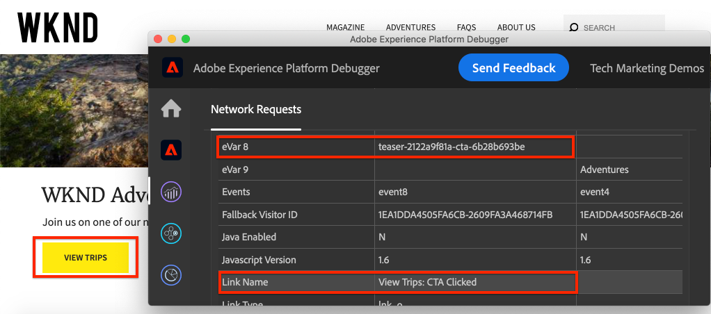

# Seguimiento del componente en el que se hizo clic con Adobe Analytics

Utilice la [capa de datos del cliente de Adobe impulsada por eventos con AEM componentes principales](https://experienceleague.adobe.com/docs/experience-manager-core-components/using/developing/data-layer/overview.html) para rastrear clics de componentes específicos en un sitio de Adobe Experience Manager. Obtenga información sobre cómo utilizar las reglas en Experience Platform Launch para detectar eventos de clic, filtrar por componente y enviar los datos a un Adobe Analytics con una señalización de seguimiento de vínculos.

## Qué va a generar

El equipo de marketing de WKND desea saber qué botones de Llamada a acción (CTA) tienen el mejor rendimiento en la página principal. En este tutorial, agregaremos una nueva regla en Experience Platform Launch que escuche los eventos `cmp:click` de los componentes **Teaser** y **Button** y envíe el ID del componente y un nuevo evento a Adobe Analytics junto con la señalización de seguimiento de vínculos.



### Objetivos {#objective}

1. Cree una regla impulsada por eventos en Launch basada en el evento `cmp:click` .
1. Filtre los diferentes eventos por tipo de recurso de componente.
1. Establezca el id de componente en el que se hizo clic y envíe Adobe Analytics de evento con la señalización de seguimiento de vínculos.

## Requisitos previos

Este tutorial es una continuación de [Collect page data with Adobe Analytics](./collect-data-analytics.md) y supone que:

* Una **propiedad de Launch** con la [extensión de Adobe Analytics](https://experienceleague.adobe.com/docs/experience-platform/tags/extensions/adobe/analytics/overview.html) habilitada
* **ID del grupo de informes y servidor de seguimiento de Adobe** Analytics/dev. Consulte la siguiente documentación para [crear un nuevo grupo de informes](https://experienceleague.adobe.com/docs/analytics/admin/manage-report-suites/new-report-suite/new-report-suite.html).
* [Experience Platform ](https://experienceleague.adobe.com/docs/debugger-learn/tutorials/experience-platform-debugger/introduction-to-the-experience-platform-debugger.html) Debugger extensión del explorador configurada con la propiedad Launch cargada en  [https://wknd.site/us/en.](https://wknd.site/us/en.html) htmlor y un sitio AEM con la capa de datos de Adobe habilitada.

## Esquema Botón y teaser de Inspect

Antes de crear reglas en Launch, es útil revisar el esquema [para Button y Teaser](https://experienceleague.adobe.com/docs/experience-manager-core-components/using/developing/data-layer/overview.html#item) e inspeccionarlos en la implementación de la capa de datos.

1. Vaya a [https://wknd.site/us/en.html](https://wknd.site/us/en.html)
1. Abra las herramientas para desarrolladores del explorador y vaya a la **Consola**. Ejecute el siguiente comando:

   ```js
   adobeDataLayer.getState();
   ```

   Esto devuelve el estado actual de la capa de datos del cliente de Adobe.

   

1. Expanda la respuesta y busque las entradas con el prefijo `button-` y `teaser-xyz-cta` . Debería ver un esquema de datos como el siguiente:

   Esquema de botón:

   ```json
   button-2e6d32893a:
       @type: "wknd/components/button"
       dc:title: "View All"
       parentId: "page-2eee4f8914"
       repo:modifyDate: "2020-07-11T22:17:55Z"
       xdm:linkURL: "/content/wknd/us/en/magazine.html"
   ```

   Esquema de teaser:

   ```json
   teaser-da32481ec8-cta-adf3c09db9:
       @type: "wknd/components/teaser/cta"
       dc:title: "Surf's Up"
       parentId: "teaser-da32481ec8"
       xdm:linkURL: "/content/wknd/us/en/magazine/san-diego-surf.html"
   ```

   Se basan en el [Esquema de elemento componente/contenedor](https://experienceleague.adobe.com/docs/experience-manager-core-components/using/developing/data-layer/overview.html#item). La regla que crearemos en Launch utilizará este esquema.

## Creación de una regla en la que se hizo clic en CTA

La capa de datos del cliente de Adobe es una capa de datos controlada por **evento**. Cuando se hace clic en cualquier componente principal, se envía un evento `cmp:click` a través de la capa de datos. A continuación, cree una regla para detectar el evento `cmp:click`.

1. Vaya al Experience Platform Launch y a la propiedad web integrada con el sitio AEM.
1. Vaya a la sección **Rules** de la interfaz de usuario de Launch y, a continuación, haga clic en **Agregar regla**.
1. Asigne a la regla el nombre **CTA Clic**.
1. Haga clic en **Events** > **Add** para abrir el asistente **Event Configuration**.
1. En **Tipo de evento** seleccione **Código personalizado**.

   

1. Haga clic en **Abrir editor** en el panel principal e introduzca el siguiente fragmento de código:

   ```js
   var componentClickedHandler = function(evt) {
      // defensive coding to avoid a null pointer exception
      if(evt.hasOwnProperty("eventInfo") && evt.eventInfo.hasOwnProperty("path")) {
         //trigger Launch Rule and pass event
         console.debug("cmp:click event: " + evt.eventInfo.path);
         var event = {
            //include the path of the component that triggered the event
            path: evt.eventInfo.path,
            //get the state of the component that triggered the event
            component: window.adobeDataLayer.getState(evt.eventInfo.path)
         };
   
         //Trigger the Launch Rule, passing in the new `event` object
         // the `event` obj can now be referenced by the reserved name `event` by other Launch data elements
         // i.e `event.component['someKey']`
         trigger(event);
      }
   }
   
   //set the namespace to avoid a potential race condition
   window.adobeDataLayer = window.adobeDataLayer || [];
   //push the event listener for cmp:click into the data layer
   window.adobeDataLayer.push(function (dl) {
      //add event listener for `cmp:click` and callback to the `componentClickedHandler` function
      dl.addEventListener("cmp:click", componentClickedHandler);
   });
   ```

   El fragmento de código anterior agregará un detector de eventos [insertando una función](https://github.com/adobe/adobe-client-data-layer/wiki#pushing-a-function) en la capa de datos. Cuando se activa el evento `cmp:click`, se llama a la función `componentClickedHandler` . En esta función se añaden algunas comprobaciones de coherencia y se construye un nuevo objeto `event` con el estado más reciente [de la capa de datos](https://github.com/adobe/adobe-client-data-layer/wiki#getstate) para el componente que activó el evento.

   Después de llamar a `trigger(event)`. `trigger()` es un nombre reservado en Launch y &quot;déclencheur&quot; de la regla de Launch. Pasamos el objeto `event` como parámetro que, a su vez, se expone con otro nombre reservado en Launch denominado `event`. Los elementos de datos de Launch ahora pueden hacer referencia a varias propiedades como esta: `event.component['someKey']`.

1. Guarde los cambios.
1. A continuación, en **Actions**, haga clic en **Add** para abrir el asistente **Action Configuration**.
1. En **Tipo de acción**, elija **Código personalizado**.

   

1. Haga clic en **Abrir editor** en el panel principal e introduzca el siguiente fragmento de código:

   ```js
   console.debug("Component Clicked");
   console.debug("Component Path: " + event.path);
   console.debug("Component type: " + event.component['@type']);
   console.debug("Component text: " + event.component['dc:title']);
   ```

   El objeto `event` se pasa desde el método `trigger()` llamado en el evento personalizado. `component` es el estado actual del componente derivado de la capa de datos  `getState` que activó el clic.

1. Guarde los cambios y ejecute una [compilación](https://experienceleague.adobe.com/docs/experience-platform/tags/publish/builds.html) en Launch para promocionar el código al [entorno](https://experienceleague.adobe.com/docs/experience-platform/tags/publish/environments/environments.html) utilizado en el sitio AEM.

   >[!NOTE]
   >
   > Puede resultar muy útil utilizar el [Adobe Experience Platform Debugger](https://experienceleague.adobe.com/docs/debugger-learn/tutorials/experience-platform-debugger/introduction-to-the-experience-platform-debugger.html) para cambiar el código incrustado a un entorno **Development**.

1. Vaya al [WKND Site](https://wknd.site/us/en.html) y abra las herramientas para desarrolladores para ver la consola. Seleccione **Mantener registro**.

1. Haga clic en uno de los botones de llamada a acción **Teaser** o **Button** para desplazarse a otra página.

   

1. Observe en la consola del desarrollador que la regla **CTA Clicked** se ha activado:

   

## Crear elementos de datos

A continuación, cree un elemento de datos para capturar el ID y el título del componente en el que se hizo clic. Recuerde que en el ejercicio anterior el resultado de `event.path` era algo similar a `component.button-b6562c963d` y el valor de `event.component['dc:title']` era algo así como &quot;Viaje&quot;.

### ID de componente

1. Vaya al Experience Platform Launch y a la propiedad web integrada con el sitio AEM.
1. Vaya a la sección **Data Elements** y haga clic en **Add New Data Element**.
1. Para **Name**, introduzca **Component ID**.
1. Para **Tipo de elemento de datos** seleccione **Código personalizado**.

   

1. Haga clic en **Abrir editor** e introduzca lo siguiente en el editor de código personalizado:

   ```js
   if(event && event.path && event.path.includes('.')) {
       // split on the `.` to return just the component ID
       return event.path.split('.')[1];
   }
   ```

   Guarde los cambios.

   >[!NOTE]
   >
   > Recuerde que el objeto `event` está disponible y tiene ámbitos según el evento que activó la **Regla** en Launch. El valor de un elemento de datos no se establece hasta que el elemento de datos esté *referenciado* dentro de una regla. Por lo tanto, es seguro utilizar este elemento de datos dentro de una regla como la regla **CTA Clicked** creada en el ejercicio anterior *pero* no sería seguro utilizar en otros contextos.

### Título de componente

1. Vaya a la sección **Data Elements** y haga clic en **Add New Data Element**.
1. Para **Name** introduzca **Component Title**.
1. Para **Tipo de elemento de datos** seleccione **Código personalizado**.
1. Haga clic en **Abrir editor** e introduzca lo siguiente en el editor de código personalizado:

   ```js
   if(event && event.component && event.component.hasOwnProperty('dc:title')) {
       return event.component['dc:title'];
   }
   ```

   Guarde los cambios.

## Añadir una condición a la regla de llamada a acción en la que se ha hecho clic

A continuación, actualice la regla **CTA Clicked** para asegurarse de que la regla solo se active cuando el evento `cmp:click` se active para un **teaser** o un **Button**. Dado que el CTA del teaser se considera un objeto independiente en la capa de datos, es importante comprobar el objeto principal para verificar que proviene de un teaser.

1. En la interfaz de usuario de Launch, vaya a la regla **Llamada a acción en la que se hizo clic** creada anteriormente.
1. En **Conditions** haga clic en **Agregar** para abrir el asistente **Configuración de la condición**.
1. Para **Tipo de condición** seleccione **Código personalizado**.

   

1. Haga clic en **Abrir editor** e introduzca lo siguiente en el editor de código personalizado:

   ```js
   if(event && event.component && event.component.hasOwnProperty('@type')) {
       // console.log("Event Type: " + event.component['@type']);
       //Check for Button Type OR Teaser CTA type
       if(event.component['@type'] === 'wknd/components/button' ||
          event.component['@type'] === 'wknd/components/teaser/cta') {
           return true;
       }
   }
   
   // none of the conditions are met, return false
   return false;
   ```

   El código anterior primero comprueba si el tipo de recurso era de un **Button** y, a continuación, comprueba si el tipo de recurso era de un CTA dentro de un **Teaser**.

1. Guarde los cambios.

## Establecimiento de variables de Analytics y señalización de vínculo de seguimiento de déclencheur

Actualmente, la regla **CTA Clicked** simplemente genera una sentencia de consola. A continuación, utilice los elementos de datos y la extensión de Analytics para establecer las variables de Analytics como **action**. También estableceremos una acción adicional para almacenar en déclencheur el **Track Link** y enviar los datos recopilados a Adobe Analytics.

1. En la **CTA Clic** regla **remove** la acción **Core - Custom Code** (las instrucciones de la consola):

   

1. En Acciones, haga clic en **Agregar** para agregar una nueva acción.
1. Establezca el tipo **Extension** en **Adobe Analytics** y establezca el **Tipo de acción** en **Establecer variables**.

1. Configure los siguientes valores para **eVars**, **Props** y **Events**:

   * `evar8` - `%Component ID%`
   * `prop8` -  `%Component ID%`
   * `event8`

   

   >[!NOTE]
   >
   > Aquí se utiliza `%Component ID%` ya que garantizará un identificador único para el CTA en el que se hizo clic. Una desventaja potencial del uso de `%Component ID%` es que el informe de Analytics contendrá valores como `button-2e6d32893a`. Usar `%Component Title%` daría un nombre más descriptivo, pero es posible que el valor no sea único.

1. A continuación, añada una acción adicional a la derecha de **Adobe Analytics - Set Variables** pulsando el icono **plus**:

   

1. Establezca el tipo **Extension** en **Adobe Analytics** y establezca el **Tipo de acción** en **Enviar señalización**.
1. En **Tracking** establezca el botón de opción en **`s.tl()`**.
1. En **Tipo de vínculo**, elija **Vínculo personalizado** y, en **Nombre del vínculo**, establezca el valor en: **`%Component Title%: CTA Clicked`**:

   

   Esto combinará la variable dinámica del elemento de datos **Component Title** y la cadena estática **CTA Click**.

1. Guarde los cambios. La regla **CTA en la que se hizo clic** debe tener ahora la siguiente configuración:

   

   * **1.** Escuche el  `cmp:click` evento.
   * **2.** Compruebe que el evento se activó mediante un  **** teaser  **de botones**.
   * **3.** Configure variables de Analytics para para que rastreen el  **ID de** componente como un  **eVar**, una  **prop** y un  **evento**.
   * **4.** Envíe la señalización del vínculo de seguimiento de Analytics (y  **** no la trate como una vista de página).

1. Guarde todos los cambios y cree la biblioteca de Launch, promociéndola al entorno adecuado.

## Validación de la señalización del vínculo de seguimiento y la llamada de Analytics

Ahora que la regla **CTA Click** envía la señalización de Analytics, debe poder ver las variables de seguimiento de Analytics mediante el depurador de Experience Platform.

1. Abra [WKND Site](https://wknd.site/us/en.html) en el explorador.
1. Haga clic en el icono de Debugger  para abrir Experience Platform Debugger.
1. Asegúrese de que Debugger asigne la propiedad de Launch a *su entorno de desarrollo*, tal como se describió anteriormente, y que **Registro de consola** esté marcado.
1. Abra el menú Analytics y compruebe que el grupo de informes esté establecido en *su grupo de informes*.

   

1. En el navegador, haga clic en uno de los botones de llamada a acción **Teaser** o **Button** para desplazarse a otra página.

   

1. Vuelva a Experience Platform Debugger y desplácese hacia abajo y amplíe **Solicitudes de red** > *Su grupo de informes*. Debe poder encontrar el conjunto **eVar**, **prop** y **evento**.

   

1. Vuelva al explorador y abra la consola del desarrollador. Vaya al pie de página del sitio y haga clic en uno de los vínculos de navegación:

   

1. Observe en la consola del explorador que el mensaje *&quot;Custom Code&quot; para la regla &quot;CTA Clicked&quot; no se ha cumplido*.

   Esto se debe a que el componente de navegación sí genera un déclencheur de un evento `cmp:click` *pero* debido a que comprobamos el valor de frente al tipo de recurso, no se realiza ninguna acción.

   >[!NOTE]
   >
   > Si no ve ningún registro de consola, asegúrese de que **Registro de consola** esté marcado en **Iniciar** en el depurador de Experience Platform.

## Felicitaciones!

Solo ha utilizado la capa de datos del cliente de Adobe impulsada por eventos y el Experience Platform Launch para rastrear clics de componentes específicos en un sitio de Adobe Experience Manager.