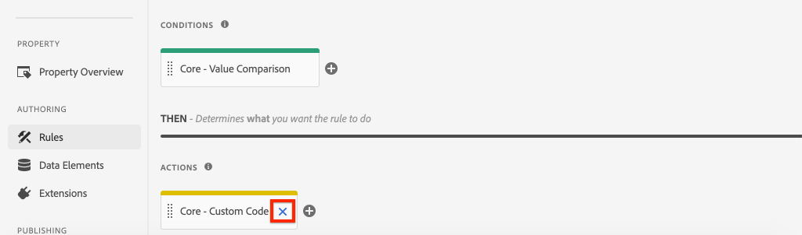

# Seguimiento de componentes en los que se hizo clic con Adobe Analytics

>[!NOTE]
>
>Adobe Experience Platform Launch se ha convertido en un conjunto de tecnologías de recopilación de datos en Adobe Experience Platform. Como resultado, se han implementado varios cambios terminológicos en la documentación del producto. Consulte lo siguiente [documento](https://experienceleague.adobe.com/docs/experience-platform/tags/term-updates.html) para obtener una referencia consolidada de los cambios terminológicos.

Utilizar la variable impulsada por eventos [Capa de datos del cliente de Adobe AEM con componentes principales de](https://experienceleague.adobe.com/docs/experience-manager-core-components/using/developing/data-layer/overview.html?lang=es) para rastrear clics de componentes específicos en un sitio de Adobe Experience Manager. Obtenga información sobre cómo utilizar las reglas en la propiedad tag para detectar eventos de clic, filtrar por componente y enviar los datos a un Adobe Analytics con una señalización de seguimiento de vínculos.

## Lo que va a generar {#what-build}

El equipo de marketing de WKND está interesado en saber cuál `Call to Action (CTA)` Los botones funcionan mejor en la página principal. En este tutorial, vamos a añadir una regla a la propiedad de etiqueta que escucha la `cmp:click` eventos de **Teaser** y **Botón** componentes. A continuación, envíe el ID de componente y un nuevo evento a Adobe Analytics junto con la señalización de seguimiento de vínculos.


### Objetivos {#objective}

1. Cree una regla impulsada por evento en la propiedad de etiqueta que capture el `cmp:click` evento.
1. Filtre los diferentes eventos por tipo de recurso de componente.
1. Establezca el ID de componente y envíe un evento a Adobe Analytics con la señalización de seguimiento de vínculos.

## Requisitos previos

Este tutorial es una continuación de [Recopilación de datos de página con Adobe Analytics](./collect-data-analytics.md) y supone que tiene lo siguiente:

* A **Propiedad de etiqueta** con el [Extensión de Adobe Analytics](https://experienceleague.adobe.com/docs/experience-platform/tags/extensions/client/analytics/overview.html) activado
* **Adobe Analytics** ID del grupo de informes de prueba/desarrollo y servidor de seguimiento. Consulte la siguiente documentación para [creación de un grupo de informes](https://experienceleague.adobe.com/docs/analytics/admin/admin-tools/manage-report-suites/c-new-report-suite/new-report-suite.html).
* [Experience Platform Debugger](https://experienceleague.adobe.com/docs/platform-learn/data-collection/debugger/overview.html) extensión del explorador configurada con la propiedad de etiqueta cargada en la [Sitio WKND](https://wknd.site/us/en.html) AEM o un sitio de con la capa de datos de Adobe habilitada.

## Inspect: Esquema de botón y teaser

Antes de crear reglas en la propiedad de etiqueta, resulta útil revisar la [para el botón y el teaser](https://experienceleague.adobe.com/docs/experience-manager-core-components/using/developing/data-layer/overview.html#item) e inspecciónelas en la implementación de la capa de datos.

1. Vaya a [Página de inicio de WKND](https://wknd.site/us/en.html)
1. Abra las herramientas para desarrolladores del explorador y vaya al **Consola**. Ejecute el siguiente comando:

   ```js
   adobeDataLayer.getState();
   ```

   El código anterior devuelve el estado actual de la capa de datos del cliente de Adobe.

   

1. Expanda la respuesta y busque las entradas con el prefijo `button-` y  `teaser-xyz-cta` entrada. Debería ver un esquema de datos como el siguiente:

   Esquema de botón:

   ```json
   button-2e6d32893a:
       @type: "wknd/components/button"
       dc:title: "View All"
       parentId: "page-2eee4f8914"
       repo:modifyDate: "2020-07-11T22:17:55Z"
       xdm:linkURL: "/content/wknd/us/en/magazine.html"
   ```

   Esquema de teaser:

   ```json
   teaser-da32481ec8-cta-adf3c09db9:
       @type: "wknd/components/teaser/cta"
       dc:title: "Surf's Up"
       parentId: "teaser-da32481ec8"
       xdm:linkURL: "/content/wknd/us/en/magazine/san-diego-surf.html"
   ```

   Los detalles de los datos anteriores se basan en lo siguiente [Esquema de componente/elemento del contenedor](https://experienceleague.adobe.com/docs/experience-manager-core-components/using/developing/data-layer/overview.html#item). La nueva regla de etiquetas utiliza este esquema.

## Crear una regla en la que se hizo clic

La capa de datos del cliente de Adobe es un **evento** capa de datos controlada. Cada vez que se hace clic en un componente principal `cmp:click` se envía a través de la capa de datos. Para escuchar el `cmp:click` evento, vamos a crear una regla

1. Vaya a Experience Platform AEM y luego a la propiedad de etiquetas integrada con el sitio de.
1. Vaya a **Reglas** en la interfaz de usuario de la propiedad de etiquetas y haga clic en **Agregar regla**.
1. Asignar un nombre a la regla **CTA seleccionada**.
1. Clic **Eventos** > **Añadir** para abrir **Configuración de eventos** asistente.
1. Para **Tipo de evento** , seleccione **Código personalizado**.

   

1. Clic **Abrir editor** en el panel principal e introduzca el siguiente fragmento de código:

   ```js
   var componentClickedHandler = function(evt) {
      // defensive coding to avoid a null pointer exception
      if(evt.hasOwnProperty("eventInfo") && evt.eventInfo.hasOwnProperty("path")) {
         //trigger Tag Rule and pass event
         console.debug("cmp:click event: " + evt.eventInfo.path);
         var event = {
            //include the path of the component that triggered the event
            path: evt.eventInfo.path,
            //get the state of the component that triggered the event
            component: window.adobeDataLayer.getState(evt.eventInfo.path)
         };
   
         //Trigger the Tag Rule, passing in the new `event` object
         // the `event` obj can now be referenced by the reserved name `event` by other Tag Property data elements
         // i.e `event.component['someKey']`
         trigger(event);
      }
   }
   
   //set the namespace to avoid a potential race condition
   window.adobeDataLayer = window.adobeDataLayer || [];
   //push the event listener for cmp:click into the data layer
   window.adobeDataLayer.push(function (dl) {
      //add event listener for `cmp:click` and callback to the `componentClickedHandler` function
      dl.addEventListener("cmp:click", componentClickedHandler);
   });
   ```

   El fragmento de código anterior agrega un detector de eventos de [inserción de una función](https://github.com/adobe/adobe-client-data-layer/wiki#pushing-a-function) en la capa de datos. Siempre que el `cmp:click` se activa el `componentClickedHandler` se llama a la función. En esta función, se añaden algunas comprobaciones de coherencia y una nueva `event` se construye con la última [estado de la capa de datos](https://github.com/adobe/adobe-client-data-layer/wiki#getstate) para el componente que activó el evento.

   Finalmente, la `trigger(event)` se llama a la función. El `trigger()` función es un nombre reservado en la propiedad etiqueta y **déclencheur** la regla. El `event` El objeto se pasa como parámetro que, a su vez, se expone con otro nombre reservado en la propiedad de etiqueta. Los elementos de datos de la propiedad de etiqueta ahora pueden hacer referencia a varias propiedades mediante fragmentos de código como `event.component['someKey']`.

1. Guarde los cambios.
1. Siguiente debajo de **Acciones** click **Añadir** para abrir **Configuración de acción** asistente.
1. Para **Tipo de acción** , elija **Código personalizado**.

   

1. Clic **Abrir editor** en el panel principal e introduzca el siguiente fragmento de código:

   ```js
   console.debug("Component Clicked");
   console.debug("Component Path: " + event.path);
   console.debug("Component type: " + event.component['@type']);
   console.debug("Component text: " + event.component['dc:title']);
   ```

   El `event` se pasa desde el `trigger()` método invocado en el evento personalizado. El `component` objeto es el estado actual del componente derivado de la capa de datos `getState()` y es el elemento que activó el clic.

1. Guarde los cambios y ejecute un [generar](https://experienceleague.adobe.com/docs/experience-platform/tags/publish/builds.html) en la propiedad tag para promocionar el código a [entorno](https://experienceleague.adobe.com/docs/experience-platform/tags/publish/environments/environments.html?lang=es) AEM se utiliza en el sitio de la.

   >[!NOTE]
   >
   > Puede resultar útil utilizar la variable [Adobe Experience Platform Debugger](https://experienceleague.adobe.com/docs/platform-learn/data-collection/debugger/overview.html) para cambiar el código incrustado a **Desarrollo** entorno.

1. Vaya a [Sitio WKND](https://wknd.site/us/en.html) y abra las herramientas para desarrolladores para ver la consola. Seleccione también la opción **Conservar registro** casilla de verificación

1. Haga clic en una de las **Teaser** o **Botón** Botones CTA para navegar a otra página.

   

1. Observe en la consola del desarrollador que la variable **CTA seleccionada** se ha activado la regla:

   

## Crear elementos de datos

A continuación, cree elementos de datos para capturar el ID y el título del componente en el que se hizo clic. Recuerde en el ejercicio anterior el resultado de `event.path` era algo similar a `component.button-b6562c963d` y el valor de `event.component['dc:title']` Era algo así como &quot;Viajes de Vista&quot;.

### ID de componente

1. Vaya a Experience Platform AEM y luego a la propiedad de etiquetas integrada con el sitio de.
1. Vaya a **Elementos de datos** y haga clic en **Añadir nuevo elemento de datos**.
1. Para **Nombre** , introduzca **ID de componente**.
1. Para **Tipo de elemento de datos** , seleccione **Código personalizado**.

   

1. Clic **Abrir editor** e introduzca lo siguiente en el editor de código personalizado:

   ```js
   if(event && event.path && event.path.includes('.')) {
       // split on the `.` to return just the component ID
       return event.path.split('.')[1];
   }
   ```

1. Guarde los cambios.

   >[!NOTE]
   >
   > Recuerde que la variable `event` está disponible y su ámbito se basa en el evento que activó el **Regla** en la propiedad de etiqueta. El valor de un elemento de datos no se establece hasta que se define el elemento de datos *referenciado* dentro de una regla. Por lo tanto, es seguro utilizar este elemento de datos dentro de una regla como la **Página cargada** regla creada en el paso anterior *pero* no sería seguro utilizarlo en otros contextos.


### Título del componente

1. Vaya a **Elementos de datos** y haga clic en **Añadir nuevo elemento de datos**.
1. Para **Nombre** , introduzca **Título del componente**.
1. Para **Tipo de elemento de datos** , seleccione **Código personalizado**.
1. Clic **Abrir editor** e introduzca lo siguiente en el editor de código personalizado:

   ```js
   if(event && event.component && event.component.hasOwnProperty('dc:title')) {
       return event.component['dc:title'];
   }
   ```

1. Guarde los cambios.

## Añadir una condición a la regla en la que se hizo clic en la CTA

A continuación, actualice el **CTA seleccionada** para garantizar que la regla solo se active cuando el `cmp:click` se activa un evento para una **Teaser** o una **Botón**. Dado que la CTA del teaser se considera un objeto independiente en la capa de datos, es importante comprobar que el elemento principal para verificar que proviene de un teaser.

1. En la interfaz de usuario de la propiedad Etiqueta, vaya a **CTA seleccionada** regla creada anteriormente.
1. En **Condiciones** click **Añadir** para abrir **Configuración de condición** asistente.
1. Para **Tipo de condición** , seleccione **Código personalizado**.

   

1. Clic **Abrir editor** e introduzca lo siguiente en el editor de código personalizado:

   ```js
   if(event && event.component && event.component.hasOwnProperty('@type')) {
       // console.log("Event Type: " + event.component['@type']);
       //Check for Button Type OR Teaser CTA type
       if(event.component['@type'] === 'wknd/components/button' ||
          event.component['@type'] === 'wknd/components/teaser/cta') {
           return true;
       }
   }
   
   // none of the conditions are met, return false
   return false;
   ```

   El código anterior comprueba primero si el tipo de recurso era de un **Botón** o si el tipo de recurso era de una CTA dentro de una **Teaser**.

1. Guarde los cambios.

## Establecer variables de Analytics y señalización de seguimiento de vínculos de déclencheur

Actualmente la variable **CTA seleccionada** La regla simplemente genera una instrucción de consola. A continuación, utilice los elementos de datos y la extensión de Analytics para establecer variables de Analytics como un **acción**. Vamos a establecer también una acción adicional para almacenar en déclencheur la variable **Vínculo de seguimiento** y enviar los datos recopilados a Adobe Analytics.

1. En el **CTA seleccionada** regla, **quitar** el **Core - Custom Code** acción (instrucciones de la consola):

   

1. En Acciones, haga clic en **Añadir** para crear una acción.
1. Configure las variables **Extensión** escriba a **Adobe Analytics** y configure el **Tipo de acción** hasta  **Establecer variables**.

1. Establezca los siguientes valores para **eVars**, **Props**, y **Eventos**:

   * `evar8` - `%Component ID%`
   * `prop8` - `%Component ID%`
   * `event8`

   

   >[!NOTE]
   >
   > Aquí `%Component ID%` se utiliza porque garantiza un identificador único para la CTA en la que se hizo clic. Una posible desventaja de utilizar `%Component ID%` es que el informe de Analytics contiene valores como `button-2e6d32893a`. Uso del `%Component Title%` daría un nombre más descriptivo, pero el valor podría no ser único.

1. A continuación, añada una acción adicional a la derecha de **Adobe Analytics: Establecer variables** pulsando el botón **plus** icono:

   

1. Configure las variables **Extensión** escriba a **Adobe Analytics** y configure el **Tipo de acción** hasta  **Send Beacon**.
1. En **Seguimiento** ajuste el botón de opción a **`s.tl()`**.
1. Para **Tipo de vínculo** , elija **Vínculo personalizado** y para **Nombre del vínculo** establezca el valor en: **`%Component Title%: CTA Clicked`**:

   

   La configuración anterior combina la variable dinámica del elemento de datos **Título del componente** y la cadena estática **CTA seleccionada**.

1. Guarde los cambios. El **CTA seleccionada** La regla debe tener la configuración siguiente:

   

   * **1.** Escuche el `cmp:click` evento.
   * **2.** Compruebe que el evento se activó mediante una **Botón** o **Teaser**.
   * **3.** Configure variables de Analytics para realizar el seguimiento de **ID de componente** como un **eVar**, **prop**, y un **evento**.
   * **4.** Envíe la señalización de seguimiento de vínculos de Analytics (y haga lo siguiente) **no** tratarla como una vista de página).

1. Guarde todos los cambios y cree su biblioteca de etiquetas, promocionando al entorno adecuado.

## Validación de la señalización de seguimiento de vínculos y la llamada de Analytics

Ahora que la variable **CTA seleccionada** La regla envía la señalización de Analytics. Debería poder ver las variables de seguimiento de Analytics mediante Experience Platform Debugger.

1. Abra el [Sitio WKND](https://wknd.site/us/en.html) en el explorador.
1. Haga clic en el icono Debugger  para abrir Experience Platform Debugger.
1. Asegúrese de que Debugger asigne la propiedad de etiqueta a *su* Entorno de desarrollo, tal como se ha descrito anteriormente y la variable **Registro de consola** está marcada.
1. Abra el menú Analytics y compruebe que el grupo de informes está configurado en *su* grupo de informes.

   

1. En el explorador, haga clic en una de las **Teaser** o **Botón** Botones CTA para navegar a otra página.

   

1. Vuelva a Experience Platform Debugger, desplácese hacia abajo y expanda **Solicitudes de red** > *Su grupo de informes*. Debería ser capaz de encontrar el **eVar**, **prop**, y **evento** set.

   

1. Vuelva al explorador y abra la consola de desarrollador. Navegue hasta el pie de página del sitio y haga clic en uno de los vínculos de navegación:

   

1. Observe el mensaje en la consola del explorador *No se cumplió el &quot;Código personalizado&quot; para la regla &quot;CTA en la que se hizo clic&quot;*.

   El mensaje anterior se debe a que el componente de navegación sí almacena en déclencheur un `cmp:click` evento *pero* debido a [Condición para la regla](#add-a-condition-to-the-cta-clicked-rule) que comprueba el tipo de recurso: no se realiza ninguna acción.

   >[!NOTE]
   >
   > Si no ve ningún registro de consola, asegúrese de que **Registro de consola** está marcado en **Etiquetas de Experience Platform** en Experience Platform Debugger.

## Enhorabuena.

Acaba de utilizar el Adobe impulsado por evento Capa de datos del cliente y Experience Platform AEM en para rastrear los clics de componentes específicos en un sitio de.
