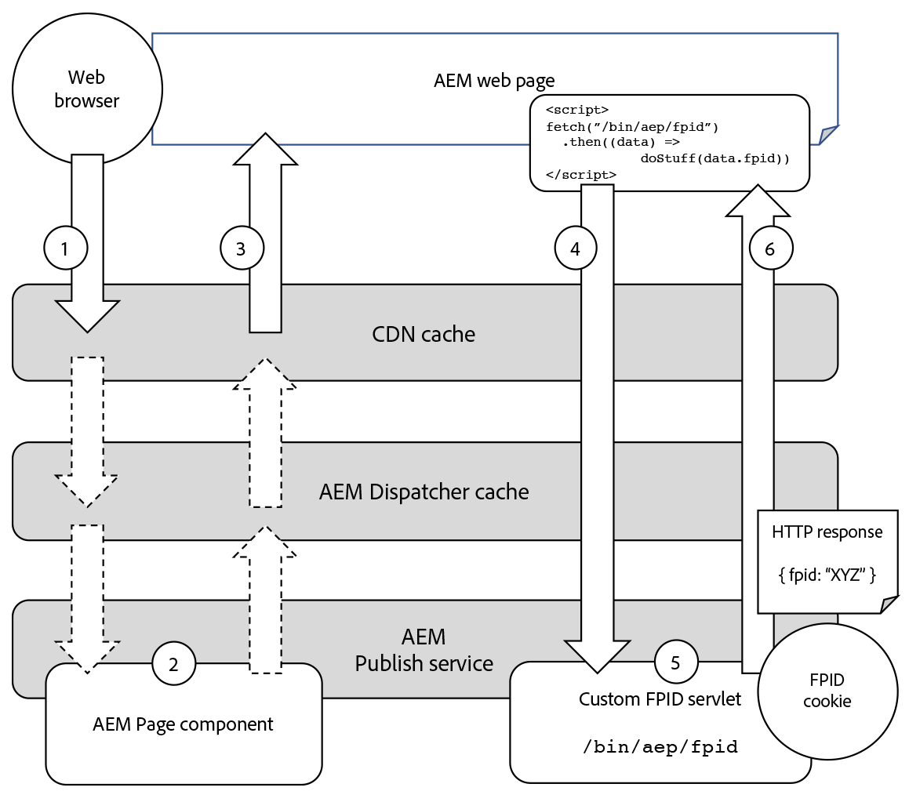

# Generación de FPID de Experience Platform con AEM

La integración de Adobe Experience Manager (AEM) con Adobe Experience Platform (AEP) requiere AEM para generar y mantener una cookie de ID de dispositivo de origen (FPID) única, con el fin de rastrear de forma exclusiva la actividad del usuario.

Lea la documentación de apoyo para [obtenga información sobre cómo funcionan juntos los ID de dispositivos de primera parte y los ID de Experience Cloud](https://experienceleague.adobe.com/docs/platform-learn/data-collection/edge-network/generate-first-party-device-ids.html?lang=en).

A continuación se ofrece una descripción general del funcionamiento de FPID al utilizar AEM como host web.


## Generar y mantener el FPID con AEM

El servicio de publicación de AEM optimiza el rendimiento almacenando en caché todas las solicitudes posibles, tanto en las cachés de CDN como de AEM Dispatcher.

Las solicitudes HTTP imperativas que generan la cookie FPID única por usuario y devuelven el valor FPID nunca se almacenan en caché y se sirven directamente desde AEM Publish, que puede implementar la lógica para garantizar la exclusividad.

Evite generar la cookie FPID en solicitudes de páginas web u otros recursos almacenables en caché, ya que la combinación del requisito de exclusividad de FPID haría que estos recursos no se pudieran almacenar en caché.

En el diagrama siguiente se describe cómo administra el servicio AEM Publish los FPID.



1. El explorador web realiza una solicitud de una página web alojada por AEM. La solicitud se puede servir utilizando una copia en caché de la página web desde CDN o AEM caché de Dispatcher.
1. Si la página web no se puede servir desde las cachés de CDN o AEM Dispatcher, la solicitud llega al servicio AEM Publish, que genera la página web solicitada.
1. A continuación, la página web se devuelve al explorador web, rellenando las cachés que no pudieron servir la solicitud. Con AEM, espere que las tasas de visitas de la caché de CDN y AEM Dispatcher sean buenas a más del 90%.
1. La página web contiene JavaScript que realiza una solicitud XHR (AJAX) asincrónica no almacenable en caché a un servlet FPID personalizado en el servicio AEM Publish. Como se trata de una solicitud no accesible (en virtud de su parámetro de consulta aleatorio y encabezados Cache-Control), nunca se almacena en caché en CDN ni en AEM Dispatcher y siempre llega al servicio AEM Publish para generar la respuesta.
1. El servlet FPID personalizado en el servicio AEM Publish procesa la solicitud, generando un nuevo FPID cuando no se encuentra ninguna cookie FPID existente o ampliando la vida de cualquier cookie FPID existente. El servlet también devuelve el FPID en el cuerpo de respuesta para que lo utilice JavaScript del lado del cliente. Afortunadamente, la lógica personalizada del servlet FPID es ligera, lo que evita que esta solicitud afecte al rendimiento del servicio de AEM Publish.
1. La respuesta para la solicitud XHR regresa al explorador con la cookie FPID y el FPID como JSON en el cuerpo de la respuesta para que lo utilice el SDK web de Platform.

## Ejemplo de código

El siguiente código y la configuración se pueden implementar en el servicio AEM Publish para crear un extremo que genere o amplíe la vida de una cookie FPID existente y devuelva el FPID como JSON.

### AEM servlet de cookie FPID

Se debe crear un extremo HTTP AEM para generar o ampliar una cookie FPID, utilizando una [Sling servlet](https://sling.apache.org/documentation/the-sling-engine/servlets.html#registering-a-servlet-using-java-annotations-1).

+ El servlet está enlazado a `/bin/aem/fpid` ya que la autenticación no es necesaria para acceder a ella. Si se requiere autenticación, enlace a un tipo de recurso de Sling.
+ El servlet acepta solicitudes de GET HTTP. La respuesta está marcada con `Cache-Control: no-store` para evitar el almacenamiento en caché, pero este extremo debe solicitarse utilizando parámetros de consulta únicos que rompen la caché también.

Cuando una solicitud HTTP llega al servlet, el servlet comprueba si existe una cookie FPID en la solicitud:

+ Si existe una cookie FPID, amplíe la duración de la cookie y recopile su valor para escribir en la respuesta.
+ Si no existe una cookie FPID, genere una nueva cookie FPID y guarde el valor para escribir en la respuesta.

A continuación, el servlet escribe el FPID en la respuesta como un objeto JSON en el formulario: `{ fpid: "<FPID VALUE>" }`.

Es importante proporcionar el FPID al cliente en el cuerpo, ya que la cookie FPID está marcada `HttpOnly`, lo que significa que solo el servidor puede leer su valor y JavaScript del lado del cliente no puede.

El valor FPID del cuerpo de respuesta se utiliza para parametrizar llamadas mediante el SDK web de Platform.

A continuación se muestra un ejemplo de código de un extremo de servlet AEM (disponible mediante `HTTP GET /bin/aep/fpid`) que genera o actualiza una cookie FPID y devuelve el FPID como JSON.

+ `core/src/main/java/com/adobe/aem/guides/wkndexamples/core/aep/impl/FpidServlet.java`

```java
package com.adobe.aem.guides.wkndexamples.core.aep.impl;

import com.google.gson.JsonObject;
import org.apache.sling.api.SlingHttpServletRequest;
import org.apache.sling.api.SlingHttpServletResponse;
import org.apache.sling.api.servlets.SlingAllMethodsServlet;
import org.osgi.service.component.annotations.Component;
import org.slf4j.Logger;
import org.slf4j.LoggerFactory;

import javax.servlet.Servlet;
import javax.servlet.http.Cookie;
import java.io.IOException;
import java.util.UUID;

import static org.apache.sling.api.servlets.ServletResolverConstants.SLING_SERVLET_PATHS;
import static org.apache.sling.api.servlets.ServletResolverConstants.SLING_SERVLET_METHODS;

@Component(
        service = {Servlet.class},
        property = {
                SLING_SERVLET_PATHS + "=/bin/aep/fpid",
                SLING_SERVLET_METHODS + "=GET"
        }
)
public class FpidServlet extends SlingAllMethodsServlet {
    private static final Logger log = LoggerFactory.getLogger(FpidServlet.class);
    private static final String COOKIE_NAME = "FPID";
    private static final String COOKIE_PATH = "/";
    private static final int COOKIE_MAX_AGE = 60 * 60 * 24 * 30 * 13;
    private static final String JSON_KEY = "fpid";

    @Override
    protected final void doGet(SlingHttpServletRequest request, SlingHttpServletResponse response) throws IOException {
        // Try to get an existing FPID cookie, this will give us the user's current FPID if it exists
        final Cookie existingCookie = request.getCookie(COOKIE_NAME);

        String cookieValue;

        if (existingCookie == null) {
            //  If no FPID cookie exists, Create a new FPID UUID
            cookieValue = UUID.randomUUID().toString();
        } else {
            // If a FPID cookie exists. get its FPID UUID so it's life can be extended
            cookieValue = existingCookie.getValue();
        }

        // Add the newly generate FPID value, or the extended FPID value to the response
        // Use addHeader(..), as we need to set SameSite=Lax (and addCoookie(..) does not support this)
        response.addHeader("Set-Cookie",
                COOKIE_NAME + "=" + cookieValue + "; " +
                        "Max-Age=" + COOKIE_MAX_AGE + "; " +
                        "Path=" + COOKIE_PATH + "; " +
                        "HttpOnly; " +
                        "Secure; " +
                        "SameSite=Lax");
        
        // Avoid caching the response in any cache
        response.addHeader("Cache-Control", "no-store");

        // Since the FPID is HttpOnly, JavaScript cannot read it (only the server can)
        // Write the FPID to the response as JSON so client JavaScript can access it.
        final JsonObject json = new JsonObject();
        json.addProperty(JSON_KEY, cookieValue);
        
        // The JSON `{ fpid: "11111111-2222-3333-4444-55555555" }` is returned in the response
        response.setContentType("application/json");
        response.getWriter().write(json.toString());
    }
}
```

### HTML, script

Se debe agregar un JavaScript personalizado del lado del cliente a la página para invocar asincrónicamente el servlet, generando o actualizando la cookie FPID y devolviendo el FPID en la respuesta.

Normalmente, esta secuencia de comandos JavaScript se agrega a la página mediante uno de los métodos siguientes:

+ [Etiquetas en Adobe Experience Platform](https://experienceleague.adobe.com/docs/experience-platform/tags/home.html)
+ [Biblioteca de cliente AEM](https://experienceleague.adobe.com/docs/experience-manager-cloud-service/content/implementing/developing/full-stack/clientlibs.html?lang=en)

La llamada XHR al servlet AEM FPID personalizado es rápida, aunque asincrónica, por lo que es posible que un usuario visite una página web servida por AEM y navegue hasta que la solicitud se complete.
Si esto ocurre, el mismo proceso volverá a tentarse en la siguiente carga de página de una página web desde AEM.

La GET HTTP al servlet AEM FPID (`/bin/aep/fpid`) está parametrizado con un parámetro de consulta aleatorio para garantizar que cualquier infraestructura entre el explorador y el servicio AEM Publish no almacene en caché la respuesta de la solicitud.
Del mismo modo, la variable `Cache-Control: no-store` el encabezado de solicitud se agrega para permitir evitar el almacenamiento en caché.

Al invocar el servlet AEM FPID, el FPID se recupera de la respuesta JSON y se utiliza en el [SDK web de plataforma](https://experienceleague.adobe.com/docs/platform-learn/implement-web-sdk/tags-configuration/install-web-sdk.html?lang=en) para enviarlo a las API de Experience Platform.

Consulte la documentación del Experience Platform para obtener más información sobre [uso de FPID en identityMap](https://experienceleague.adobe.com/docs/experience-platform/edge/identity/first-party-device-ids.html#identityMap)

```javascript
...
<script>
    // Invoke the AEM FPID servlet, and then do something with the response

    fetch(`/bin/aep/fpid?_=${new Date().getTime() + '' + Math.random()}`, { 
            method: 'GET',
            headers: {
                'Cache-Control': 'no-store'
            }
        })
        .then((response) => response.json())
        .then((data) => { 
            // Get the FPID from JSON returned by AEM's FPID servlet
            console.log('My FPID is: ' + data.fpid);

            // Send the `data.fpid` to Experience Platform APIs            
        });
</script>
```

### Filtro de permitidos de Dispatcher

Por último, las solicitudes de GET HTTP al servlet FPID personalizado deben estar permitidas a través de AEM de Dispatcher `filter.any` configuración.

Si esta configuración de Dispatcher no está implementada correctamente, la GET HTTP solicita `/bin/aep/fpid` da como resultado un 404.

+ `dispatcher/src/conf.dispatcher.d/filters/filters.any`

```
/1099 { /type "allow" /method "GET" /url "/bin/aep/fpid" }
```

## Recursos del Experience Platform

Revise la siguiente documentación del Experience Platform para los ID de dispositivos de origen (FPID) y gestione los datos de identidad con el SDK web de Platform.

+ [Generar ID de dispositivos de origen](https://experienceleague.adobe.com/docs/platform-learn/data-collection/edge-network/generate-first-party-device-ids.html)
+ [ID de dispositivo de origen en el SDK web de Platform](https://experienceleague.adobe.com/docs/experience-platform/edge/identity/first-party-device-ids.html)
+ [Datos de identidad en el SDK web de Platform](https://experienceleague.adobe.com/docs/experience-platform/edge/identity/overview.html)


