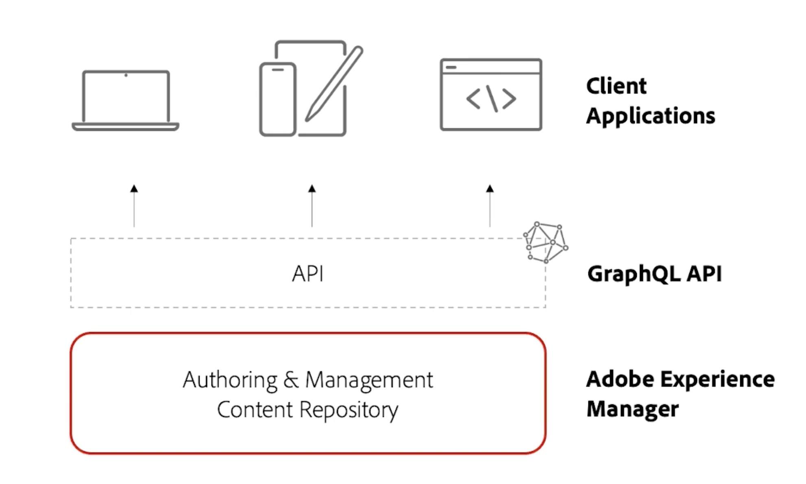

# Vídeos y tutoriales de AEM Sites {#overview}

{{edge-delivery-services}}

Adobe Experience Manager (AEM) Sites es la plataforma de administración de experiencias de Adobe que permite la creación, administración y entrega de experiencias digitales, ya sea a través de un sitio web, una aplicación móvil o cualquier otro canal digital.

## Tres formas de ofrecer experiencias con AEM Sites

AEM Sites ofrece tres formas de generar, desarrollar y entregar experiencias. Tanto si desea crear sitios web, optimizar el rendimiento de Edge como impulsar aplicaciones sin encabezado, AEM Sites ofrece opciones flexibles para adaptarse a las necesidades de su proyecto:

1. Las experiencias de **Edge Delivery Services** utilizan Edge Network de Adobe para ofrecer contenido de alta velocidad y baja latencia. El servicio optimiza automáticamente el contenido del dispositivo, los motores de búsqueda y los agentes GenAI que lo consumen. Los autores crean contenido mediante el Editor universal de Adobe o la creación basada en documentos.
1. Las experiencias **sin encabezado/con API** utilizan AEM Publish para entregar contenido como JSON a través de API HTTP para aplicaciones móviles, aplicaciones de una sola página (SPA) u otros clientes sin encabezado. Los autores crean contenido mediante el Editor de fragmentos de contenido o el Editor universal.
1. Las experiencias **tradicionales de AEM** utilizan AEM Publish para entregar contenido como páginas web de HTML. Los autores crean contenido mediante el Editor de páginas del autor de AEM. Esta opción es perfecta para proyectos existentes o proyectos ya migrados.

Las tres opciones son enfoques sólidos y la mejor opción depende de su caso de uso y de las necesidades de la organización. Cada enfoque permite a los equipos ofrecer experiencias personalizadas y atractivas a velocidad y escala en cualquier canal o dispositivo.

>[!IMPORTANT]
>
> **Edge Delivery Services** es la forma más reciente y avanzada de distribuir sitios web con AEM. Combina la velocidad y la escalabilidad del Edge Network de Adobe con las modernas opciones de creación. Aunque se recomienda Edge Delivery Services para nuevos proyectos, AEM Sites sigue admitiendo enfoques tradicionales y sin encabezado, para que pueda elegir la ruta que mejor se adapte a sus necesidades.

El diagrama siguiente muestra las diferentes opciones para crear experiencias con AEM Sites:

{width="700" zoomable="yes"}

### Comparación de las formas de crear con AEM Sites

En la siguiente tabla se proporciona una comparación de alto nivel de las tres rutas. Se centra en la creación de contenido y en los matices de distribución de experiencias de cada ruta.

|            | Edge Delivery Services | Sin encabezado/API first | AEM tradicional |
|---------------------|------------------------------|---------------------------------|---------------------------------------------|
| **Mejor para** | Sitios web con gran cantidad de tráfico, rendimiento y necesidades de escalabilidad | Aplicaciones móviles, SPA y otras aplicaciones sin encabezado | Proyectos existentes o migrados |
| **Herramientas de creación** | Creación basada en documentos, Editor universal, Editor de páginas | Fragmentos de contenido, editor universal | Editor de páginas, editor universal |
| **Almacén de contenido creado** | Documentos de AEM Author (JCR) | AEM Author (JCR) | AEM Author (JCR) |
| **Entrega** | Edge Delivery Services | AEM Publish (con Adobe CDN + Dispatcher) | AEM Publish (con Adobe CDN + Dispatcher) |
| **Almacén de contenido de entrega** | Edge Delivery Services | AEM Publish (JCR) | AEM Publish (JCR) |
| **Formato de envío** | HTML | JSON | HTML |
| **Tecnología de desarrollo** | JavaScript, CSS | Cualquiera (por ejemplo, Swift, React, etc.) | Java™, HTL, JavaScript, CSS |
| **Compatibilidad con bots de búsqueda y agentes GenAI** | Optimizado para bots, motores de búsqueda y agentes GenAI | Funciona para bots y agentes, pero puede requerir SSR o configuración adicional | Adecuado para bots, pero el rendimiento puede ser más lento en comparación con Edge Delivery Services |

## Migración desde AMS o locales

Si está migrando de AMS o local (OTP) a AEM as a Cloud Service, Adobe le recomienda evaluar el paso directamente a Edge Delivery Services. Normalmente, el esfuerzo no es mayor que migrar a AEM as a Cloud Service Publish, ya que ofrece un rendimiento más rápido y una mayor escalabilidad. Si decide que Edge Delivery Services no es la opción correcta para usted en este momento, o si los demás enfoques satisfacen mejor sus necesidades, siguen siendo opciones totalmente compatibles y válidas para su proyecto.

## Tutoriales

Explore los tres métodos para crear con AEM Sites con más detalle. Los tutoriales siguientes le guían por el funcionamiento de cada opción, las herramientas involucradas y cuándo utilizarlas.

<!-- CARDS

* https://www.aem.live/docs/
  {title = Edge Delivery Services - Guides}
  {description = Explore Edge Delivery Services with comprehensive guides. The Build, Publish, and Launch guides cover everything you need to get started with Edge Delivery Services.}
  {image = ./assets/edge-delivery-services.png}
  {target = _blank}
* https://experienceleague.adobe.com/en/docs/experience-manager-learn/getting-started-with-aem-headless/overview
  {title = Headless/API-First - Tutorials}
  {description = Learn how to build headless applications powered by AEM content. Tutorials cover frameworks like iOS, Android, and React—choose what fits your stack.}
  {image = ./assets/headless.png}
  {target = _self}
* https://experienceleague.adobe.com/en/docs/experience-manager-learn/getting-started-wknd-tutorial-develop/overview
  {title = Traditional AEM - WKND Tutorial}
  {description = Learn how to build a sample AEM Sites project using the WKND tutorial. This guide walks you through project setup, Core Components, Editable Templates, client-side libraries, and component development.}
  {image = ./assets/aem-wknd-spa-editor-tutorial.png}
  {target = _self}
-->
<!-- START CARDS HTML - DO NOT MODIFY BY HAND -->

    

        

            

                <figure class="image x-is-16by9">
                    
                </figure>
            

            

                

                    

                        <a href="https://www.aem.live/docs/" target="_blank" rel="referrer" title="Edge Delivery Services: guías">Edge Delivery Services: guías</a>
                    

                    
Explore Edge Delivery Services con guías completas. Las guías de compilación, publicación e inicio abarcan todo lo que necesita para empezar a utilizar Edge Delivery Services.

                

                <a href="https://www.aem.live/docs/" target="_blank" rel="referrer" class="spectrum-Button spectrum-Button--outline spectrum-Button--primary spectrum-Button--sizeM" style="align-self: flex-start; margin-top: 1rem;">
                    Más información
                </a>
            

        

    

    

        

            

                <figure class="image x-is-16by9">
                    
                </figure>
            

            

                

                    

                        <a href="https://experienceleague.adobe.com/es/docs/experience-manager-learn/getting-started-with-aem-headless/overview" target="_self" rel="referrer" title="Sin encabezado/API first: tutoriales">Sin encabezado/API first: tutoriales</a>
                    

                    
Aprenda a crear aplicaciones sin encabezado basadas en contenido de AEM. Los tutoriales abarcan marcos de trabajo como iOS, Android y React. Elija el que mejor se adapte a su pila.

                

                <a href="https://experienceleague.adobe.com/es/docs/experience-manager-learn/getting-started-with-aem-headless/overview" target="_self" rel="referrer" class="spectrum-Button spectrum-Button--outline spectrum-Button--primary spectrum-Button--sizeM" style="align-self: flex-start; margin-top: 1rem;">
                    Más información
                </a>
            

        

    

    

        

            

                <figure class="image x-is-16by9">
                    
                </figure>
            

            

                

                    

                        <a href="https://experienceleague.adobe.com/es/docs/experience-manager-learn/getting-started-wknd-tutorial-develop/overview" target="_self" rel="referrer" title="AEM tradicional: Tutorial de WKND">AEM tradicional: Tutorial de WKND</a>
                    

                    
En el tutorial WKND, obtenga información sobre cómo generar un proyecto en AEM Sites de ejemplo. Esta guía explica paso a paso la configuración del proyecto, los componentes principales, las plantillas editables, las bibliotecas del lado del cliente y el desarrollo de componentes.

                

                <a href="https://experienceleague.adobe.com/es/docs/experience-manager-learn/getting-started-wknd-tutorial-develop/overview" target="_self" rel="referrer" class="spectrum-Button spectrum-Button--outline spectrum-Button--primary spectrum-Button--sizeM" style="align-self: flex-start; margin-top: 1rem;">
                    Más información
                </a>
            

        

    

<!-- END CARDS HTML - DO NOT MODIFY BY HAND -->

## Recursos adicionales

* [Documentación sobre la creación de AEM Sites](https://experienceleague.adobe.com/es/docs/experience-manager-65/content/sites/authoring/essentials/first-steps)
* [Documentación sobre el desarrollo de AEM Sites](https://experienceleague.adobe.com/es/docs/experience-manager-65/content/implementing/developing/introduction/getting-started)
* [Documentación sobre la administración de AEM Sites](https://experienceleague.adobe.com/es/docs/experience-manager-65/content/sites/administering/home)
* [Documentación sobre la implementación de AEM Sites](https://experienceleague.adobe.com/es/docs/experience-manager-65/content/implementing/deploying/introduction/platform)
* [Tutoriales de AEM as a Cloud Service](/help/cloud-service/overview.md)
* [Tutoriales de AEM Assets](/help/assets/overview.md)
* [Tutoriales de AEM Forms](/help/forms/overview.md)
* [Tutoriales de AEM Foundation](/help/foundation/overview.md)
