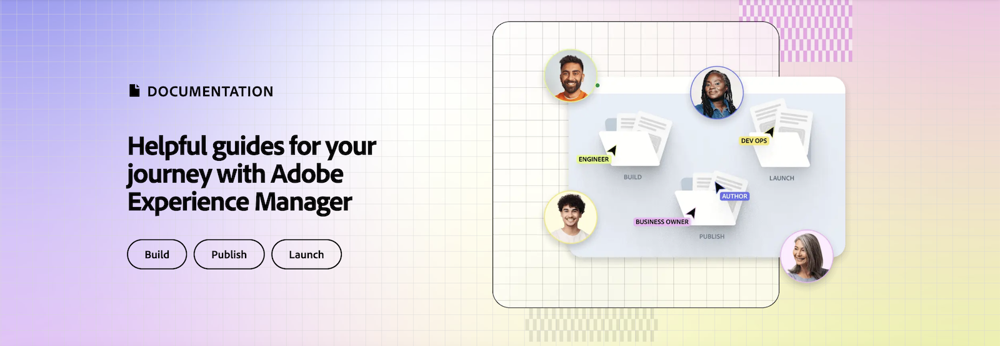

# Vídeos y tutoriales de AEM Sites {#overview}

{{edge-delivery-services}}

Adobe Experience Manager (AEM) Sites es una plataforma líder de administración de experiencias. Esta guía del usuario contiene vídeos y tutoriales sobre las numerosas funciones y funcionalidades de AEM Sites.

## Tres formas de generar con AEM Sites

AEM Sites ofrece tres formas de generar, desarrollar y entregar experiencias. Tanto si desea crear páginas completas, optimizar el rendimiento de primera línea o impulsando aplicaciones sin encabezado, AEM Sites ofrece opciones flexibles para satisfacer las necesidades de su proyecto:

1. Los sitios web de **Edge Delivery Services** aprovechan la creación basada en documentos o el Editor universal de Adobe para crear contenido, que luego se activa y luego se entrega a los usuarios finales mediante páginas web de Edge Delivery Services as a HTML. Esta opción está destinada principalmente a _proyectos nuevos y existentes_ que requieren alto rendimiento, escalabilidad y velocidad.
1. Las experiencias web **sin encabezado/API-first** utilizan el Editor de fragmentos de contenido o el Editor universal para crear contenido, que luego se activa y se entrega mediante la publicación de AEM como JSON. Esta opción está dirigida principalmente a _proyectos nuevos y existentes_ que requieren la entrega sin encabezado de contenido a aplicaciones móviles, aplicaciones de una sola página (SPA) u otras aplicaciones sin encabezado.
1. **AEM tradicional** no es el enfoque más actual para crear experiencias web con AEM Sites. La versión tradicional de AEM utiliza el editor de páginas del autor de AEM para crear contenido, que se activa y se envía a los usuarios finales mediante las páginas web de AEM Publish as HTML. Se recomienda el AEM tradicional para _proyectos existentes_.

Estas opciones están diseñadas para satisfacer las diversas necesidades de las organizaciones de marketing, para ofrecer experiencias personalizadas y atractivas a alta velocidad y a escala en cualquier canal o dispositivo.

>[!IMPORTANT]
>
> **Edge Delivery Services** es la última forma de compilar con AEM Sites. Está diseñado para ofrecer sitios web de alto rendimiento a escala, aprovechando la potencia del Edge Network de Adobe.

El diagrama siguiente ilustra las diferentes rutas:

{width="700" zoomable="yes"}

### Comparación de las formas de crear con AEM Sites

En la siguiente tabla se proporciona una comparación de alto nivel de las tres rutas. Se centra en la creación de contenido y en los matices de distribución de experiencias de cada ruta.

|            | Edge Delivery Services | Sin encabezado/API first | AEM tradicional |
|---------------------|------------------------------|---------------------------------|---------------------------------------------|
| **Mejor Para** | Sitios web con alto tráfico, rendimiento y necesidades de escalabilidad | Aplicaciones móviles, SPA y otras aplicaciones sin encabezado | Proyectos existentes (no es el enfoque más actual) |
| **Herramientas de creación** | Creación basada en documentos, editor universal | Fragmentos de contenido, editor universal | Editor de páginas |
| **Almacén de contenido creado** | Documentos de AEM Author (JCR) | AEM Author (JCR) | AEM Author (JCR) |
| **Entrega** | Edge Delivery Services | AEM Publish (con Adobe CDN + Dispatcher) | AEM Publish (con Adobe CDN + Dispatcher) |
| **Almacén de contenido de distribución** | Edge Delivery Services | AEM Publish (JCR) | AEM Publish (JCR) |
| **Formato de distribución** | HTML | JSON | HTML |
| **Tecnología de desarrollo** | JavaScript, CSS | Cualquiera (por ejemplo, Swift, React, etc.) | Java™, JavaScript, CSS |
| **Fase de implementación** | Proyectos nuevos y existentes | Proyectos nuevos y existentes | Solo proyectos existentes |

## Tutoriales

Obtenga información sobre cada una de las tres rutas para generar con AEM Sites a través de los siguientes tutoriales:

<!-- CARDS

* https://www.aem.live/docs/
  {title = Edge Delivery Services - Guides}
  {description = Explore Edge Delivery Services with comprehensive guides. The Build, Publish, and Launch guides cover everything you need to get started with EDS.}
  {image = ./assets/edge-delivery-services.png}
  {target = _blank}
* https://experienceleague.adobe.com/es/docs/experience-manager-learn/getting-started-with-aem-headless/overview
  {title = Headless/API-First - Tutorials}
  {description = Learn how to build headless applications powered by AEM content. Tutorials cover frameworks like iOS, Android, and React—choose what fits your stack.}
  {image = ./assets/headless.png}
  {target = _self}
* https://experienceleague.adobe.com/es/docs/experience-manager-learn/getting-started-wknd-tutorial-develop/overview
  {title = Traditional AEM - WKND Tutorial}
  {description = Learn how to build a sample AEM Sites project using the WKND tutorial. This guide walks you through project setup, Core Components, Editable Templates, client-side libraries, and component development.}
  {image = ./assets/aem-wknd-spa-editor-tutorial.png}
  {target = _self}
-->
<!-- START CARDS HTML - DO NOT MODIFY BY HAND -->

    

        

            

                <figure class="image x-is-16by9">
                    
                </figure>
            

            

                

                    

                        <a href="https://www.aem.live/docs/" target="_blank" rel="referrer" title="Edge Delivery Services: guías">Edge Delivery Services: guías</a>
                    

                    
Explore Edge Delivery Services con guías completas. Las guías de compilación, publicación y lanzamiento cubren todo lo necesario para utilizar EDS.

                

                <a href="https://www.aem.live/docs/" target="_blank" rel="referrer" class="spectrum-Button spectrum-Button--outline spectrum-Button--primary spectrum-Button--sizeM" style="align-self: flex-start; margin-top: 1rem;">
                    Más información
                </a>
            

        

    

    

        

            

                <figure class="image x-is-16by9">
                    
                </figure>
            

            

                

                    

                        <a href="https://experienceleague.adobe.com/es/docs/experience-manager-learn/getting-started-with-aem-headless/overview" target="_self" rel="referrer" title="Sin encabezado/API first: tutoriales">Sin encabezado/API first: tutoriales</a>
                    

                    
Aprenda a crear aplicaciones sin encabezado basadas en contenido de AEM. Los tutoriales cubren marcos de trabajo como iOS, Android y React, y permiten elegir lo que se adapta a su pila.

                

                <a href="https://experienceleague.adobe.com/es/docs/experience-manager-learn/getting-started-with-aem-headless/overview" target="_self" rel="referrer" class="spectrum-Button spectrum-Button--outline spectrum-Button--primary spectrum-Button--sizeM" style="align-self: flex-start; margin-top: 1rem;">
                    Más información
                </a>
            

        

    

    

        

            

                <figure class="image x-is-16by9">
                    
                </figure>
            

            

                

                    

                        <a href="https://experienceleague.adobe.com/es/docs/experience-manager-learn/getting-started-wknd-tutorial-develop/overview" target="_self" rel="referrer" title="Tutorial tradicional de AEM - WKND">Tutorial tradicional de AEM - WKND</a>
                    

                    
En el tutorial WKND, obtenga información sobre cómo generar un proyecto en AEM Sites de ejemplo. Esta guía explica paso a paso la configuración del proyecto, los componentes principales, las plantillas editables, las bibliotecas del lado del cliente y el desarrollo de componentes.

                

                <a href="https://experienceleague.adobe.com/es/docs/experience-manager-learn/getting-started-wknd-tutorial-develop/overview" target="_self" rel="referrer" class="spectrum-Button spectrum-Button--outline spectrum-Button--primary spectrum-Button--sizeM" style="align-self: flex-start; margin-top: 1rem;">
                    Más información
                </a>
            

        

    

<!-- END CARDS HTML - DO NOT MODIFY BY HAND -->

## Recursos adicionales

* [Documentación sobre la creación de AEM Sites](https://experienceleague.adobe.com/es/docs/experience-manager-65/content/sites/authoring/essentials/first-steps)
* [Documentación sobre el desarrollo de AEM Sites](https://experienceleague.adobe.com/es/docs/experience-manager-65/content/implementing/developing/introduction/getting-started)
* [Documentación sobre la administración de AEM Sites](https://experienceleague.adobe.com/es/docs/experience-manager-65/content/sites/administering/home)
* [Documentación sobre la implementación de AEM Sites](https://experienceleague.adobe.com/es/docs/experience-manager-65/content/implementing/deploying/introduction/platform)
* [Tutoriales de AEM as a Cloud Service](/help/cloud-service/overview.md)
* [Tutoriales de AEM Assets](/help/assets/overview.md)
* [Tutoriales de AEM Forms](/help/forms/overview.md)
* [Tutoriales de AEM Foundation](/help/foundation/overview.md)
