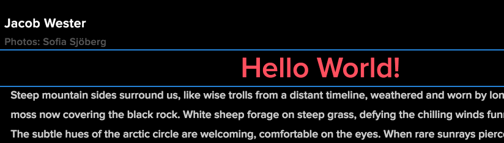

# Desarrollo con el Editor SPA de AEM - Tutorial de Hello World {#developing-with-the-aem-spa-editor-hello-world-tutorial}

>[!WARNING]
>
> Este tutorial está **en desuso**. Se recomienda seguir una de estas opciones: [Introducción al Editor de SPA de AEM y a Angular](https://docs.adobe.com/content/help/en/experience-manager-learn/spa-angular-tutorial/overview.html) o [Introducción al Editor de SPA de AEM y Reaccionar](https://docs.adobe.com/content/help/en/experience-manager-learn/spa-react-tutorial/overview.html)

AEM Editor SPA ofrece compatibilidad con la edición en contexto de una aplicación o SPA de una sola página. Este tutorial es una introducción al desarrollo de SPA que se utilizará con AEM SDK SPA Editor JS. El tutorial ampliará la aplicación de Historial We.Retail agregando un componente Hello World personalizado. Los usuarios pueden completar el tutorial con los marcos React o Angular.

>[!NOTE]
>
> La función Editor de aplicaciones (SPA) de una sola página requiere AEM 6.4 service pack 2 o posterior.
>
> El Editor de SPA es la solución recomendada para proyectos que requieren SPA procesamiento del lado del cliente basado en el marco de trabajo (por ejemplo, React o Angular).

## Lectura de requisitos previos {#prereq}

Este tutorial está diseñado para resaltar los pasos necesarios para asignar un componente de SPA a un componente de AEM para permitir la edición en contexto. Los usuarios que inicien este tutorial deben estar familiarizados con los conceptos básicos de desarrollo de Adobe Experience Manager, AEM, así como con el desarrollo de los marcos React of Angular. El tutorial cubre tanto tareas de desarrollo del back-end como del front-end.

Se recomienda revisar los siguientes recursos antes de iniciar este tutorial:

* [Vídeo](spa-editor-framework-feature-video-use.md)  sobre las funciones del Editor de SPA: Vídeo de descripción general del Editor de SPA y la aplicación de Historial We.Retail.
* [Tutorial](https://reactjs.org/tutorial/tutorial.html)  de React.js: Introducción al desarrollo con el marco de React.
* [Tutorial](https://angular.io/tutorial)  angular: Introducción al desarrollo con Angular

## Entorno de desarrollo local {#local-dev}

Este tutorial está diseñado para:

[Adobe Experience Manager 6.5](https://helpx.adobe.com/es/experience-manager/6-5/release-notes.html) o  [Adobe Experience Manager 6.4](https://helpx.adobe.com/experience-manager/6-4/sites/deploying/using/technical-requirements.html) +  [Service Pack 5](https://helpx.adobe.com/experience-manager/6-4/release-notes/sp-release-notes.html)

En este tutorial se deben instalar las siguientes tecnologías y herramientas:

1. [Java 11](https://downloads.experiencecloud.adobe.com/content/software-distribution/en/general.html)
2. [Apache Maven - 3.3.1+](https://maven.apache.org/)
3. [Node.js - 8.11.1+](https://nodejs.org/en/) y npm 5.6.0+ (npm se instala con node.js)

Compruebe el doble de la instalación de las herramientas anteriores abriendo un nuevo terminal y ejecutando lo siguiente:

```shell
$ java -version
java version "11 +"

$ mvn -version
Apache Maven 3.3.9

$ node --version
v8.11.1

$ npm --version
6.1.0
```

## Información general {#overview}

El concepto básico es asignar un componente SPA a un componente AEM. AEM componentes, ejecutar en el servidor, exportar contenido en forma de JSON. El contenido JSON lo consume el SPA, y se ejecuta en el navegador en el lado del cliente. Se crea una asignación 1:1 entre SPA componentes y un componente AEM.


Los marcos [Reaccionar JS](https://reactjs.org/) y [Angular](https://angular.io/) populares son compatibles de forma predeterminada. Los usuarios pueden completar este tutorial en Angular o Reaccionar, independientemente del marco con el que se sientan más cómodos.

## Configuración del proyecto {#project-setup}

SPA desarrollo tiene un pie en AEM desarrollo, y el otro fuera. El objetivo es permitir que SPA desarrollo se produzca de manera independiente, y (principalmente) agnóstico para AEM.

* SPA proyectos pueden funcionar independientemente del proyecto AEM durante el desarrollo del front-end.
* Siguen utilizándose herramientas y tecnologías de diseño front-end como Webpack, NPM, [!DNL Grunt] y [!DNL Gulp].
* Para construir para AEM, el proyecto SPA se compila y se incluye automáticamente en el proyecto AEM.
* Paquetes de AEM estándar utilizados para implementar la SPA en AEM.


*SPA desarrollo tiene un pie en AEM desarrollo, y el otro en el exterior -permitiendo que el desarrollo SPA se produzca de manera independiente, y (en su mayoría) agnóstico para AEM.*

El objetivo de este tutorial es ampliar la aplicación de Historial We.Retail con un nuevo componente. Inicio descargando el código fuente de la aplicación de Historial We.Retail e implementándolo en un AEM local.

1. **** Descargue el último código de Historial  [We.Retail de GitHub](https://github.com/adobe/aem-sample-we-retail-journal).

   O clona el repositorio desde la línea de comandos:

   ```shell
   $ git clone git@github.com:adobe/aem-sample-we-retail-journal.git
   ```

   >[!NOTE]
   >
   >El tutorial funcionará con la rama **maestra** con la versión **1.2.1-SNAPSHOT** del proyecto.

1. Debe estar visible la siguiente estructura:

   

   El proyecto contiene los siguientes módulos principales:

   * `all`:: Incrusta e instala todo el proyecto en un solo paquete.
   * `bundles`:: Contiene dos paquetes OSGi: commons y core que contienen  [!DNL Sling Models] y otro código Java.
   * `ui.apps`:: contiene las partes /apps del proyecto, es decir, clientlibs de JS y CSS, componentes y configuraciones específicas de modo de ejecución.
   * `ui.content`:: contiene contenido estructural y configuraciones (`/content`,  `/conf`)
   * `react-app`:: Aplicación We.Retail Historial React. Este es un módulo Maven y un proyecto de webpack.
   * `angular-app`:: Aplicación angular de We.Retail Historial. Este es un módulo [!DNL Maven] y un proyecto de webpack.

1. Abra una nueva ventana de terminal y ejecute el siguiente comando para compilar e implementar toda la aplicación en una instancia de AEM local que se ejecute en [http://localhost:4502](http://localhost:4502).

   ```shell
   $ cd <src>/aem-sample-we-retail-journal
   $ mvn -PautoInstallSinglePackage clean install
   ```

   >[!NOTE]
   >
   > En este proyecto, el perfil Maven para crear y empaquetar todo el proyecto es `autoInstallSinglePackage`

   >[!CAUTION]
   >
   > Si recibe un error durante la compilación, [asegúrese de que el archivo settings.xml de Maven incluya el repositorio de artefactos Maven del Adobe](https://helpx.adobe.com/experience-manager/kb/SetUpTheAdobeMavenRepository.html).

1. Ir a:

   * [http://localhost:4502/editor.html/content/we-retail-journal/react/en/home.html](http://localhost:4502/editor.html/content/we-retail-journal/react/en/home.html)
   * [http://localhost:4502/editor.html/content/we-retail-journal/angular/en/home.html](http://localhost:4502/editor.html/content/we-retail-journal/angular/en/home.html)

   La aplicación de Historial We.Retail debe mostrarse en el editor de AEM Sites.

1. En el modo [!UICONTROL Editar], seleccione un componente para editarlo y actualice el contenido.

   

1. Seleccione el icono [!UICONTROL Propiedades de la página] para abrir las [!UICONTROL Propiedades de la página]. Seleccione [!UICONTROL Editar plantilla] para abrir la plantilla de la página.

   

1. En la versión más reciente del Editor de SPA, [Las plantillas editables](https://helpx.adobe.com/experience-manager/6-5/sites/developing/using/page-templates-editable.html) se pueden usar del mismo modo que con las implementaciones de sitios tradicionales. Esto se volverá a examinar más adelante con nuestro componente personalizado.

   >[!NOTE]
   >
   > Solo AEM 6.5 y AEM 6.4 + **Service Pack 5** admiten plantillas editables.

## Información general de desarrollo {#development-overview}


SPA iteraciones de desarrollo se producen independientemente del AEM. Cuando el SPA está listo para ser desplegado en AEM, se dan los siguientes pasos de alto nivel (como se ilustra más arriba).

1. Se invoca la construcción del proyecto AEM, que a su vez déclencheur una construcción del proyecto SPA. El Historial We.Retail utiliza el [**complemento front-maven-plugin**](https://github.com/eirslett/frontend-maven-plugin).
1. El [**aem-clientlib-generator**](https://www.npmjs.com/package/aem-clientlib-generator) del proyecto de SPA incrusta el SPA compilado como una biblioteca de clientes AEM en el proyecto AEM.
1. El proyecto de AEM genera un paquete de AEM, incluyendo el SPA compilado, además de cualquier otro código AEM de soporte.

## Crear AEM componente {#aem-component}

**Persona: Desarrollador de AEM**

Primero se creará un componente AEM. El componente AEM es responsable de procesar las propiedades JSON leídas por el componente React. El componente AEM también es responsable de proporcionar un cuadro de diálogo para cualquier propiedad editable del componente.

Mediante [!DNL Eclipse] u otro [!DNL IDE], importe el proyecto Maven de Historial We.Retail.

1. Actualice el reactor **pom.xml** para eliminar el complemento [!DNL Apache Rat]. Este complemento comprueba cada archivo para asegurarse de que hay un encabezado de licencia. Para nuestros propósitos no necesitamos preocuparnos por esta funcionalidad.

   En **aem-sample-we-retail-journal/pom.xml** quitar **apache-rate-plugin**:

   ```xml
   <!-- Remove apache-rat-plugin -->
   <plugin>
           <groupId>org.apache.rat</groupId>
           <artifactId>apache-rat-plugin</artifactId>
           <configuration>
               <excludes combine.children="append">
                   <exclude>*</exclude>
                       ...
               </excludes>
           </configuration>
           <executions>
                   <execution>
                       <phase>verify</phase>
                       <goals>
                           <goal>check</goal>
                       </goals>
               </execution>
           </executions>
       </plugin>
   ```

1. En el módulo **we-Retail-historial-content** (`<src>/aem-sample-we-retail-journal/ui.apps`), cree un nuevo nodo debajo de `ui.apps/jcr_root/apps/we-retail-journal/components` denominado **helloworld** de tipo **cq:Component**.
1. Añada las siguientes propiedades al componente **helloworld**, representado en XML (`/helloworld/.content.xml`) a continuación:

   ```xml
   <?xml version="1.0" encoding="UTF-8"?>
   <jcr:root xmlns:cq="http://www.day.com/jcr/cq/1.0" xmlns:jcr="http://www.jcp.org/jcr/1.0"
       jcr:description="Hello World Component for We.Retail Journal"
       jcr:primaryType="cq:Component"
       jcr:title="Hello World"
       componentGroup="We.Retail Journal" />
   ```

   

   >[!NOTE]
   >
   > Para ilustrar la función Plantillas editables, hemos establecido el `componentGroup="Custom Components"` a propósito. En un proyecto real, lo mejor es minimizar el número de grupos de componentes, de modo que un mejor grupo sea &quot;[!DNL We.Retail Journal]&quot; para coincidir con los otros componentes de contenido.
   >
   > Solo AEM 6.5 y AEM 6.4 + **Service Pack 5** admiten plantillas editables.

1. A continuación se creará un cuadro de diálogo para permitir que se configure un mensaje personalizado para el componente **Hello World**. Debajo de `/apps/we-retail-journal/components/helloworld` agregue un nombre de nodo **cq:dialog** de **nt:unestructure**.
1. El **cq:dialog** mostrará un solo campo de texto que persista en el texto de una propiedad denominada **[!DNL message]**. Debajo de la **cq:dialog** recién creada, agregue los siguientes nodos y propiedades, representados en XML a continuación (`helloworld/_cq_dialog/.content.xml`):

   ```xml
   <?xml version="1.0" encoding="UTF-8"?>
   <jcr:root xmlns:sling="http://sling.apache.org/jcr/sling/1.0" xmlns:cq="http://www.day.com/jcr/cq/1.0" xmlns:jcr="http://www.jcp.org/jcr/1.0" xmlns:nt="http://www.jcp.org/jcr/nt/1.0"
       jcr:primaryType="nt:unstructured"
       jcr:title="We.Retail Journal - Hello World"
       sling:resourceType="cq/gui/components/authoring/dialog">
       <content
           jcr:primaryType="nt:unstructured"
           sling:resourceType="granite/ui/components/coral/foundation/container">
           <items jcr:primaryType="nt:unstructured">
               <tabs
                   jcr:primaryType="nt:unstructured"
                   sling:resourceType="granite/ui/components/coral/foundation/tabs"
                   maximized="{Boolean}true">
                   <items jcr:primaryType="nt:unstructured">
                       <properties
                           jcr:primaryType="nt:unstructured"
                           jcr:title="Properties"
                           sling:resourceType="granite/ui/components/coral/foundation/container"
                           margin="{Boolean}true">
                           <items jcr:primaryType="nt:unstructured">
                               <columns
                                   jcr:primaryType="nt:unstructured"
                                   sling:resourceType="granite/ui/components/coral/foundation/fixedcolumns"
                                   margin="{Boolean}true">
                                   <items jcr:primaryType="nt:unstructured">
                                       <column
                                           jcr:primaryType="nt:unstructured"
                                           sling:resourceType="granite/ui/components/coral/foundation/container">
                                           <items jcr:primaryType="nt:unstructured">
                                               <message
                                                   jcr:primaryType="nt:unstructured"
                                                   sling:resourceType="granite/ui/components/coral/foundation/form/textfield"
                                                   fieldLabel="Message"
                                                   name="./message"
                                                   required="{Boolean}true"/>
                                           </items>
                                       </column>
                                   </items>
                               </columns>
                           </items>
                       </properties>
                   </items>
               </tabs>
           </items>
       </content>
   </jcr:root>
   ```

   

   La definición de nodo XML anterior creará un cuadro de diálogo con un solo campo de texto que permitirá al usuario introducir un &quot;mensaje&quot;. Observe la propiedad `name="./message"` dentro del nodo `<message />`. Es el nombre de la propiedad que se almacenará en el JCR dentro de AEM.

1. A continuación, se creará un cuadro de diálogo de directiva vacío (`cq:design_dialog`). El cuadro de diálogo Política es necesario para ver el componente en el Editor de plantillas. Para este caso de uso sencillo, será un cuadro de diálogo vacío.

   Debajo de `/apps/we-retail-journal/components/helloworld` agregue un nombre de nodo `cq:design_dialog` de `nt:unstructured`.

   La configuración se representa en XML a continuación (`helloworld/_cq_design_dialog/.content.xml`)

   ```xml
   <?xml version="1.0" encoding="UTF-8"?>
   <jcr:root xmlns:sling="http://sling.apache.org/jcr/sling/1.0" xmlns:cq="http://www.day.com/jcr/cq/1.0" xmlns:jcr="http://www.jcp.org/jcr/1.0" xmlns:nt="http://www.jcp.org/jcr/nt/1.0"
   jcr:primaryType="nt:unstructured" />
   ```

1. Implemente el código base para AEM desde la línea de comandos:

   ```shell
   $ cd <src>/aem-sample-we-retail-journal/content
   $ mvn -PautoInstallPackage clean install
   ```

   En [CRXDE Lite](http://localhost:4502/crx/de/index.jsp#/apps/we-retail-journal/global/components/helloworld), validar el componente se ha implementado inspeccionando la carpeta en `/apps/we-retail-journal/components:`

   

## Crear modelo Sling {#create-sling-model}

**Persona: Desarrollador de AEM**

A continuación se crea un [!DNL Sling Model] para respaldar el componente [!DNL Hello World]. En un caso de uso tradicional de WCM, [!DNL Sling Model] implementa cualquier lógica empresarial y un script de procesamiento del lado del servidor (HTL) llamará al [!DNL Sling Model]. Esto mantiene la secuencia de comandos de procesamiento relativamente sencilla.

[!DNL Sling Models] también se utilizan en el caso de uso de SPA para implementar la lógica empresarial del lado del servidor. La diferencia es que en el caso de uso [!DNL SPA], [!DNL Sling Models] expone sus métodos como JSON serializados.

>[!NOTE]
>
>Como práctica recomendada, los desarrolladores deben buscar utilizar [Componentes principales de AEM](https://docs.adobe.com/content/help/es-ES/experience-manager-core-components/using/introduction.html) cuando sea posible. Entre otras funciones, los Componentes principales proporcionan [!DNL Sling Models] salida JSON &quot;lista para SPA&quot;, lo que permite a los desarrolladores centrarse más en la presentación de interfaz.

1. En el editor que elija, abra el proyecto **we-Retail-historial-commons** ( `<src>/aem-sample-we-retail-journal/bundles/commons`).
1. En el paquete `com.adobe.cq.sample.spa.commons.impl.models`:
   * Cree una nueva clase denominada `HelloWorld`.
   * Añadir una interfaz de implementación para `com.adobe.cq.export.json.ComponentExporter.`

   

   La interfaz `ComponentExporter` debe implementarse para que [!DNL Sling Model] sea compatible con AEM Content Services.

   ```java
    package com.adobe.cq.sample.spa.commons.impl.models;
   
    import com.adobe.cq.export.json.ComponentExporter;
   
    public class HelloWorld implements ComponentExporter {
   
        @Override
        public String getExportedType() {
            return null;
        }
    }
   ```

1. Añada una variable estática denominada `RESOURCE_TYPE` para identificar el tipo de recurso del componente [!DNL HelloWorld]:

   ```java
    ...
    public class HelloWorld implements ComponentExporter {
   
        static final String RESOURCE_TYPE = "we-retail-journal/components/helloworld";
   
        ...
    }
   ```

1. Añada las anotaciones OSGi para `@Model` y `@Exporter`. La anotación `@Model` registrará la clase como [!DNL Sling Model]. La anotación `@Exporter` mostrará los métodos como JSON serializados mediante el marco [!DNL Jackson Exporter].

   ```java
   import org.apache.sling.api.SlingHttpServletRequest;
   import org.apache.sling.models.annotations.Exporter;
   import org.apache.sling.models.annotations.Model;
   import com.adobe.cq.export.json.ExporterConstants;
   ...
   
   @Model(
           adaptables = SlingHttpServletRequest.class,
           adapters = {ComponentExporter.class},
           resourceType = HelloWorld.RESOURCE_TYPE
   )
   @Exporter(
           name = ExporterConstants.SLING_MODEL_EXPORTER_NAME, 
           extensions = ExporterConstants.SLING_MODEL_EXTENSION
   )
   public class HelloWorld implements ComponentExporter {
   
   ...
   ```

1. Implemente el método `getDisplayMessage()` para devolver la propiedad JCR `message`. Utilice la anotación [!DNL Sling Model] de `@ValueMapValue` para facilitar la recuperación de la propiedad `message` almacenada debajo del componente. La anotación `@Optional` es importante porque cuando se agrega el componente por primera vez a la página, `message` no se rellenará.

   Como parte de la lógica empresarial, se antepondrá al mensaje una cadena &quot;**Hello**&quot;.

   ```java
   import org.apache.sling.models.annotations.injectorspecific.ValueMapValue;
   import org.apache.sling.models.annotations.Optional;
   
   ...
   
   public class HelloWorld implements ComponentExporter {
   
      static final String RESOURCE_TYPE = "we-retail-journal/components/helloworld";
   
      private static final String PREPEND_MSG = "Hello";
   
       @ValueMapValue @Optional
       private String message;
   
       public String getDisplayMessage() {
           if(message != null && message.length() > 0) {
               return PREPEND_MSG + " "  + message;
           }
           return null;
       }
   
   ...
   ```

   >[!NOTE]
   >
   > El nombre del método `getDisplayMessage` es importante. Cuando el [!DNL Sling Model] se serializa con el [!DNL Jackson Exporter], se expone como una propiedad JSON: `displayMessage`. El [!DNL Jackson Exporter] serializará y expondrá todos los métodos `getter` que no toman un parámetro (a menos que se marque explícitamente para omitir). Más adelante en la aplicación React/Angular, leeremos este valor de propiedad y lo mostraremos como parte de la aplicación.

   El método `getExportedType` también es importante. El valor del componente `resourceType` se utilizará para &quot;asignar&quot; los datos JSON al componente front-end (Angular / React). Lo analizaremos en la siguiente sección.

1. Implemente el método `getExportedType()` para devolver el tipo de recurso del componente `HelloWorld`.

   ```java
    @Override
       public String getExportedType() {
           return RESOURCE_TYPE;
       }
   ```

   El código completo de [**HelloWorld.java** se puede encontrar aquí.](https://github.com/Adobe-Marketing-Cloud/aem-guides/blob/master/spa-helloworld-guide/src/bundles/commons/HelloWorld.java)

1. Implemente el código para AEM con Apache Maven:

   ```shell
   $ cd <src>/sample-we-retail-spa-content/bundles/commons
   $ mvn -PautoInstallPackage clean install
   ```

   Verifique la implementación y el registro de [!DNL Sling Model] navegando a [[!UICONTROL Status] > [!UICONTROL Sling Models]](http://localhost:4502/system/console/status-slingmodels) en la consola OSGi.

   Debe ver que el modelo Sling `HelloWorld` está enlazado al tipo de recurso Sling `we-retail-journal/components/helloworld` y que está registrado como [!DNL Sling Model Exporter Servlet]:

   ```shell
   com.adobe.cq.sample.spa.commons.impl.models.HelloWorld - we-retail-journal/components/helloworld
   com.adobe.cq.sample.spa.commons.impl.models.HelloWorld exports 'we-retail-journal/components/helloworld' with selector 'model' and extension '[Ljava.lang.String;@6480f3e5' with exporter 'jackson'
   ```

## Crear componente de reacción {#react-component}

**Persona: Desarrollador de front-end**

A continuación, se creará el componente Reacción. Abra el módulo **response-app** ( `<src>/aem-sample-we-retail-journal/react-app`) con el editor que desee.

>[!NOTE]
>
> No dude en omitir esta sección si sólo está interesado en [desarrollo angular](#angular-component).

1. Dentro de la carpeta `react-app` navegue a su carpeta src. Expanda la carpeta components para vista de los archivos de componente React existentes.

   

1. Añada un nuevo archivo debajo de la carpeta de componentes denominada `HelloWorld.js`.
1. Abra `HelloWorld.js`. Añada una instrucción import para importar la biblioteca de componentes React. Añada una segunda instrucción import para importar el asistente `MapTo` proporcionado por Adobe. El asistente `MapTo` proporciona una asignación del componente React al JSON del componente AEM.

   ```js
   import React, {Component} from 'react';
   import {MapTo} from '@adobe/cq-react-editable-components';
   ```

1. Debajo de las importaciones, cree una nueva clase denominada `HelloWorld` que extienda la interfaz de React `Component`. Añada el método `render()` requerido a la clase `HelloWorld`.

   ```js
   import React, {Component} from 'react';
   import {MapTo} from '@adobe/cq-react-editable-components';
   
   class HelloWorld extends Component {
   
       render() {
   
       }
   }
   ```

1. El asistente `MapTo` incluye automáticamente un objeto llamado `cqModel` como parte de las props del componente React. El `cqModel` incluye todas las propiedades expuestas por el [!DNL Sling Model].

   Recuerde que el [!DNL Sling Model] creado anteriormente contiene un método `getDisplayMessage()`. `getDisplayMessage()` se traduce como una clave JSON denominada  `displayMessage` al generar la salida.

   Implemente el método `render()` para generar una etiqueta `h1` que contenga el valor de `displayMessage`. [JSX](https://reactjs.org/docs/introducing-jsx.html), una extensión de sintaxis para JavaScript, se utiliza para devolver el marcado final del componente.

   ```js
   ...
   
   class HelloWorld extends Component {
       render() {
   
           if(this.props.displayMessage) {
               return (
                   <div className="cmp-helloworld">
                       <h1 className="cmp-helloworld_message">{this.props.displayMessage}</h1>
                   </div>
               );
           }
           return null;
       }
   }
   ```

1. Implemente un método de configuración de edición. Este método se pasa a través del asistente `MapTo` y proporciona al editor de AEM información para mostrar un marcador de posición en caso de que el componente esté vacío. Esto ocurre cuando el componente se agrega al SPA pero aún no se ha creado. Añada lo siguiente debajo de la clase `HelloWorld`:

   ```js
   ...
   
   class HelloWorld extends Component {
       ...
   }
   
   const HelloWorldEditConfig = {
   
       emptyLabel: 'Hello World',
   
       isEmpty: function(props) {
           return !props || !props.displayMessage || props.displayMessage.trim().length < 1;
       }
   };
   
   ...
   ```

1. Al final del archivo, llame al asistente `MapTo`, pasando la clase `HelloWorld` y la `HelloWorldEditConfig`. Esto asignará el componente React al componente AEM en función del tipo de recurso del componente AEM: `we-retail-journal/components/helloworld`.

   ```js
   MapTo('we-retail-journal/components/helloworld')(HelloWorld, HelloWorldEditConfig);
   ```

   El código completado para [**HelloWorld.js** puede encontrarse aquí.](https://github.com/Adobe-Marketing-Cloud/aem-guides/blob/master/spa-helloworld-guide/src/react-app/components/HelloWorld.js)

1. Abra el archivo `ImportComponents.js`. Se encuentra en `<src>/aem-sample-we-retail-journal/react-app/src/ImportComponents.js`.

   Añada una línea para requerir el `HelloWorld.js` con los demás componentes del paquete JavaScript compilado:

   ```js
   ...
     require('./components/Text');
     require('./components/Image');
     require('./components/HelloWorld');
   ...
   ```

1. En la carpeta `components`, cree un nuevo archivo denominado `HelloWorld.css` como un elemento secundario de `HelloWorld.js.` Rellene el archivo con lo siguiente para crear un estilo básico para el componente `HelloWorld`:

   ```css
   /* HelloWorld.css to style HelloWorld component */
   
   .cmp-helloworld_message {
       text-align: center;
       color: #ff505e;
       text-transform: unset;
       letter-spacing: unset;
   }
   ```

1. Vuelva a abrir `HelloWorld.js` y actualice debajo de las instrucciones de importación para requerir `HelloWorld.css`:

   ```js
   import React, {Component} from 'react';
   import {MapTo} from '@adobe/cq-react-editable-components';
   
   require('./HelloWorld.css');
   
   ...
   ```

1. Implemente el código para AEM con Apache Maven:

   ```shell
   $ cd <src>/sample-we-retail-spa-content
   $ mvn -PautoInstallSinglePackage clean install
   ```

1. En [CRXDE-Lite](http://localhost:4502/crx/de/index.jsp#/apps/we-retail-journal/react/clientlibs/we-retail-journal-react/js/app.js) abra `/apps/we-retail-journal/react/clientlibs/we-retail-journal-react/js/app.js`. Realice una búsqueda rápida de HelloWorld en app.js para comprobar que el componente React se ha incluido en la aplicación compilada.

   >[!NOTE]
   >
   > **app.** jsis es la aplicación React incluida. El código ya no es legible por el ser humano. El comando `npm run build` ha desencadenado una compilación optimizada que genera JavaScript compilado que puede ser interpretado por los exploradores modernos.


## Crear componente angular {#angular-component}

**Persona: Desarrollador de front-end**

>[!NOTE]
>
> No dude en omitir esta sección si sólo está interesado en el desarrollo de React.

A continuación, se creará el componente Angular. Abra el módulo **angular-app** (`<src>/aem-sample-we-retail-journal/angular-app`) con el editor que desee.

1. Dentro de la carpeta `angular-app` navegue a su carpeta `src`. Expanda la carpeta components para vista de los archivos de componentes Angular existentes.

   

1. Añada una nueva carpeta debajo de la carpeta de componentes denominada `helloworld`. Debajo de la carpeta `helloworld`, agregue nuevos archivos con el nombre `helloworld.component.css, helloworld.component.html, helloworld.component.ts`.

   ```plain
   /angular-app
       /src
           /app
               /components
   +                /helloworld
   +                    helloworld.component.css
   +                    helloworld.component.html
   +                    helloworld.component.ts
   ```

1. Abra `helloworld.component.ts`. Añada una instrucción import para importar las clases Angular `Component` y `Input`. Cree un nuevo componente, señalando `styleUrls` y `templateUrl` a `helloworld.component.css` y `helloworld.component.html`. Por último, exporte la clase `HelloWorldComponent` con la entrada esperada de `displayMessage`.

   ```js
   //helloworld.component.ts
   
   import { Component, Input } from '@angular/core';
   
   @Component({
     selector: 'app-helloworld',
     host: { 'class': 'cmp-helloworld' },
     styleUrls:['./helloworld.component.css'],
     templateUrl: './helloworld.component.html',
   })
   
   export class HelloWorldComponent {
     @Input() displayMessage: string;
   }
   ```

   >[!NOTE]
   >
   > Si recuerda el [!DNL Sling Model] creado anteriormente, había un método **getDisplayMessage()**. El JSON serializado de este método será **displayMessage**, que ahora estamos leyendo en la aplicación Angular.

1. Abra `helloworld.component.html` para incluir una etiqueta `h1` que imprima la propiedad `displayMessage`:

   ```html
   <h1 *ngIf="displayMessage" class="cmp-helloworld_message">
       {{displayMessage}}
   </h1>
   ```

1. Actualice `helloworld.component.css` para incluir algunos estilos básicos para el componente.

   ```css
   :host-context {
       display: block;
   };
   
   .cmp-helloworld {
       display:block;
   }
   .cmp-helloworld_message {
       text-align: center;
       color: #ff505e;
       text-transform: unset;
       letter-spacing: unset;
   }
   ```

1. Actualice `helloworld.component.spec.ts` con el siguiente banco de pruebas:

   ```js
   import { async, ComponentFixture, TestBed } from '@angular/core/testing';
   
   import { HelloWorldComponent } from './helloworld.component';
   
       describe('HelloWorld', () => {
       let component: HelloWorldComponent;
       let fixture: ComponentFixture<HelloWorldComponent>;
   
       beforeEach(async(() => {
           TestBed.configureTestingModule({
           declarations: [ HelloWorldComponent ]
           })
           .compileComponents();
       }));
   
       beforeEach(() => {
           fixture = TestBed.createComponent(HelloWorldComponent);
           component = fixture.componentInstance;
           fixture.detectChanges();
       });
   
       it('should create', () => {
           expect(component).toBeTruthy();
       });
   });
   ```

1. Próxima actualización `src/components/mapping.ts` para incluir el `HelloWorldComponent`. Añada un `HelloWorldEditConfig` que marque el marcador de posición en el editor de AEM antes de que se haya configurado el componente. Finalmente, agregue una línea para asignar el componente AEM al componente Angular con el asistente `MapTo`.

   ```js
   // src/components/mapping.ts
   
   import { HelloWorldComponent } from "./helloworld/helloworld.component";
   
   ...
   
   const HelloWorldEditConfig = {
   
       emptyLabel: 'Hello World',
   
       isEmpty: function(props) {
           return !props || !props.displayMessage || props.displayMessage.trim().length < 1;
       }
   };
   
   ...
   
   MapTo('we-retail-journal/components/helloworld')(HelloWorldComponent, HelloWorldEditConfig);
   ```

   El código completo para [**mapping.ts** puede encontrarse aquí.](https://github.com/Adobe-Marketing-Cloud/aem-guides/blob/master/spa-helloworld-guide/src/angular-app/mapping.ts)

1. Actualice `src/app.module.ts` para actualizar el **NgModule**. Añada **`HelloWorldComponent`** como una **declaración** que pertenece al **AppModule**. Agregue también `HelloWorldComponent` como **entryComponent** para que se compile y se incluya dinámicamente en la aplicación a medida que se procesa el modelo JSON.

   ```js
   import { HelloWorldComponent } from './components/helloworld/helloworld.component';
   
   ...
   
   @NgModule({
     imports: [BrowserModule.withServerTransition({ appId: 'we-retail-sample-angular' }),
       SpaAngularEditableComponentsModule,
     AngularWeatherWidgetModule.forRoot({
       key: "37375c33ca925949d7ba331e52da661a",
       name: WeatherApiName.OPEN_WEATHER_MAP,
       baseUrl: 'http://api.openweathermap.org/data/2.5'
     }),
       AppRoutingModule,
       BrowserTransferStateModule],
     providers: [ModelManagerService,
       { provide: APP_BASE_HREF, useValue: '/' }],
     declarations: [AppComponent,
       TextComponent,
       ImageComponent,
       WeatherComponent,
       NavigationComponent,
       MenuComponent,
       MainContentComponent,
       HelloWorldComponent],
     entryComponents: [TextComponent,
       ImageComponent,
       WeatherComponent,
       NavigationComponent,
       MainContentComponent,
       HelloWorldComponent],
     bootstrap: [AppComponent]
    })
   ```

   El código completado para [**app.module.ts** se puede encontrar aquí.](https://github.com/Adobe-Marketing-Cloud/aem-guides/blob/master/spa-helloworld-guide/src/angular-app/app.module.ts)

1. Implemente el código para AEM con Maven:

   ```shell
   $ cd <src>/sample-we-retail-spa-content
   $ mvn -PautoInstallSinglePackage clean install
   ```

1. En [CRXDE-Lite](http://localhost:4502/crx/de/index.jsp#/apps/we-retail-journal/angular/clientlibs/we-retail-journal-angular/js/main.js) abra `/apps/we-retail-journal/angular/clientlibs/we-retail-journal-angular/js/main.js`. Realice una búsqueda rápida de **HelloWorld** en `main.js` para verificar que se haya incluido el componente angular.

   >[!NOTE]
   >
   > **main.** jsis es la aplicación Angular incluida. El código ya no es legible por el ser humano. El comando npm run build ha activado una compilación optimizada que genera JavaScript compilado que puede ser interpretado por los navegadores modernos.

## Actualización de la plantilla {#template-update}

1. Vaya a Plantilla editable para las versiones React y/o Angular:

   * (Angular) [http://localhost:4502/editor.html/conf/we-retail-journal/angular/settings/wcm/templates/we-retail-angular-weather-template/structure.html](http://localhost:4502/editor.html/conf/we-retail-journal/angular/settings/wcm/templates/we-retail-angular-weather-template/structure.html)
   * (React) [http://localhost:4502/editor.html/conf/we-retail-journal/react/settings/wcm/templates/we-retail-react-weather-template/structure.html](http://localhost:4502/editor.html/conf/we-retail-journal/react/settings/wcm/templates/we-retail-react-weather-template/structure.html)

1. Seleccione el [!UICONTROL Contenedor de diseño principal] y seleccione el icono [!UICONTROL Política] para abrir su directiva:

   

   En **[!UICONTROL Propiedades]** > **[!UICONTROL Componentes permitidos]**, realice una búsqueda de **[!DNL Custom Components]**. Debe ver el componente **[!DNL Hello World]**, selecciónelo. Guarde los cambios haciendo clic en la casilla de verificación situada en la esquina superior derecha.

   

1. Después de guardar, debe ver el componente **[!DNL HelloWorld]** como un componente permitido en el [!UICONTROL Contenedor de diseño].

   

   >[!NOTE]
   >
   > Solo AEM 6.5 y AEM 6.4.5 admiten la función Plantilla editable del Editor de SPA. Si utiliza AEM 6.4, deberá configurar manualmente la directiva para los componentes permitidos mediante CRXDE Lite: `/conf/we-retail-journal/react/settings/wcm/policies/wcm/foundation/components/responsivegrid/default` o `/conf/we-retail-journal/angular/settings/wcm/policies/wcm/foundation/components/responsivegrid/default`

   CRXDE Lite que muestra las configuraciones de directiva actualizadas para [!UICONTROL Componentes permitidos] en el [!UICONTROL Contenedor de diseño]:

   

## Colocando todo {#putting-together}

1. Vaya a las páginas Angular o Reacción:

   * [http://localhost:4502/editor.html/content/we-retail-journal/react/en/home.html](http://localhost:4502/editor.html/content/we-retail-journal/react/en/home.html)
   * [http://localhost:4502/editor.html/content/we-retail-journal/angular/en/home.html](http://localhost:4502/editor.html/content/we-retail-journal/angular/en/home.html)

1. Busque el componente **[!DNL Hello World]** y arrastre y suelte el componente **[!DNL Hello World]** en la página.

   

   Debe aparecer el marcador de posición.

   

1. Seleccione el componente y agregue un mensaje en el cuadro de diálogo, es decir, &quot;Mundo&quot; o &quot;Su nombre&quot;. Guarde los cambios.

   

   Tenga en cuenta que la cadena &quot;Hello&quot; siempre se antepone al mensaje. Esto es el resultado de la lógica en `HelloWorld.java` [!DNL Sling Model].

## Próximos pasos {#next-steps}

[Solución completada para el componente HelloWorld](assets/spa-editor-helloworld-tutorial-use/aem-sample-we-retail-journal-HelloWorldSolution.zip)

* Código fuente completo para [[!DNL We.Retail Journal] en GitHub](https://github.com/adobe/aem-sample-we-retail-journal)
* Consulte un tutorial más detallado sobre el desarrollo de React con [[!DNL Getting Started with the AEM SPA Editor - WKND Tutorial]](https://helpx.adobe.com/experience-manager/kt/sites/using/getting-started-spa-wknd-tutorial-develop.html)

## Solución de problemas {#troubleshooting}

### No se puede generar el proyecto en Eclipse {#unable-to-build-project-in-eclipse}

**Error:** error al importar el  [!DNL We.Retail Journal] proyecto en Eclipse para ejecuciones de objetivos no reconocidas:

`Execution npm install, Execution npm run build, Execution default-analyze-classes*`


**Resolución**: Haga clic en Finalizar para resolverlos más tarde. Esto no debe impedir la finalización del tutorial.

**Error**: El módulo React,  `react-app`, no se genera correctamente durante una compilación Maven.

**Resolución:** Intente eliminar la  `node_modules` carpeta debajo de la aplicación de  **reacción**. Vuelva a ejecutar el comando Apache Maven `mvn  clean install -PautoInstallSinglePackage` desde la raíz del proyecto.

### Dependencias no satisfechas en AEM {#unsatisfied-dependencies-in-aem}


Si no se satisface una dependencia de AEM, en el **[!UICONTROL Administrador de paquetes de AEM]** o en la **[!UICONTROL Consola web de AEM]** (Consola Felix), esto indica que SPA Función de editor no está disponible.

### El componente no se muestra

**Error**: Incluso después de una implementación correcta y de comprobar que las versiones compiladas de las aplicaciones React/Angular tienen el  `helloworld` componente actualizado, mi componente no se muestra cuando lo arrastro a la página. Puedo ver el componente en la interfaz de usuario de AEM.

**Resolución**: Borre el historial/caché del explorador y/o abra un nuevo explorador o utilice el modo de incógnito. Si no funciona, invalide la caché de la biblioteca de cliente en la instancia de AEM local. AEM intenta almacenar en caché grandes bibliotecas de clientes para que sean eficientes. En ocasiones, es necesario invalidar manualmente la caché para solucionar problemas en los que el código obsoleto se almacena en caché.

Vaya a: [http://localhost:4502/libs/granite/ui/content/dumplibs.rebuild.html](http://localhost:4502/libs/granite/ui/content/dumplibs.rebuild.html) y haga clic en Invalidar caché. Vuelva a la página de Reacción/Angular y actualice la página.


