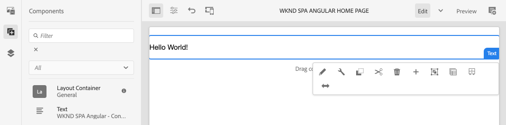
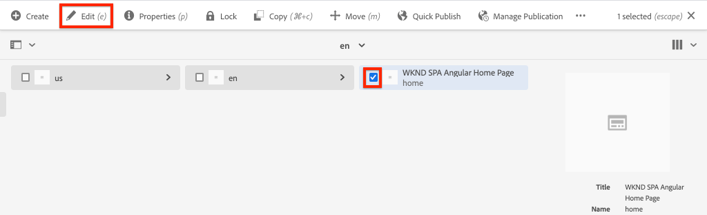

# Proyecto de editor de SPA {#create-project}

Aprenda a utilizar un proyecto de Adobe Experience Manager (AEM) Maven como punto de partida para una aplicación angular integrada con el Editor de SPA de AEM.

## Objetivo

1. Comprender la estructura de un nuevo proyecto del Editor de SPA de AEM creado a partir de un arquetipo de Maven.
2. Implemente el proyecto de inicio en una instancia local de AEM.

## Qué va a generar

En este capítulo, se implementará un nuevo proyecto de AEM, basado en el [AEM Arquetipo](https://github.com/adobe/aem-project-archetype)del Proyecto. El proyecto AEM se iniciará con un punto de partida muy sencillo para el SPA angular. El proyecto que se utiliza en este capítulo servirá de base para la aplicación de la Declaración y Plan de Acción del WKND y se basará en futuros capítulos.



*Un mensaje clásico de Hello World.*

## Requisitos previos

Revise las herramientas y las instrucciones necesarias para configurar un entorno [de desarrollo](overview.md#local-dev-environment)local. Asegúrese de que se esté ejecutando localmente una nueva instancia de Adobe Experience Manager, iniciada en modo de **autor** .

## Obtener el proyecto

Existen varias opciones para crear un proyecto multimódulo Maven para AEM. Este tutorial ha utilizado el último [AEM arquetipo](https://github.com/adobe/aem-project-archetype) del proyecto como base para el código del tutorial. Se han realizado modificaciones en el código del proyecto para admitir varias versiones de AEM. Revise [la nota sobre compatibilidad](overview.md#compatibility)con versiones anteriores.

>[!CAUTION]
>
>Se recomienda utilizar la **última** versión del [arquetipo](https://github.com/adobe/aem-project-archetype) para generar un nuevo proyecto para una implementación real. AEM proyectos deben destinatario una sola versión de AEM utilizando la `aemVersion` propiedad del arquetipo.

1. Descargue el punto de partida de este tutorial a través de Git:

   ```shell
   $ git clone git@github.com:adobe/aem-guides-wknd-spa.git
   $ cd aem-guides-wknd-spa
   $ git checkout Angular/create-project-start
   ```

2. La siguiente estructura de archivos y carpetas representa el proyecto de AEM que generó el arquetipo de Maven en el sistema de archivos local:

   ```plain
   |--- aem-guides-wknd-spa
       |--- all/
       |--- core/
       |--- dispatcher/
       |--- ui.apps/
       |--- ui.apps.structure/
       |--- ui.content/
       |--- ui.frontend /
       |--- it.tests/
       |--- pom.xml
       |--- README.md
       |--- .gitignore
       |--- archetype.properties
   ```

3. Se utilizaron las siguientes propiedades al generar el proyecto AEM desde el arquetipo [Proyecto](https://github.com/Adobe-Marketing-Cloud/aem-project-archetype/releases/tag/aem-project-archetype-14)AEM:

   | Propiedad | Value |
   |-----------------|---------------------------------------|
   | aemVersion | nube |
   | appTitle | WKND SPA angular |
   | appId | wknd-spa-angular |
   | groupId | com.adobe.aem.guides |
   | frontModule | angular |
   | package | com.adobe.aem.guides.wknd.spa.angular |
   | includeExamples | n |

   >[!NOTE]
   >
   > Notice the `frontendModule=angular` property. Esto indica al Arquetipo de proyecto AEM que inicie el proyecto con un código [angular de inicio que se utilizará](https://docs.adobe.com/content/help/en/experience-manager-core-components/using/developing/archetype/uifrontend-angular.html) con el Editor de SPA de AEM.

## Crear el proyecto

A continuación, compile, cree e implemente el código del proyecto en una instancia local de AEM mediante Maven.

1. Asegúrese de que una instancia de AEM se esté ejecutando localmente en el puerto **4502**.
2. Desde el terminal de la línea de comandos, compruebe que Maven está instalado:

   ```shell
   $ mvn --version
    Apache Maven 3.6.2
    Maven home: /Library/apache-maven-3.6.2
    Java version: 11.0.4, vendor: Oracle Corporation, runtime: /Library/Java/JavaVirtualMachines/jdk-11.0.4.jdk/Contents/Home
   ```

3. Ejecute el siguiente comando Maven desde el `aem-guides-wknd-spa` directorio para crear e implementar el proyecto en AEM:

   ```shell
   $ mvn -PautoInstallSinglePackage clean install
   ```

   Si se utiliza [AEM 6.x](overview.md#compatibility):

   ```shell
   $ mvn clean install -PautoInstallSinglePackage -Pclassic
   ```

   Los múltiples módulos del proyecto deben compilarse e implementarse en AEM.

   ```plain
    [INFO] ------------------------------------------------------------------------
    [INFO] Reactor Summary for wknd-spa-angular 1.0.0-SNAPSHOT:
    [INFO] 
    [INFO] wknd-spa-angular ................................... SUCCESS [  0.473 s]
    [INFO] WKND SPA Angular - Core ............................ SUCCESS [ 54.866 s]
    [INFO] wknd-spa-angular.ui.frontend - UI Frontend ......... SUCCESS [02:10 min]
    [INFO] WKND SPA Angular - Repository Structure Package .... SUCCESS [  0.694 s]
    [INFO] WKND SPA Angular - UI apps ......................... SUCCESS [  6.351 s]
    [INFO] WKND SPA Angular - UI content ...................... SUCCESS [  2.885 s]
    [INFO] WKND SPA Angular - All ............................. SUCCESS [  1.736 s]
    [INFO] WKND SPA Angular - Integration Tests Bundles ....... SUCCESS [  2.563 s]
    [INFO] WKND SPA Angular - Integration Tests Launcher ...... SUCCESS [  1.846 s]
    [INFO] WKND SPA Angular - Dispatcher ...................... SUCCESS [  0.270 s]
    [INFO] ------------------------------------------------------------------------
    [INFO] BUILD SUCCESS
    [INFO] ------------------------------------------------------------------------
   ```

   Maven perfil ***autoInstallSinglePackage*** compila los módulos individuales del proyecto e implementa un paquete único en la instancia de AEM. De forma predeterminada, este paquete se implementará en una instancia de AEM que se ejecuta localmente en el puerto **4502** y con las credenciales de **admin:admin**.

4. Vaya al Administrador **[!UICONTROL de paquetes]** en la instancia de AEM local: [http://localhost:4502/crx/packmgr/index.jsp](http://localhost:4502/crx/packmgr/index.jsp).

5. Debería ver tres paquetes para `wknd-spa-angular.all`, `wknd-spa-angular.ui.apps` y `wknd-spa-angular.ui.content`.

   

   Todo el código personalizado necesario para el proyecto se incluirá en estos paquetes y se instalará en el tiempo de ejecución de AEM.

6. También debería ver varios paquetes para `spa.project.core` y `core.wcm.components`. Son dependencias que el arquetipo incluye automáticamente. Puede encontrar más información sobre [AEM componentes principales aquí](https://docs.adobe.com/content/help/es-ES/experience-manager-core-components/using/introduction.html).

## Contenido de creación

A continuación, abra el SPA de inicio generado por el arquetipo y actualice parte del contenido.

1. Vaya a la consola **[!UICONTROL Sitios]** : [http://localhost:4502/sites.html/content](http://localhost:4502/sites.html/content).

   El WKND SPA incluye una estructura básica del sitio con un país, idioma y página de inicio. Esta jerarquía se basa en los valores predeterminados del arquetipo para `language_country` y `isSingleCountryWebsite`. Estos valores se pueden sobrescribir actualizando las propiedades [](https://github.com/adobe/aem-project-archetype#available-properties) disponibles al generar un proyecto.

2. Para abrir la página **[!DNL us]** > **[!DNL en]** > **[!DNL WKND SPA Angular Home Page]** , seleccione la página y haga clic en el botón **[!UICONTROL Editar]** de la barra de menús:

   

3. Ya se ha agregado un componente **[!UICONTROL Texto]** a la página. Puede editar este componente como cualquier otro componente de AEM.

   

4. Añada un componente **[!UICONTROL Texto]** adicional a la página.

   Tenga en cuenta que la experiencia de creación es similar a la de una página de AEM Sites tradicional. Actualmente hay un número limitado de componentes disponibles para su uso. Se agregará más durante el curso del tutorial.

## Aplicación de página única Inspect

A continuación, compruebe que se trata de una aplicación de una sola página con las herramientas de desarrollador del explorador.

1. En el Editor **[!UICONTROL de]** páginas, haga clic en el menú Información **[!UICONTROL de]** página > **[!UICONTROL Vista como publicada]**:

   

   Se abrirá una nueva ficha con el parámetro de consulta `?wcmmode=disabled` que desactiva efectivamente el editor de AEM: [http://localhost:4502/content/wknd-spa-angular/us/en/home.html?wcmmode=disabled](http://localhost:4502/content/wknd-spa-angular/us/en/home.html?wcmmode=disabled)

2. Vista el origen de la página y observe que no se encuentra el contenido del texto **[!DNL Hello World]** o ninguno de los demás contenidos. En su lugar, debería ver HTML como el siguiente:

   ```html
   ...
   <body>
       <noscript>You need to enable JavaScript to run this app.</noscript>
       <div id="spa-root"></div>
       <script type="text/javascript" src="/etc.clientlibs/wknd-spa-angular/clientlibs/clientlib-angular.min.js"></script>
       ...
   </body>
   ...
   ```

   `clientlib-angular.min.js` es el SPA angular que se carga en la página y es responsable de procesar el contenido.

   *¿De dónde viene el contenido?*

3. Vuelva a la ficha: [http://localhost:4502/content/wknd-spa-angular/us/en/home.html?wcmmode=disabled](http://localhost:4502/content/wknd-spa-angular/us/en/home.html?wcmmode=disabled)
4. Abra las herramientas de desarrollador del navegador e inspeccione el tráfico de red de la página durante una actualización. Vista de las solicitudes **XHR** :

   

   Debería haber una solicitud para [http://localhost:4502/content/wknd-spa-angular/us/en.model.json](http://localhost:4502/content/wknd-spa-angular/us/en.model.json). Contiene todo el contenido, formateado en JSON, que dirigirá el SPA.

5. En una ficha nueva, abra [http://localhost:4502/content/wknd-spa-angular/us/en.model.json](http://localhost:4502/content/wknd-spa-angular/us/en.model.json)

   La solicitud `en.model.json` representa el modelo de contenido que dirigirá la aplicación. Inspect muestra la salida JSON y debería poder encontrar el fragmento que representa los componentes de **[!UICONTROL texto]** .

   ```json
   ...
   ":items": {
       "text": {
           "text": "<p>Hello World! Updated content!</p>\r\n",
           "richText": true,
           ":type": "wknd-spa-angular/components/text"
       },
       "text_98796435": {
           "text": "<p>A new text component.</p>\r\n",
           "richText": true,
           ":type": "wknd-spa-angular/components/text"
   },
   ...
   ```

   En el siguiente capítulo analizaremos cómo se asigna el contenido JSON de Componentes de AEM a Componentes de SPA para formar la base de la experiencia AEM Editor de SPA.

   >[!NOTE]
   >
   > Puede resultar útil instalar una extensión de explorador para dar formato automáticamente a la salida JSON.

## Felicitaciones! {#congratulations}

Felicitaciones, acaba de crear su primer proyecto AEM editor de SPA!

Es bastante simple ahora, pero en los próximos capítulos se agregará más funcionalidad.

### Próximos pasos {#next-steps}

[Integrar el SPA](integrate-spa.md) : Conozca cómo el código fuente de SPA está integrado con el proyecto de AEM y comprenda las herramientas disponibles para desarrollar rápidamente el SPA.
