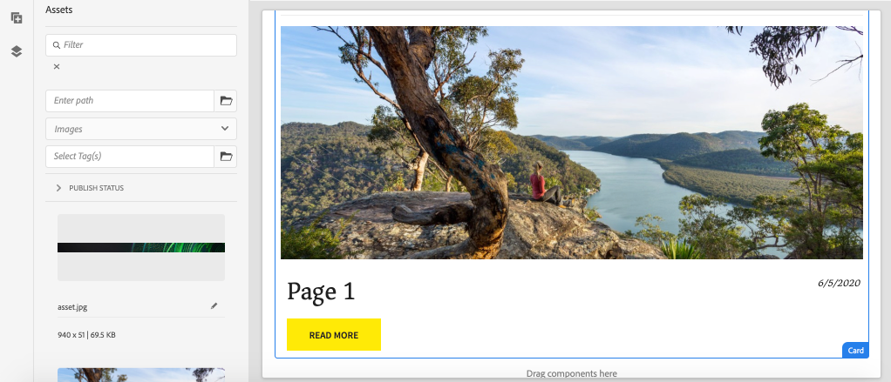

# Ampliar un componente principal {#extend-component}

Obtenga información sobre cómo ampliar un componente principal existente para utilizarlo con el Editor de SPA de AEM. El comprender cómo ampliar un componente existente es una técnica eficaz para personalizar y ampliar las capacidades de una implementación de editor SPA AEM.

## Objetivo

1. Amplíe un componente principal existente con propiedades y contenido adicionales.
2. Comprender los aspectos básicos de la herencia de componentes con el uso de `sling:resourceSuperType`.
3. Descubra cómo aprovechar el [Patrón de delegación](https://github.com/adobe/aem-core-wcm-components/wiki/Delegation-Pattern-for-Sling-Models) para los modelos Sling para reutilizar la lógica y funcionalidad existentes.

## Qué va a generar

En este capítulo se creará un nuevo componente `Card`. El componente `Card` ampliará el [Componente principal de imagen](https://docs.adobe.com/content/help/es-ES/experience-manager-core-components/using/components/image.html) agregando campos de contenido adicionales como un Título y un botón Llamada a acción para realizar la función de teaser para otro contenido dentro del SPA.


>[!NOTE]
>
> En una implementación en el mundo real, puede ser más apropiado simplemente utilizar el [componente Teaser](https://docs.adobe.com/content/help/en/experience-manager-core-components/using/components/teaser.html) y luego extender el [componente principal de imagen](https://docs.adobe.com/content/help/en/experience-manager-core-components/using/components/image.html) para hacer un componente `Card` según los requerimientos del proyecto. Siempre se recomienda utilizar [Componentes principales](https://docs.adobe.com/content/help/es-ES/experience-manager-core-components/using/introduction.html) directamente cuando sea posible.

## Requisitos previos

Revise las herramientas y las instrucciones necesarias para configurar un [entorno de desarrollo local](overview.md#local-dev-environment).

### Obtener el código

1. Descargue el punto de partida de este tutorial a través de Git:

   ```shell
   $ git clone git@github.com:adobe/aem-guides-wknd-spa.git
   $ cd aem-guides-wknd-spa
   $ git checkout Angular/extend-component-start
   ```

2. Implemente el código base en una instancia de AEM local mediante Maven:

   ```shell
   $ mvn clean install -PautoInstallSinglePackage
   ```

   Si utiliza [AEM 6.x](overview.md#compatibility) agregue el perfil `classic`:

   ```shell
   $ mvn clean install -PautoInstallSinglePackage -Pclassic
   ```

3. Instale el paquete terminado para el [sitio de referencia WKND tradicional](https://github.com/adobe/aem-guides-wknd/releases/latest). Las imágenes proporcionadas por [sitio de referencia WKND](https://github.com/adobe/aem-guides-wknd/releases/latest) se reutilizarán en el SPA WKND. El paquete se puede instalar mediante [Administrador de paquetes de AEM](http://localhost:4502/crx/packmgr/index.jsp).

   

Siempre puede realizar la vista del código terminado en [GitHub](https://github.com/adobe/aem-guides-wknd-spa/tree/Angular/extend-component-solution) o extraer el código localmente cambiando a la rama `Angular/extend-component-solution`.

## Implementación inicial de Inspect Card

El código de inicio de capítulo ha proporcionado un componente de tarjeta inicial. Inspect es el punto de partida para la implementación de tarjetas.

1. En el IDE de su elección, abra el módulo `ui.apps`.
2. Vaya a `ui.apps/src/main/content/jcr_root/apps/wknd-spa-angular/components/card` y vista el archivo `.content.xml`.

   

   ```xml
   <?xml version="1.0" encoding="UTF-8"?>
   <jcr:root xmlns:sling="http://sling.apache.org/jcr/sling/1.0" xmlns:cq="http://www.day.com/jcr/cq/1.0" xmlns:jcr="http://www.jcp.org/jcr/1.0"
       jcr:primaryType="cq:Component"
       jcr:title="Card"
       sling:resourceSuperType="wknd-spa-angular/components/image"
       componentGroup="WKND SPA Angular - Content"/>
   ```

   La propiedad `sling:resourceSuperType` señala a `wknd-spa-angular/components/image` indicando que el componente `Card` heredará toda la funcionalidad del componente Imagen SPA WKND.

3. Inspect el archivo `ui.apps/src/main/content/jcr_root/apps/wknd-spa-angular/components/image/.content.xml`:

   ```xml
   <?xml version="1.0" encoding="UTF-8"?>
   <jcr:root xmlns:sling="http://sling.apache.org/jcr/sling/1.0" xmlns:cq="http://www.day.com/jcr/cq/1.0" xmlns:jcr="http://www.jcp.org/jcr/1.0"
       jcr:primaryType="cq:Component"
       jcr:title="Image"
       sling:resourceSuperType="core/wcm/components/image/v2/image"
       componentGroup="WKND SPA Angular - Content"/>
   ```

   Observe que el `sling:resourceSuperType` apunta a `core/wcm/components/image/v2/image`. Esto indica que el componente de imagen de SPA WKND hereda toda la funcionalidad de la imagen del componente principal.

   También conocida como la herencia de recursos Sling [Proxy pattern](https://docs.adobe.com/content/help/en/experience-manager-core-components/using/developing/guidelines.html#proxy-component-pattern) es un potente patrón de diseño que permite que los componentes secundarios hereden la funcionalidad y extiendan o sobrescriban el comportamiento cuando lo desee. La herencia de Sling admite varios niveles de herencia, por lo que en última instancia el nuevo componente `Card` hereda la funcionalidad de la imagen del componente principal.

   Muchos equipos de desarrollo se esfuerzan por ser D.R.Y. (no se repita). La herencia de Sling permite esto con AEM.

4. Debajo de la carpeta `card`, abra el archivo `_cq_dialog/.content.xml`.

   Este archivo es la definición del cuadro de diálogo de componentes para el componente `Card`. Si se utiliza la herencia Sling, es posible utilizar las características de la [fusión de recursos Sling](https://docs.adobe.com/content/help/en/experience-manager-65/developing/platform/sling-resource-merger.html) para anular o ampliar partes del cuadro de diálogo. En este ejemplo, se ha agregado una nueva ficha al cuadro de diálogo para capturar datos adicionales de un autor para rellenar el componente de tarjeta.

   Las propiedades como `sling:orderBefore` permiten a un desarrollador elegir dónde insertar nuevas fichas o campos de formulario. En este caso, la ficha `Text` se insertará antes de la ficha `asset`. Para aprovechar al máximo la fusión de recursos de Sling, es importante conocer la estructura de nodos de cuadro de diálogo original para el cuadro de diálogo del componente [Imagen](https://github.com/adobe/aem-core-wcm-components/blob/master/content/src/content/jcr_root/apps/core/wcm/components/image/v2/image/_cq_dialog/.content.xml).

5. Debajo de la carpeta `card`, abra el archivo `_cq_editConfig.xml`. Este archivo dicta el comportamiento de arrastrar y soltar en la IU de creación de AEM. Al ampliar el componente Imagen, es importante que el tipo de recurso coincida con el propio componente. Revise el nodo `<parameters>`:

   ```xml
   <parameters
       jcr:primaryType="nt:unstructured"
       sling:resourceType="wknd-spa-angular/components/card"
       imageCrop=""
       imageMap=""
       imageRotate=""/>
   ```

   La mayoría de los componentes no requieren `cq:editConfig`, la imagen y los descendientes secundarios del componente Imagen son excepciones.

6. En el conmutador IDE al módulo `ui.frontend`, vaya a `ui.frontend/src/app/components/card`:

   

7. Inspect el archivo `card.component.ts`.

   El componente ya se ha encontrado para asignarse al componente AEM `Card` mediante la función estándar `MapTo`.

   ```js
   MapTo('wknd-spa-angular/components/card')(CardComponent, CardEditConfig);
   ```

   Revise los tres parámetros `@Input` de la clase para `src`, `alt` y `title`. Estos son valores JSON esperados del componente AEM que se asignarán al componente Angular.

8. Abra el archivo `card.component.html`:

   ```html
   <div class="card"  *ngIf="hasContent">
       <app-image class="card__image" [src]="src" [alt]="alt" [title]="title"></app-image>
   </div>
   ```

   En este ejemplo hemos elegido reutilizar el componente de imagen de Angular existente `app-image` pasando simplemente los parámetros `@Input` de `card.component.ts`. Más adelante en el tutorial se agregarán y mostrarán propiedades adicionales.

## Actualizar la directiva de plantilla

Con esta implementación inicial `Card` revise la funcionalidad en el Editor de SPA de AEM. Para ver el componente `Card` inicial se necesita una actualización de la directiva Plantilla.

1. Implemente el código de inicio en una instancia local de AEM, si aún no lo ha hecho:

   ```shell
   $ cd aem-guides-wknd-spa
   $ mvn clean install -PautoInstallSinglePackage
   ```

2. Vaya a la Plantilla de página SPA en [http://localhost:4502/editor.html/conf/wknd-spa-angular/settings/wcm/templates/spa-page-template/structure.html](http://localhost:4502/editor.html/conf/wknd-spa-angular/settings/wcm/templates/spa-page-template/structure.html).
3. Actualice la directiva del Contenedor de diseño para agregar el nuevo componente `Card` como un componente permitido:

   

   Guarde los cambios en la directiva y observe el componente `Card` como un componente permitido:

   

## Autor del componente de tarjeta inicial

A continuación, cree el componente `Card` con el Editor de SPA de AEM.

1. Vaya a [http://localhost:4502/editor.html/content/wknd-spa-angular/us/en/home.html](http://localhost:4502/editor.html/content/wknd-spa-angular/us/en/home.html).
2. En el modo `Edit`, agregue el componente `Card` a `Layout Container`:

   

3. Arrastre y suelte una imagen desde Asset Finder en el componente `Card`:

   

4. Abra el cuadro de diálogo del componente `Card` y observe la adición de una ficha **Texto**.
5. Introduzca los siguientes valores en la ficha **Texto**:

   

   **Ruta**  de tarjeta: elija una página debajo de la página principal de SPA.

   **Texto**  de llamada a acción: &quot;Más información&quot;

   **Título**  de la tarjeta: dejar en blanco

   **Obtener título de una página**  vinculada: marque la casilla de verificación para indicar verdadero.

6. Actualice la ficha **Metadatos del recurso** para agregar valores para **Texto alternativo** y **Rótulo**.

   Actualmente no aparecen cambios adicionales después de actualizar el cuadro de diálogo. Para exponer los nuevos campos al componente Angular, debemos actualizar el modelo Sling para el componente `Card`.

7. Abra una nueva ficha y vaya a [CRXDE-Lite](http://localhost:4502/crx/de/index.jsp#/content/wknd-spa-angular/us/en/home/jcr%3Acontent/root/responsivegrid/card). Inspect los nodos de contenido debajo de `/content/wknd-spa-angular/us/en/home/jcr:content/root/responsivegrid` para encontrar el contenido del componente `Card`.

   

   Observe que el cuadro de diálogo mantiene las propiedades `cardPath`, `ctaText`, `titleFromPage`.

## Actualizar modelo Sling de tarjeta

Para exponer finalmente los valores del cuadro de diálogo del componente al componente Angular, debemos actualizar el modelo Sling que rellena el JSON para el componente `Card`. También tenemos la oportunidad de implementar dos elementos de lógica empresarial:

* Si `titleFromPage` es **true**, devuelve el título de la página especificada por `cardPath`; de lo contrario, devuelve el valor de `cardTitle` textfield.
* Devuelve la última fecha modificada de la página especificada por `cardPath`.

Vuelva al IDE de su elección y abra el módulo `core`.

1. Abra el archivo `Card.java` en `core/src/main/java/com/adobe/aem/guides/wknd/spa/angular/core/models/Card.java`.

   Observe que la interfaz `Card` actualmente se extiende `com.adobe.cq.wcm.core.components.models.Image` y, por lo tanto, hereda todos los métodos de la interfaz `Image`. La interfaz `Image` ya amplía la interfaz `ComponentExporter`, lo que permite exportar el modelo Sling como JSON y asignarlo al editor de SPA. Por lo tanto, no necesitamos extender explícitamente la `ComponentExporter` interfaz como hicimos en el [capítulo del componente personalizado](custom-component.md).

2. Añada los siguientes métodos a la interfaz:

   ```java
   @ProviderType
   public interface Card extends Image {
   
       /***
       * The URL to populate the CTA button as part of the card.
       * The link should be based on the cardPath property that points to a page.
       * @return String URL
       */
       public String getCtaLinkURL();
   
       /***
       * The text to display on the CTA button of the card.
       * @return String CTA text
       */
       public String getCtaText();
   
   
   
       /***
       * The date to be displayed as part of the card.
       * This is based on the last modified date of the page specified by the cardPath
       * @return
       */
       public Calendar getCardLastModified();
   
   
       /**
       * Return the title of the page specified by cardPath if `titleFromPage` is set to true.
       * Otherwise return the value of `cardTitle`
       * @return
       */
       public String getCardTitle();
   }
   ```

   Estos métodos se exponen mediante la API de modelo JSON y se pasan al componente Angular.

3. Abra `CardImpl.java`. Ésta es la implementación de la interfaz `Card.java`. Esta implementación ya se ha estropeado parcialmente para acelerar el tutorial.  Observe el uso de las anotaciones `@Model` y `@Exporter` para garantizar que el modelo de Sling pueda serializarse como JSON mediante el exportador del modelo de Sling.

   `CardImpl.java` también utiliza el patrón  [Delegación para Sling ](https://github.com/adobe/aem-core-wcm-components/wiki/Delegation-Pattern-for-Sling-Models) Models para evitar reescribir toda la lógica del componente principal Imagen.

4. Observe las líneas siguientes:

   ```java
   @Self
   @Via(type = ResourceSuperType.class)
   private Image image;
   ```

   La anotación anterior creará una instancia de un objeto de imagen denominado `image` en función de la herencia `sling:resourceSuperType` del componente `Card`.

   ```java
   @Override
   public String getSrc() {
       return null != image ? image.getSrc() : null;
   }
   ```

   Entonces es posible simplemente utilizar el objeto `image` para implementar los métodos definidos por la interfaz `Image`, sin tener que escribir la lógica nosotros mismos. Esta técnica se utiliza para `getSrc()`, `getAlt()` y `getTitle()`.

5. A continuación, implemente el método `initModel()` para iniciar una variable privada `cardPage` en base al valor de `cardPath`

   ```java
   @PostConstruct
   public void initModel() {
       if(StringUtils.isNotBlank(cardPath) && pageManager != null) {
           cardPage = pageManager.getPage(this.cardPath);
       }
   }
   ```

   Siempre se llamará a `@PostConstruct initModel()` cuando se inicialice el modelo Sling, por lo que es una buena oportunidad para inicializar objetos que puedan ser utilizados por otros métodos del modelo. El `pageManager` es uno de un número de [objetos globales respaldados por Java](https://docs.adobe.com/content/help/en/experience-manager-htl/using/htl/global-objects.html#java-backed-objects) que se ponen a disposición de los modelos Sling mediante la anotación `@ScriptVariable`. El método [getPage](https://docs.adobe.com/content/help/en/experience-manager-cloud-service/implementing/developing/ref/javadoc/com/day/cq/wcm/api/PageManager.html#getPage-java.lang.String-) toma una ruta y devuelve un objeto AEM [Page](https://docs.adobe.com/content/help/en/experience-manager-cloud-service/implementing/developing/ref/javadoc/com/day/cq/wcm/api/Page.html) o nulo si la ruta no apunta a una página válida.

   Esto inicializará la variable `cardPage`, que será utilizada por los otros nuevos métodos para devolver datos sobre la página vinculada subyacente.

6. Revise las variables globales ya asignadas a las propiedades JCR guardadas en el cuadro de diálogo de creación. La anotación `@ValueMapValue` se utiliza para realizar automáticamente la asignación.

   ```java
   @ValueMapValue
   private String cardPath;
   
   @ValueMapValue
   private String ctaText;
   
   @ValueMapValue
   private boolean titleFromPage;
   
   @ValueMapValue
   private String cardTitle;
   ```

   Estas variables se utilizarán para implementar los métodos adicionales para la interfaz `Card.java`.

7. Implementar los métodos adicionales definidos en la interfaz `Card.java`:

   ```java
   @Override
   public String getCtaLinkURL() {
       if(cardPage != null) {
           return cardPage.getPath() + ".html";
       }
       return null;
   }
   
   @Override
   public String getCtaText() {
       return ctaText;
   }
   
   @Override
   public Calendar getCardLastModified() {
      if(cardPage != null) {
          return cardPage.getLastModified();
      }
      return null;
   }
   
   @Override
   public String getCardTitle() {
       if(titleFromPage) {
           return cardPage != null ? cardPage.getTitle() : null;
       }
       return cardTitle;
   }
   ```

   >[!NOTE]
   >
   > Puede realizar la vista de la [CardImpl.java terminada aquí](https://github.com/adobe/aem-guides-wknd-spa/blob/Angular/extend-component-solution/core/src/main/java/com/adobe/aem/guides/wknd/spa/angular/core/models/impl/CardImpl.java).

8. Abra una ventana de terminal e implemente sólo las actualizaciones del módulo `core` mediante el perfil Maven `autoInstallBundle` del directorio `core`.

   ```shell
   $ cd core/
   $ mvn clean install -PautoInstallBundle
   ```

   Si utiliza [AEM 6.x](overview.md#compatibility), agregue el perfil `classic`.

9. Vista de la respuesta del modelo JSON en: [http://localhost:4502/content/wknd-spa-angular/us/en.model.json](http://localhost:4502/content/wknd-spa-angular/us/en.model.json) y busque el `wknd-spa-angular/components/card`:

   ```json
   "card": {
       "ctaText": "Read More",
       "cardTitle": "Page 1",
       "title": "Woman chillaxing with river views in Australian bushland",
       "src": "/content/wknd-spa-angular/us/en/home/_jcr_content/root/responsivegrid/card.coreimg.jpeg/1595190732886/adobestock-216674449.jpeg",
       "alt": "Female sitting on a large rock relaxing in afternoon dappled light the Australian bushland with views over the river",
       "cardLastModified": 1591360492414,
       "ctaLinkURL": "/content/wknd-spa-angular/us/en/home/page-1.html",
       ":type": "wknd-spa-angular/components/card"
   }
   ```

   Observe que el modelo JSON se actualiza con pares de clave/valor adicionales después de actualizar los métodos en el modelo Sling `CardImpl`.

## Actualizar componente Angular

Ahora que el modelo JSON se rellena con nuevas propiedades para `ctaLinkURL`, `ctaText`, `cardTitle` y `cardLastModified`, podemos actualizar el componente Angular para que las muestre.

1. Vuelva al IDE y abra el módulo `ui.frontend`. Opcionalmente, puede realizar un inicio en el servidor de desarrollo de webpack desde una nueva ventana de terminal para ver los cambios en tiempo real:

   ```shell
   $ cd ui.frontend
   $ npm install
   $ npm start
   ```

2. Abra `card.component.ts` en `ui.frontend/src/app/components/card/card.component.ts`. Añada las `@Input` anotaciones adicionales para capturar el nuevo modelo:

   ```diff
   export class CardComponent implements OnInit {
   
        @Input() src: string;
        @Input() alt: string;
        @Input() title: string;
   +    @Input() cardTitle: string;
   +    @Input() cardLastModified: number;
   +    @Input() ctaLinkURL: string;
   +    @Input() ctaText: string;
   ```

3. Añada métodos para comprobar si la llamada a acción está lista y para devolver una cadena de fecha y hora basada en la entrada `cardLastModified`:

   ```js
   export class CardComponent implements OnInit {
       ...
       get hasCTA(): boolean {
           return this.ctaLinkURL && this.ctaLinkURL.trim().length > 0 && this.ctaText && this.ctaText.trim().length > 0;
       }
   
       get lastModifiedDate(): string {
           const lastModifiedDate = this.cardLastModified ? new Date(this.cardLastModified) : null;
   
           if (lastModifiedDate) {
           return lastModifiedDate.toLocaleDateString();
           }
           return null;
       }
       ...
   }
   ```

4. Abra `card.component.html` y agregue la siguiente marca para mostrar el título, la llamada a acción y la fecha de la última modificación:

   ```html
   <div class="card"  *ngIf="hasContent">
       <app-image class="card__image" [src]="src" [alt]="alt" [title]="title"></app-image>
       <div class="card__content">
           <h2 class="card__title">
               {{cardTitle}}
               <span class="card__lastmod" *ngIf="lastModifiedDate">{{lastModifiedDate}}</span>
           </h2>
           <div class="card__action-container" *ngIf="hasCTA">
               <a [routerLink]="ctaLinkURL" class="card__action-link" [title]="ctaText">
                   {{ctaText}}
               </a>
           </div>
       </div>
   </div>
   ```

   Ya se han agregado reglas de estado a `card.component.scss` para aplicar estilo al título, la llamada a acción y la fecha de la última modificación.

   >[!NOTE]
   >
   > Puede realizar la vista del código del componente de la tarjeta de Angular [aquí](https://github.com/adobe/aem-guides-wknd-spa/tree/Angular/extend-component-solution/ui.frontend/src/app/components/card).

5. Implemente los cambios completos en AEM desde la raíz del proyecto mediante Maven:

   ```shell
   $ cd aem-guides-wknd-spa
   $ mvn clean install -PautoInstallSinglePackage
   ```

6. Vaya a [http://localhost:4502/editor.html/content/wknd-spa-angular/us/en/home.html](http://localhost:4502/editor.html/content/wknd-spa-angular/us/en/home.html) para ver el componente actualizado:

   

7. Debería poder volver a crear el contenido existente para crear una página similar a la siguiente:

   

## Felicitaciones! {#congratulations}

Enhorabuena, ha aprendido a ampliar un componente de AEM mediante el modelo JSON y cómo funcionan los modelos de Sling y los diálogos.

Siempre puede realizar la vista del código terminado en [GitHub](https://github.com/adobe/aem-guides-wknd-spa/tree/Angular/extend-component-solution) o extraer el código localmente cambiando a la rama `Angular/extend-component-solution`.
