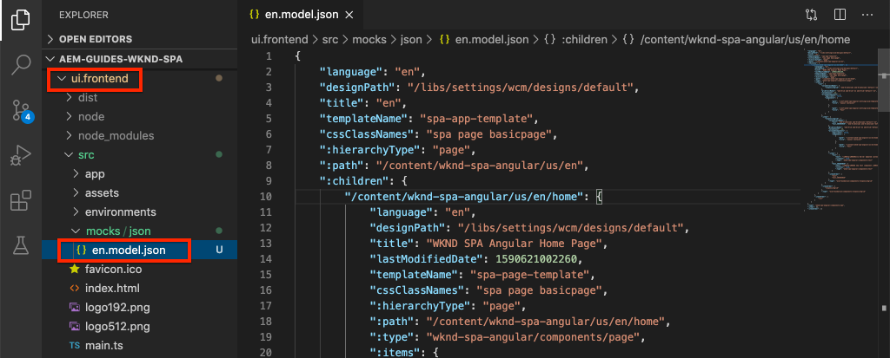
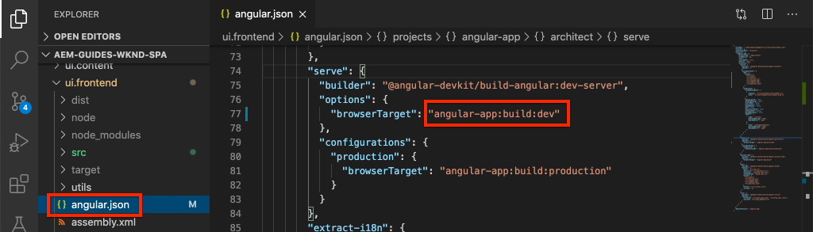

# Integrar un SPA {#integrate-spa}

Comprender cómo se puede integrar el código fuente de una aplicación de una sola página (SPA) escrita en Angular con un proyecto de Adobe Experience Manager (AEM). Aprenda a utilizar herramientas de front-end modernas, como un servidor de desarrollo de webpack, para desarrollar rápidamente la SPA con la AEM API de modelo JSON.

## Objetivo

1. Comprender cómo se integra el proyecto SPA con AEM con las bibliotecas del lado del cliente.
2. Aprenda a utilizar un servidor de desarrollo local para el desarrollo de front-end dedicado.
3. Explore el uso de un archivo **proxy** y estático **de prueba** para desarrollar con la API del modelo JSON de AEM

## Qué va a generar

Este capítulo agregará un componente simple `Header` al SPA. En el proceso de creación de este `Header` componente estático se utilizarán varios enfoques para AEM desarrollo de SPA.


*El SPA se amplía para agregar un  `Header` componente estático*

## Requisitos previos

Revise las herramientas y las instrucciones necesarias para configurar un [entorno de desarrollo local](overview.md#local-dev-environment).

### Obtener el código

1. Descargue el punto de partida de este tutorial a través de Git:

   ```shell
   $ git clone git@github.com:adobe/aem-guides-wknd-spa.git
   $ cd aem-guides-wknd-spa
   $ git checkout Angular/integrate-spa-start
   ```

2. Implemente el código base en una instancia de AEM local mediante Maven:

   ```shell
   $ mvn clean install -PautoInstallSinglePackage
   ```

   Si utiliza [AEM 6.x](overview.md#compatibility) agregue el perfil `classic`:

   ```shell
   $ mvn clean install -PautoInstallSinglePackage -Pclassic
   ```

Siempre puede realizar la vista del código terminado en [GitHub](https://github.com/adobe/aem-guides-wknd-spa/tree/Angular/integrate-spa-solution) o extraer el código localmente cambiando a la rama `Angular/integrate-spa-solution`.

## Enfoque de integración {#integration-approach}

Se crearon dos módulos como parte del proyecto AEM: `ui.apps` y `ui.frontend`.

El módulo `ui.frontend` es un proyecto [webpack](https://webpack.js.org/) que contiene todo el código fuente SPA. La mayoría de las pruebas y el desarrollo SPA se realizarán en el proyecto de webpack. Cuando se activa una compilación de producción, la SPA se genera y se compila mediante webpack. Los artefactos compilados (CSS y Javascript) se copian en el módulo `ui.apps` que luego se implementa en el motor de ejecución de AEM.


*Descripción de alto nivel de la integración de SPA.*

Puede [encontrar más información sobre la compilación de front-end aquí](https://docs.adobe.com/content/help/en/experience-manager-core-components/using/developing/archetype/uifrontend-angular.html).

## Inspect la integración de SPA {#inspect-spa-integration}

A continuación, inspeccione el módulo `ui.frontend` para comprender la SPA que ha sido generada automáticamente por el arquetipo de proyecto [AEM](https://docs.adobe.com/content/help/en/experience-manager-core-components/using/developing/archetype/uifrontend-angular.html).

1. En el IDE de su elección abra el proyecto AEM para el SPA WKND. Este tutorial utilizará el [IDE de código de Visual Studio](https://docs.adobe.com/content/help/en/experience-manager-learn/cloud-service/local-development-environment-set-up/development-tools.html#microsoft-visual-studio-code).

   

2. Expanda e inspeccione la carpeta `ui.frontend`. Abra el archivo `ui.frontend/package.json`

3. Debajo de `dependencies` debe ver varios relacionados con `@angular`:

   ```json
   "@angular/animations": "~9.1.11",
   "@angular/common": "~9.1.11",
   "@angular/compiler": "~9.1.11",
   "@angular/core": "~9.1.11",
   "@angular/forms": "~9.1.10",
   "@angular/platform-browser": "~9.1.10",
   "@angular/platform-browser-dynamic": "~9.1.10",
   "@angular/router": "~9.1.10",
   ```

   El módulo `ui.frontend` es una [aplicación angular](https://angular.io) generada mediante el uso de la [herramienta CLI angular](https://angular.io/cli) que incluye enrutamiento.

4. También hay tres dependencias con el prefijo `@adobe`:

   ```json
   "@adobe/cq-angular-editable-components": "^2.0.2",
   "@adobe/cq-spa-component-mapping": "^1.0.3",
   "@adobe/cq-spa-page-model-manager": "^1.1.3",
   ```

   Los módulos anteriores conforman el [AEM SDK de JS del Editor SPA](https://docs.adobe.com/content/help/en/experience-manager-65/developing/headless/spas/spa-blueprint.html) y proporcionan la funcionalidad necesaria para poder asignar SPA componentes a AEM componentes.

5. En el archivo `package.json` se definen varios `scripts`:

   ```json
   "scripts": {
       "start": "ng serve --open --proxy-config ./proxy.conf.json",
       "build": "ng lint && ng build && clientlib",
       "build:production": "ng lint && ng build --prod && clientlib",
       "test": "ng test",
       "sync": "aemsync -d -w ../ui.apps/src/main/content"
   }
   ```

   Estas secuencias de comandos se basan en comandos [CLI angulares](https://angular.io/cli/build) comunes, pero se han modificado ligeramente para funcionar con el proyecto de AEM más grande.

   `start` - ejecuta la aplicación Angular localmente mediante un servidor web local. Se ha actualizado para proxy el contenido de la instancia de AEM local.

   `build` - compila la aplicación Angular para la distribución de producción. La adición de `&& clientlib` es responsable de copiar el SPA compilado en el módulo `ui.apps` como una biblioteca del lado del cliente durante una compilación. El módulo npm [aem-clientlib-generator](https://github.com/wcm-io-frontend/aem-clientlib-generator) se utiliza para facilitar esto.

   Encontrará más detalles sobre las secuencias de comandos disponibles [aquí](https://docs.adobe.com/content/help/en/experience-manager-core-components/using/developing/archetype/uifrontend-angular.html).

6. Inspect el archivo `ui.frontend/clientlib.config.js`. Este archivo de configuración lo utiliza [aem-clientlib-generator](https://github.com/wcm-io-frontend/aem-clientlib-generator#clientlibconfigjs) para determinar cómo generar la biblioteca del cliente.

7. Inspect el archivo `ui.frontend/pom.xml`. Este archivo transforma la carpeta `ui.frontend` en un [módulo Maven](http://maven.apache.org/guides/mini/guide-multiple-modules.html). El archivo `pom.xml` se ha actualizado para utilizar el [plugin pretendido-maven](https://github.com/eirslett/frontend-maven-plugin) en **prueba** y **compilación** la SPA durante una compilación de Maven.

8. Inspect el archivo `app.component.ts` en `ui.frontend/src/app/app.component.ts`:

   ```js
   import { Constants } from '@adobe/cq-angular-editable-components';
   import { ModelManager } from '@adobe/cq-spa-page-model-manager';
   import { Component } from '@angular/core';
   
   @Component({
   selector: '#spa-root', // tslint:disable-line
   styleUrls: ['./app.component.css'],
   templateUrl: './app.component.html'
   })
   export class AppComponent {
       ...
   
       constructor() {
           ModelManager.initialize().then(this.updateData);
       }
   
       private updateData = pageModel => {
           this.path = pageModel[Constants.PATH_PROP];
           this.items = pageModel[Constants.ITEMS_PROP];
           this.itemsOrder = pageModel[Constants.ITEMS_ORDER_PROP];
       }
   }
   ```

   `app.component.js` es el punto de entrada del SPA. `ModelManager` lo proporciona el SDK de JS Editor de AEM SPA. Es responsable de llamar e inyectar el `pageModel` (contenido JSON) en la aplicación.

## Añadir un componente de encabezado {#header-component}

A continuación, agregue un componente nuevo a la SPA e implemente los cambios en una instancia de AEM local para ver la integración.

1. Abra una nueva ventana de terminal y vaya a la carpeta `ui.frontend`:

   ```shell
   $ cd aem-guides-wknd-spa/ui.frontend
   ```

2. Instalar [CLI angular](https://angular.io/cli#installing-angular-cli) globalmente Esto se utiliza para generar componentes angulares así como para generar y servir la aplicación Angular mediante el comando **ng**.

   ```shell
   $ npm install -g @angular/cli
   ```

   >[!CAUTION]
   >
   > La versión de **@angular/cli** utilizada por este proyecto es **9.1.7**. Se recomienda mantener sincronizadas las versiones de la CLI angular.

3. Cree un nuevo componente `Header` ejecutando el comando CLI angular `ng generate component` desde la carpeta `ui.frontend`.

   ```shell
   $ ng generate component components/header
   
   CREATE src/app/components/header/header.component.css (0 bytes)
   CREATE src/app/components/header/header.component.html (21 bytes)
   CREATE src/app/components/header/header.component.spec.ts (628 bytes)
   CREATE src/app/components/header/header.component.ts (269 bytes)
   UPDATE src/app/app.module.ts (1809 bytes)
   ```

   Esto creará un esqueleto para el nuevo componente Encabezado angular en `ui.frontend/src/app/components/header`.

4. Abra el proyecto `aem-guides-wknd-spa` en el IDE que desee. Vaya a la carpeta `ui.frontend/src/app/components/header`.

   

5. Abra el archivo `header.component.html` y reemplace el contenido por lo siguiente:

   ```html
   <!--/* header.component.html */-->
   <header className="header">
       <div className="header-container">
           <h1>WKND</h1>
       </div>
   </header>
   ```

   Tenga en cuenta que esto muestra contenido estático, por lo que este componente angular no requiere ningún ajuste en el `header.component.ts` predeterminado generado.

6. Abra el archivo **app.component.html** en `ui.frontend/src/app/app.component.html`. Añada el `app-header`:

   ```html
   <app-header></app-header>
   <router-outlet></router-outlet>
   ```

   Esto incluirá el componente `header` sobre todo el contenido de la página.

7. Abra un nuevo terminal y vaya a la carpeta `ui.frontend` y ejecute el comando `npm run build`:

   ```shell
   $ cd ui.frontend
   $ npm run build
   
   Linting "angular-app"...
   All files pass linting.
   Generating ES5 bundles for differential loading...
   ES5 bundle generation complete.
   ```

8. Vaya a la carpeta `ui.apps`. Debajo de `ui.apps/src/main/content/jcr_root/apps/wknd-spa-angular/clientlibs/clientlib-angular` debe ver que los archivos de SPA compilados se han copiado de la carpeta`ui.frontend/build`.

   

9. Vuelva al terminal y navegue a la carpeta `ui.apps`. Ejecute el siguiente comando Maven:

   ```shell
   $ cd ../ui.apps
   $ mvn clean install -PautoInstallPackage
   ...
   [INFO] ------------------------------------------------------------------------
   [INFO] BUILD SUCCESS
   [INFO] ------------------------------------------------------------------------
   [INFO] Total time:  9.629 s
   [INFO] Finished at: 2020-05-04T17:48:07-07:00
   [INFO] ------------------------------------------------------------------------
   ```

   Esto implementará el paquete `ui.apps` en una instancia de ejecución local de AEM.

10. Abra una ficha del explorador y vaya a [http://localhost:4502/editor.html/content/wknd-spa-angular/us/en/home.html](http://localhost:4502/editor.html/content/wknd-spa-angular/us/en/home.html). Ahora debería ver el contenido del componente `Header` que se muestra en el SPA.

   

   Los pasos **7-9** se ejecutan automáticamente al activar una compilación Maven desde la raíz del proyecto (es decir, `mvn clean install -PautoInstallSinglePackage`). Ahora debe comprender los conceptos básicos de la integración entre las bibliotecas de SPA y AEM del lado del cliente. Observe que aún puede editar y agregar `Text` componentes en AEM, pero el componente `Header` no es editable.

## Servidor de desarrollo de Webpack: proxy de la API de JSON {#proxy-json}

Como se ha visto en ejercicios anteriores, realizar una compilación y sincronizar la biblioteca del cliente con una instancia local de AEM tarda unos minutos. Esto es aceptable para las pruebas finales, pero no es ideal para la mayoría del desarrollo SPA.

Se puede utilizar un [servidor de desarrollo de webpack](https://webpack.js.org/configuration/dev-server/) para desarrollar rápidamente la SPA. El SPA está impulsado por un modelo JSON generado por AEM. En este ejercicio, el contenido JSON de una instancia de AEM en ejecución será **proxy** en el servidor de desarrollo configurado por el [proyecto angular](https://angular.io/guide/build).

1. Vuelva al IDE y abra el archivo **proxy.conf.json** en `ui.frontend/proxy.conf.json`.

   ```json
   [
       {
           "context": [
                       "/content/**/*.(jpg|jpeg|png|model.json)",
                       "/etc.clientlibs/**/*"
                   ],
           "target": "http://localhost:4502",
           "auth": "admin:admin",
           "logLevel": "debug"
       }
   ]
   ```

   La [aplicación angular](https://angular.io/guide/build#proxying-to-a-backend-server) proporciona un mecanismo sencillo para las solicitudes de API proxy. Los patrones especificados en `context` se procesan como proxy a través de `localhost:4502`, el inicio rápido AEM local.

2. Abra el archivo **index.html** en `ui.frontend/src/index.html`. Este es el archivo HTML raíz que utiliza el servidor dev.

   Tenga en cuenta que hay una entrada para `base href="/"`. La [etiqueta base](https://angular.io/guide/deployment#the-base-tag) es crítica para que la aplicación resuelva las direcciones URL relativas.

   ```html
   <base href="/">
   ```

3. Abra una ventana de terminal y vaya a la carpeta `ui.frontend`. Ejecute el comando `npm start`:

   ```shell
   $ cd ui.frontend
   $ npm start
   
   > wknd-spa-angular@0.1.0 start /Users/dgordon/Documents/code/aem-guides-wknd-spa/ui.frontend
   > ng serve --open --proxy-config ./proxy.conf.json
   
   10% building 3/3 modules 0 active[HPM] Proxy created: [ '/content/**/*.(jpg|jpeg|png|model.json)', '/etc.clientlibs/**/*' ]  ->  http://localhost:4502
   [HPM] Subscribed to http-proxy events:  [ 'error', 'close' ]
   ℹ ｢wds｣: Project is running at http://localhost:4200/webpack-dev-server/
   ℹ ｢wds｣: webpack output is served from /
   ℹ ｢wds｣: 404s will fallback to //index.html
   ```

4. Abra una nueva ficha del explorador (si no se ha abierto ya) y vaya a [http://localhost:4200/content/wknd-spa-angular/us/en/home.html](http://localhost:4200/content/wknd-spa-angular/us/en/home.html).

   

   Debería ver el mismo contenido que en AEM, pero sin ninguna de las capacidades de creación habilitadas.

5. Vuelva al IDE y cree una nueva carpeta denominada `img` en `ui.frontend/src/assets`.
6. Descargue y agregue el siguiente logotipo WKND a la carpeta `img`:

   

7. Abra **header.component.html** en `ui.frontend/src/app/components/header/header.component.html` e incluya el logotipo:

   ```html
   <header class="header">
       <div class="header-container">
           <div class="logo">
               
           </div>
       </div>
   </header>
   ```

   Guarde los cambios en **header.component.html**.

8. Vuelva al explorador. Debe ver inmediatamente los cambios realizados en la aplicación.

   

   Puede seguir realizando actualizaciones de contenido en **AEM** y verlas reflejadas en **servidor de desarrollo de webpack**, ya que estamos proxizando el contenido. Tenga en cuenta que los cambios en el contenido solo son visibles en el **servidor de desarrollo de webpack**.

9. Detenga el servidor web local con `ctrl+c` en el terminal.

## Servidor de desarrollo de Webpack: API de JSON de simulación {#mock-json}

Otro método para el desarrollo rápido es utilizar un archivo JSON estático para actuar como modelo JSON. Al &quot;burlarse&quot; del JSON, eliminamos la dependencia de una instancia de AEM local. También permite que un desarrollador front-end actualice el modelo JSON para probar la funcionalidad y generar cambios en la API de JSON que luego sería implementada por un desarrollador back-end.

La configuración inicial del JSON de prueba requiere **una instancia de AEM local**.

1. En el explorador, navegue a [http://localhost:4502/content/wknd-spa-angular/us/en.model.json](http://localhost:4502/content/wknd-spa-angular/us/en.model.json).

   Este es el JSON exportado por AEM que dirige la aplicación. Copie la salida JSON.

2. Vuelva al IDE, navegue a `ui.frontend/src` y agregue nuevas carpetas denominadas **mocks** y **json** para que coincidan con la siguiente estructura de carpetas:

   ```plain
   |-- ui.frontend
       |-- src
           |-- mocks
               |-- json
   ```

3. Cree un nuevo archivo con el nombre **en.model.json** debajo de `ui.frontend/public/mocks/json`. Pegue la salida JSON desde **Paso 1** aquí.

   

4. Cree un nuevo archivo **proxy.mock.conf.json** debajo de `ui.frontend`. Rellene el archivo con lo siguiente:

   ```json
   [
       {
       "context": [
           "/content/**/*.model.json"
       ],
       "pathRewrite": { "^/content/wknd-spa-angular/us" : "/mocks/json"} ,
       "target": "http://localhost:4200",
       "logLevel": "debug"
       }
   ]
   ```

   Esta configuración proxy reescribirá las solicitudes que inicio con `/content/wknd-spa-angular/us` con `/mocks/json` y servirá el archivo JSON estático correspondiente, por ejemplo:

   ```plain
   /content/wknd-spa-angular/us/en.model.json -> /mocks/json/en.model.json
   ```

5. Abra el archivo **angular.json**. Añada una nueva configuración **dev** con una matriz **assets** actualizada para hacer referencia a la carpeta **mocks** creada.

   ```json
    "dev": {
             "assets": [
               "src/mocks",
               "src/assets",
               "src/favicon.ico",
               "src/logo192.png",
               "src/logo512.png",
               "src/manifest.json"
             ]
       },
   ```

   

   La creación de una configuración **dev** dedicada garantiza que la carpeta **mocks** sólo se utilice durante el desarrollo y nunca se implemente en AEM en una compilación de producción.

6. En el archivo **angular.json**, actualice a continuación la configuración **browserTarget** para utilizar la nueva configuración **dev**:

   ```diff
     ...
     "serve": {
         "builder": "@angular-devkit/build-angular:dev-server",
         "options": {
   +       "browserTarget": "angular-app:build:dev"
   -       "browserTarget": "angular-app:build"
         },
     ...
   ```

   

7. Abra el archivo `ui.frontend/package.json` y agregue un nuevo comando **inicio:mock** para hacer referencia al archivo **proxy.mock.conf.json**.

   ```diff
       "scripts": {
           "start": "ng serve --open --proxy-config ./proxy.conf.json",
   +       "start:mock": "ng serve --open --proxy-config ./proxy.mock.conf.json",
           "build": "ng lint && ng build && clientlib",
           "build:production": "ng lint && ng build --prod && clientlib",
           "test": "ng test",
           "sync": "aemsync -d -w ../ui.apps/src/main/content"
       }
   ```

   Añadir un nuevo comando facilita la alternancia entre las configuraciones de proxy.

8. Si se está ejecutando, detenga el **servidor de desarrollo de webpack**. Inicio del **servidor de desarrollo de webpack** mediante el script **inicio:mock**:

   ```shell
   $ npm run start:mock
   
   > wknd-spa-angular@0.1.0 start:mock /Users/dgordon/Documents/code/aem-guides-wknd-spa/ui.frontend
   > ng serve --open --proxy-config ./proxy.mock.conf.json
   ```

   Vaya a [http://localhost:4200/content/wknd-spa-angular/us/en/home.html](http://localhost:4200/content/wknd-spa-angular/us/en/home.html) y debería ver la misma SPA, pero el contenido ahora se está extrayendo del archivo **de prueba** JSON.

9. Realice un pequeño cambio en el archivo **en.model.json** creado anteriormente. El contenido actualizado debe reflejarse inmediatamente en el **servidor de desarrollo de webpack**.

   

   Poder manipular el modelo JSON y ver los efectos en un SPA activo puede ayudar a un desarrollador a comprender la API del modelo JSON. También permite que el desarrollo del front-end y del back-end se produzca en paralelo.

## Añadir estilos con Sass

A continuación, se agregará al proyecto algún estilo actualizado. Este proyecto agregará compatibilidad con [Sass](https://sass-lang.com/) para algunas funciones útiles como variables.

1. Abra una ventana de terminal y detenga el **servidor de desarrollo de webpack** si se inicia. Desde la carpeta `ui.frontend`, introduzca el siguiente comando para actualizar la aplicación Angular y procesar **.scss** archivos.

   ```shell
   $ cd ui.frontend
   $ ng config schematics.@schematics/angular:component.styleext scss
   ```

   Esto actualizará el archivo `angular.json` con una nueva entrada en la parte inferior del archivo:

   ```json
   "schematics": {
       "@schematics/angular:component": {
       "styleext": "scss"
       }
   }
   ```

2. Instale `normalize-scss` para normalizar los estilos en todos los exploradores:

   ```shell
   $ npm install normalize-scss --save
   ```

3. Vuelva al IDE y debajo de `ui.frontend/src` cree una nueva carpeta con el nombre `styles`.
4. Cree un nuevo archivo debajo de `ui.frontend/src/styles` con el nombre `_variables.scss` y llénelo con las siguientes variables:

   ```scss
   //_variables.scss
   
   //== Colors
   //
   //## Gray and brand colors for use across theme.
   
   $black:                  #202020;
   $gray:                   #696969;
   $gray-light:             #EBEBEB;
   $gray-lighter:           #F7F7F7;
   $white:                  #FFFFFF;
   $yellow:                 #FFEA00;
   $blue:                   #0045FF;
   
   
   //== Typography
   //
   //## Font, line-height, and color for body text, headings, and more.
   
   $font-family-sans-serif:  "Helvetica Neue", Helvetica, Arial, sans-serif;
   $font-family-serif:       Georgia, "Times New Roman", Times, serif;
   $font-family-base:        $font-family-sans-serif;
   $font-size-base:          18px;
   
   $line-height-base:        1.5;
   $line-height-computed:    floor(($font-size-base * $line-height-base));
   
   // Functional Colors
   $brand-primary:             $yellow;
   $body-bg:                   $white;
   $text-color:                $black;
   $text-color-inverse:        $gray-light;
   $link-color:                $blue;
   
   //Layout
   $max-width: 1024px;
   $header-height: 75px;
   
   // Spacing
   $gutter-padding: 12px;
   ```

5. Cambie el nombre de la extensión del archivo **style.css** en `ui.frontend/src/styles.css` a **style.scss**. Sustituya el contenido por el siguiente:

   ```scss
   /* styles.scss * /
   
   /* Normalize */
   @import '~normalize-scss/sass/normalize';
   
   @import './styles/variables';
   
   body {
       background-color: $body-bg;
       font-family: $font-family-base;
       margin: 0;
       padding: 0;
       font-size: $font-size-base;
       text-align: left;
       color: $text-color;
       line-height: $line-height-base;
   }
   
   body.page {
       max-width: $max-width;
       margin: 0 auto;
       padding: $gutter-padding;
       padding-top: $header-height;
   }
   ```

6. Actualice **angular.json** y vuelva a nombrar todas las referencias a **style.css** con **style.scss**. Debería haber tres referencias.

   ```diff
     "styles": [
   -    "src/styles.css"
   +    "src/styles.scss"
      ],
   ```

## Actualizar estilos de encabezado

A continuación, agregue algunos estilos específicos de la marca al componente **Header** mediante Sass.

1. Inicio el **servidor de desarrollo de webpack** para ver la actualización de estilos en tiempo real:

   ```shell
   $ npm run start:mock
   ```

2. En `ui.frontend/src/app/components/header` vuelva a nombrar **header.component.css** a **header.component.scss**. Rellene el archivo con lo siguiente:

   ```scss
   @import "~src/styles/variables";
   
   .header {
       width: 100%;
       position: fixed;
       top: 0;
       left:0;
       z-index: 99;
       background-color: $brand-primary;
       box-shadow: 0px 0px 10px 0px rgba(0, 0, 0, 0.24);
   }
   
   .header-container {
       display: flex;
       max-width: $max-width;
       margin: 0 auto;
       padding-left: $gutter-padding;
       padding-right: $gutter-padding;
   }
   
   .logo {
       z-index: 100;
       display: flex;
       padding-top: $gutter-padding;
       padding-bottom: $gutter-padding;
   }
   
   .logo-img {
       width: 100px;
   }
   ```

3. Actualice **header.component.js** para hacer referencia a **header.component.scss**:

   ```diff
   ...
     @Component({
       selector: 'app-header',
       templateUrl: './header.component.html',
   -   styleUrls: ['./header.component.css']
   +   styleUrls: ['./header.component.scss']
     })
   ...
   ```

4. Vuelva al explorador y al **servidor de desarrollo de webpack**:

   

   Ahora debería ver los estilos actualizados agregados al componente **Header**.

## Implementar SPA actualizaciones en AEM

Los cambios realizados en el **Encabezado** actualmente solo son visibles a través del **servidor de desarrollo de webpack**. Implemente la SPA actualizada para AEM los cambios.

1. Detenga el **servidor de desarrollo de webpack**.
2. Vaya a la raíz del proyecto `/aem-guides-wknd-spa` e implemente el proyecto en AEM mediante Maven:

   ```shell
   $ cd ..
   $ mvn clean install -PautoInstallSinglePackage
   ```

3. Vaya a [http://localhost:4502/editor.html/content/wknd-spa-angular/us/en/home.html](http://localhost:4502/editor.html/content/wknd-spa-angular/us/en/home.html). Debe ver el **Encabezado** actualizado con el logotipo y los estilos aplicados:

   

   Ahora que la SPA actualizada está en AEM, la creación puede continuar.

## Felicitaciones! {#congratulations}

Felicitaciones, ha actualizado la SPA y ha explorado la integración con AEM! Ahora conoce dos enfoques diferentes para desarrollar la SPA en comparación con la API del modelo JSON AEM mediante un **servidor de desarrollo de webpack**.

Siempre puede realizar la vista del código terminado en [GitHub](https://github.com/adobe/aem-guides-wknd-spa/tree/Angular/integrate-spa-solution) o extraer el código localmente cambiando a la rama `Angular/integrate-spa-solution`.

### Próximos pasos {#next-steps}

[Asignación de componentes de SPA a componentes](map-components.md)  de AEM: Descubra cómo asignar componentes de Angular a componentes de Adobe Experience Manager (AEM) con el SDK de JS del Editor de AEM. La asignación de componentes permite a los autores realizar actualizaciones dinámicas de SPA componentes en el Editor de SPA de AEM, de forma similar a la creación de AEM tradicional.
