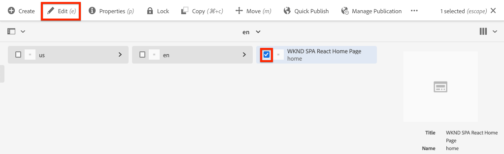

# Proyecto del Editor de SPA {#spa-editor-project}

Aprenda a utilizar un proyecto de Adobe Experience Manager (AEM) Maven como punto de partida para una aplicación React integrada con el AEM Editor SPA.

## Objetivo

1. Comprender la estructura de un nuevo proyecto de AEM SPA Editor creado a partir de un arquetipo Maven.
2. Implemente el proyecto de inicio en una instancia local de AEM.

## Qué va a generar

En este capítulo, se implementará un nuevo proyecto de AEM, basado en el [AEM Arquetipo de proyecto](https://github.com/adobe/aem-project-archetype). El proyecto AEM se iniciará con un punto de partida muy sencillo para el SPA React. El proyecto utilizado en este capítulo servirá de base para la aplicación del SPA WKND y se basará en futuros capítulos.


*Iniciando la jerarquía del sitio para la SPA WKND.*

## Requisitos previos

Revise las herramientas y las instrucciones necesarias para configurar un [entorno de desarrollo local](overview.md#local-dev-environment). Asegúrese de que se esté ejecutando localmente una nueva instancia de Adobe Experience Manager, iniciada en el modo **author**.

## Obtener el proyecto

Existen varias opciones para crear un proyecto multimódulo Maven para AEM. En este tutorial se ha utilizado el último [AEM Arquetipo de proyecto](https://github.com/adobe/aem-project-archetype) como base para el código del tutorial. Se han realizado modificaciones en el código del proyecto para admitir varias versiones de AEM. Revise [la nota sobre compatibilidad con versiones anteriores](overview.md#compatibility).

>[!CAUTION]
>
> Se recomienda utilizar la versión **más reciente** del [arquetipo](https://github.com/adobe/aem-project-archetype) para generar un nuevo proyecto para una implementación en el mundo real. AEM proyectos deben destinatario una sola versión de AEM usando la propiedad `aemVersion` del arquetipo.

1. Descargue el punto de partida de este tutorial a través de Git:

   ```shell
   $ git clone git@github.com:adobe/aem-guides-wknd-spa.git
   $ cd aem-guides-wknd-spa
   $ git checkout React/create-project-start
   ```

2. La siguiente estructura de archivos y carpetas representa el proyecto de AEM que generó el arquetipo de Maven en el sistema de archivos local:

   ```plain
   |--- aem-guides-wknd-spa
       |--- all/
       |--- core/
       |--- dispatcher/
       |--- ui.apps/
       |--- ui.apps.structure/
       |--- ui.content/
       |--- ui.frontend /
       |--- it.tests/
       |--- pom.xml
       |--- README.md
       |--- .gitignore
       |--- archetype.properties
   ```

3. Se utilizaron las siguientes propiedades al generar el proyecto AEM desde el arquetipo [AEM Proyecto](https://github.com/Adobe-Marketing-Cloud/aem-project-archetype/releases/tag/aem-project-archetype-14):

   | Propiedad | Value |
   |-----------------|-------------------------------------|
   | aemVersion | nube |
   | appTitle | WKND SPA React |
   | appId | wknd-spa-reaccionar |
   | groupId | com.adobe.aem.guides |
   | frontModule | reaccionar |
   | package | com.adobe.aem.guides.wknd.spa.react |
   | includeExamples | n |

   >[!NOTE]
   >
   > Observe la propiedad `frontendModule=react`. Esto indica al arquetipo del proyecto AEM que inicie el proyecto con un [código de reacción base](https://docs.adobe.com/content/help/en/experience-manager-core-components/using/developing/archetype/uifrontend-react.html) que se usará con el Editor de SPA de AEM.

## Crear el proyecto

A continuación, compile, cree e implemente el código del proyecto en una instancia local de AEM mediante Maven.

1. Asegúrese de que una instancia de AEM se esté ejecutando localmente en el puerto **4502**.
2. Desde el terminal de la línea de comandos, compruebe que Maven está instalado:

   ```shell
   $ mvn --version
    Apache Maven 3.6.2
    Maven home: /Library/apache-maven-3.6.2
    Java version: 11.0.4, vendor: Oracle Corporation, runtime: /Library/Java/JavaVirtualMachines/jdk-11.0.4.jdk/Contents/Home
   ```

3. Ejecute el siguiente comando Maven desde el directorio `aem-guides-wknd-spa` para crear e implementar el proyecto en AEM:

   ```shell
   $ mvn clean install -PautoInstallSinglePackage
   ```

   Si utiliza [AEM 6.x](overview.md#compatibility):

   ```shell
   $ mvn clean install -PautoInstallSinglePackage -Pclassic
   ```

   Los múltiples módulos del proyecto deben compilarse e implementarse en AEM.

   ```plain
    [INFO] ------------------------------------------------------------------------
    [INFO] Reactor Summary for wknd-spa-react 1.0.0-SNAPSHOT:
    [INFO] 
    [INFO] wknd-spa-react ..................................... SUCCESS [  0.523 s]
    [INFO] WKND SPA React - Core .............................. SUCCESS [  8.069 s]
    [INFO] wknd-spa-react.ui.frontend - UI Frontend ........... SUCCESS [01:23 min]
    [INFO] WKND SPA React - Repository Structure Package ...... SUCCESS [  0.830 s]
    [INFO] WKND SPA React - UI apps ........................... SUCCESS [  4.654 s]
    [INFO] WKND SPA React - UI content ........................ SUCCESS [  1.607 s]
    [INFO] WKND SPA React - All ............................... SUCCESS [  0.384 s]
    [INFO] WKND SPA React - Integration Tests Bundles ......... SUCCESS [  0.770 s]
    [INFO] WKND SPA React - Integration Tests Launcher ........ SUCCESS [  1.407 s]
    [INFO] WKND SPA React - Dispatcher ........................ SUCCESS [  0.055 s]
    [INFO] ------------------------------------------------------------------------
    [INFO] BUILD SUCCESS
    [INFO] ------------------------------------------------------------------------
    [INFO] Total time:  01:44 min
   ```

   El perfil Maven ***autoInstallSinglePackage*** compila los módulos individuales del proyecto e implementa un paquete único en la instancia de AEM. De forma predeterminada, este paquete se implementará en una instancia de AEM que se ejecuta localmente en el puerto **4502** y con las credenciales de **admin:admin**.

4. Vaya a **[!UICONTROL Administrador de paquetes]** en la instancia de AEM local: [http://localhost:4502/crx/packmgr/index.jsp](http://localhost:4502/crx/packmgr/index.jsp).

5. Debe ver tres paquetes para `wknd-spa-react.all`, `wknd-spa-react.ui.apps` y `wknd-spa-react.ui.content`.

   

   *Administrador de paquetes AEM*

   Todo el código personalizado necesario para el proyecto se incluirá en estos paquetes y se instalará en el tiempo de ejecución de AEM.

6. También debería ver varios paquetes para `spa.project.core` y `core.wcm.components`. El arquetipo incluye automáticamente estas dependencias. Puede encontrar más información sobre [Componentes principales de AEM aquí](https://docs.adobe.com/content/help/es-ES/experience-manager-core-components/using/introduction.html).

   `spa.project.core` es una dependencia necesaria para generar la API de modelo JSON que espera el Editor SPA.

## Contenido de creación

A continuación, abra el SPA de inicio generado por el arquetipo y actualice parte del contenido.

1. Vaya a la consola **[!UICONTROL Sites]**: [http://localhost:4502/sites.html/content](http://localhost:4502/sites.html/content).

   El SPA WKND incluye una estructura básica del sitio con un país, idioma y página de inicio. Esta jerarquía se basa en los valores predeterminados del arquetipo para `language_country` y `isSingleCountryWebsite`. Estos valores se pueden sobrescribir actualizando las [propiedades disponibles](https://github.com/adobe/aem-project-archetype#available-properties) al generar un proyecto.

2. Abra la página **[!DNL us]** > **[!DNL en]** > **[!DNL WKND SPA React Home Page]** seleccionando la página y haciendo clic en el botón **[!UICONTROL Editar]** en la barra de menús:

   

3. Ya se ha agregado un componente **[!UICONTROL Texto]** a la página. Puede editar este componente como cualquier otro componente de AEM.

   

4. Añada un componente **[!UICONTROL Texto]** adicional a la página.

   Tenga en cuenta que la experiencia de creación es similar a la de una página de AEM Sites tradicional. Actualmente hay un número limitado de componentes disponibles para su uso. Se agregará más durante el curso del tutorial.

## Aplicación de página única Inspect

A continuación, compruebe que se trata de una aplicación de una sola página con las herramientas de desarrollador del explorador.

1. En el **[!UICONTROL Editor de páginas]**, haga clic en el botón **[!UICONTROL Información de página]** > **[!UICONTROL Vista tal como se publicó]**:

   

   Esto abrirá una nueva ficha con el parámetro de consulta `?wcmmode=disabled` que desactiva efectivamente el editor de AEM: [http://localhost:4502/content/wknd-spa-react/us/en/home.html?wcmmode=disabled](http://localhost:4502/content/wknd-spa-react/us/en/home.html?wcmmode=disabled)

2. Vista el origen de la página y observe que no se encuentra el contenido de texto **[!DNL Hello World]** o cualquiera de los demás contenidos. En su lugar, debería ver HTML como el siguiente:

   ```html
   ...
   <body>
       <noscript>You need to enable JavaScript to run this app.</noscript>
       <div id="spa-root"></div>
       <script type="text/javascript" src="/etc.clientlibs/wknd-spa-react/clientlibs/clientlib-react.min.js"></script>
   </body>
   ...
   ```

   `clientlib-react.min.js` es la SPA Reacción que se carga en la página y es responsable de procesar el contenido.

   Sin embargo, *de dónde proviene el contenido?*

3. Vuelva a la ficha: [http://localhost:4502/content/wknd-spa-react/us/en/home.html?wcmmode=disabled](http://localhost:4502/content/wknd-spa-react/us/en/home.html?wcmmode=disabled)
4. Abra las herramientas de desarrollador del navegador e inspeccione el tráfico de red de la página durante una actualización. Vista de las solicitudes **XHR**:

   

   Debería haber una solicitud a [http://localhost:4502/content/wknd-spa-react/us/en.model.json](http://localhost:4502/content/wknd-spa-react/us/en.model.json). Contiene todo el contenido, formateado en JSON, que dirigirá la SPA.

5. En una nueva ficha, abra [http://localhost:4502/content/wknd-spa-react/us/en.model.json](http://localhost:4502/content/wknd-spa-react/us/en.model.json)

   La solicitud `en.model.json` representa el modelo de contenido que dirigirá la aplicación. Inspect muestra la salida JSON y debe poder encontrar el fragmento que representa los componentes **[!UICONTROL Texto]**.

   ```json
   ...
   ":items": {
       "text": {
           "text": "<p>Hello World! Updated content!</p>\r\n",
           "richText": true,
           ":type": "wknd-spa-react/components/text"
       },
       "text_98796435": {
           "text": "<p>A new text component.</p>\r\n",
           "richText": true,
           ":type": "wknd-spa-react/components/text"
       },
   }
   ...
   ```

   En el siguiente capítulo analizaremos cómo se asigna este contenido JSON desde Componentes AEM a Componentes SPA para formar la base de la experiencia del Editor SPA AEM.

   >[!NOTE]
   >
   > Puede resultar útil instalar una extensión de explorador para dar formato automáticamente a la salida JSON.

## Felicitaciones! {#congratulations}

Felicitaciones, acaba de crear su primer proyecto AEM editor SPA!

El SPA es bastante sencillo. En los próximos capítulos se agregará más funcionalidad.

### Próximos pasos {#next-steps}

[Integrar el SPA](integrate-spa.md) - Conozca cómo el código fuente SPA está integrado con el Proyecto AEM y comprenda las herramientas disponibles para desarrollar rápidamente el SPA.
