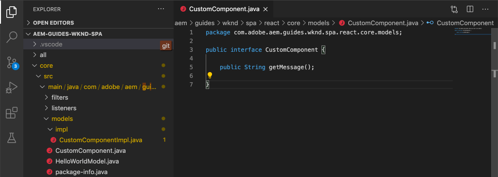
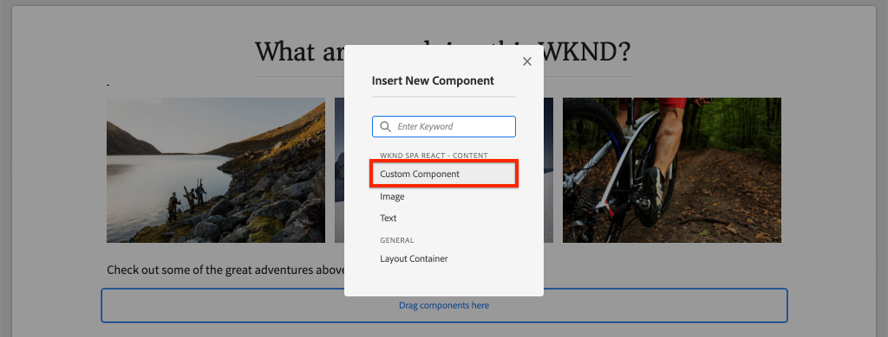

# Crear un componente personalizado {#custom-component}

Aprenda a crear un componente personalizado para utilizarlo con el Editor de SPA de AEM. Aprenda a desarrollar cuadros de diálogo de autor y modelos de Sling para ampliar el modelo JSON y rellenar un componente personalizado.

## Objetivo

1. Comprenda el papel de los modelos Sling en la manipulación de la API del modelo JSON proporcionada por AEM.
2. Obtenga información sobre cómo crear nuevos cuadros de diálogo de componentes de AEM.
3. Aprenda a crear un componente de AEM **personalizado** que sea compatible con el marco del editor de SPA.

## Qué va a generar

El objetivo de los capítulos anteriores era desarrollar componentes de SPA y asignarlos a *componentes principales existentes* de AEM. Este capítulo se centrará en cómo crear y ampliar *nuevos* componentes de AEM y manipular el modelo JSON servido por AEM.

Una sencilla `Custom Component` ilustra los pasos necesarios para crear un nuevo componente de AEM.


## Requisitos previos

Revise las herramientas e instrucciones necesarias para configurar un [entorno de desarrollo local](overview.md#local-dev-environment).

### Obtención del código

1. Descargue el punto de partida para este tutorial mediante Git:

   ```shell
   $ git clone git@github.com:adobe/aem-guides-wknd-spa.git
   $ cd aem-guides-wknd-spa
   $ git checkout React/custom-component-start
   ```

2. Implemente el código base en una instancia local de AEM mediante Maven:

   ```shell
   $ mvn clean install -PautoInstallSinglePackage
   ```

   Si utiliza [AEM 6.x](overview.md#compatibility), añada el perfil `classic`:

   ```shell
   $ mvn clean install -PautoInstallSinglePackage -Pclassic
   ```

3. Instale el paquete terminado para el sitio de referencia tradicional [WKND](https://github.com/adobe/aem-guides-wknd/releases/latest). Las imágenes proporcionadas por [WKND reference site](https://github.com/adobe/aem-guides-wknd/releases/latest) se reutilizarán en el WKND SPA. El paquete se puede instalar utilizando el [Administrador de paquetes de AEM](http://localhost:4502/crx/packmgr/index.jsp).

   

Siempre puede ver el código terminado en [GitHub](https://github.com/adobe/aem-guides-wknd-spa/tree/React/custom-component-solution) o extraer el código localmente cambiando a la rama `React/custom-component-solution`.

## Definición del componente AEM

Un componente AEM se define como un nodo y propiedades. En el proyecto, estos nodos y propiedades se representan como archivos XML en el módulo `ui.apps`. A continuación, cree el componente AEM en el módulo `ui.apps` .

>[!NOTE]
>
> Puede resultar útil realizar un repaso rápido sobre los [conceptos básicos de los componentes de AEM](https://docs.adobe.com/content/help/en/experience-manager-learn/getting-started-wknd-tutorial-develop/component-basics.html).

1. En el IDE de su elección, abra la carpeta `ui.apps` .
2. Vaya a `ui.apps/src/main/content/jcr_root/apps/wknd-spa-react/components` y cree una nueva carpeta denominada `custom-component`.
3. Cree un nuevo archivo con el nombre `.content.xml` debajo de la carpeta `custom-component`. Rellene `custom-component/.content.xml` con lo siguiente:

   ```xml
   <?xml version="1.0" encoding="UTF-8"?>
   <jcr:root xmlns:sling="http://sling.apache.org/jcr/sling/1.0" xmlns:cq="http://www.day.com/jcr/cq/1.0" xmlns:jcr="http://www.jcp.org/jcr/1.0"
       jcr:primaryType="cq:Component"
       jcr:title="Custom Component"
       componentGroup="WKND SPA React - Content"/>
   ```

   

   `jcr:primaryType="cq:Component"` : identifica que este nodo será un componente de AEM.

   `jcr:title` es el valor que se muestra a los autores de contenido y  `componentGroup` determina la agrupación de componentes en la interfaz de usuario de creación.

4. Debajo de la carpeta `custom-component`, cree otra carpeta denominada `_cq_dialog`.
5. Debajo de la carpeta `_cq_dialog` cree un nuevo archivo llamado `.content.xml` y rellénelo de la siguiente manera:

   ```xml
   <?xml version="1.0" encoding="UTF-8"?>
   <jcr:root xmlns:sling="http://sling.apache.org/jcr/sling/1.0" xmlns:granite="http://www.adobe.com/jcr/granite/1.0" xmlns:cq="http://www.day.com/jcr/cq/1.0" xmlns:jcr="http://www.jcp.org/jcr/1.0" xmlns:nt="http://www.jcp.org/jcr/nt/1.0"
       jcr:primaryType="nt:unstructured"
       jcr:title="Custom Component"
       sling:resourceType="cq/gui/components/authoring/dialog">
       <content
           jcr:primaryType="nt:unstructured"
           sling:resourceType="granite/ui/components/coral/foundation/container">
           <items jcr:primaryType="nt:unstructured">
               <tabs
                   jcr:primaryType="nt:unstructured"
                   sling:resourceType="granite/ui/components/coral/foundation/tabs"
                   maximized="{Boolean}true">
                   <items jcr:primaryType="nt:unstructured">
                       <properties
                           jcr:primaryType="nt:unstructured"
                           jcr:title="Properties"
                           sling:resourceType="granite/ui/components/coral/foundation/container"
                           margin="{Boolean}true">
                           <items jcr:primaryType="nt:unstructured">
                               <columns
                                   jcr:primaryType="nt:unstructured"
                                   sling:resourceType="granite/ui/components/coral/foundation/fixedcolumns"
                                   margin="{Boolean}true">
                                   <items jcr:primaryType="nt:unstructured">
                                       <column
                                           jcr:primaryType="nt:unstructured"
                                           sling:resourceType="granite/ui/components/coral/foundation/container">
                                           <items jcr:primaryType="nt:unstructured">
                                               <message
                                                   jcr:primaryType="nt:unstructured"
                                                   sling:resourceType="granite/ui/components/coral/foundation/form/textfield"
                                                   fieldDescription="The text to display on the component."
                                                   fieldLabel="Message"
                                                   name="./message"/>
                                           </items>
                                       </column>
                                   </items>
                               </columns>
                           </items>
                       </properties>
                   </items>
               </tabs>
           </items>
       </content>
   </jcr:root>
   ```

   

   El archivo XML anterior genera un cuadro de diálogo muy sencillo para `Custom Component`. La parte crítica del archivo es el nodo `<message>` interno. Este cuadro de diálogo contendrá un `textfield` sencillo denominado `Message` y persistirá el valor del campo de texto en una propiedad denominada `message`.

   Se creará un modelo de Sling junto a para exponer el valor de la propiedad `message` a través del modelo JSON.

   >[!NOTE]
   >
   > Puede ver muchos más [ejemplos de cuadros de diálogo consultando las definiciones de los componentes principales](https://github.com/adobe/aem-core-wcm-components/tree/master/content/src/content/jcr_root/apps/core/wcm/components). También puede ver campos de formulario adicionales, como `select`, `textarea`, `pathfield`, disponibles debajo de `/libs/granite/ui/components/coral/foundation/form` en [CRXDE-Lite](http://localhost:4502/crx/de/index.jsp#/libs/granite/ui/components/coral/foundation/form).

   Con un componente AEM tradicional, normalmente se requiere un script [HTL](https://docs.adobe.com/content/help/es-ES/experience-manager-htl/using/overview.html). Dado que la SPA procesará el componente, no se necesita ningún script HTL.

## Creación del modelo Sling

Los modelos Sling son objetos Java Java &quot;POJO&quot; (objetos Java antiguos comunes) impulsados por anotaciones que facilitan la asignación de datos de JCR a variables Java. [Sling ](https://docs.adobe.com/content/help/en/experience-manager-learn/getting-started-wknd-tutorial-develop/component-basics.html#sling-models) funciona de forma modesta para encapsular una lógica empresarial compleja del lado del servidor para los componentes AEM.

En el contexto del Editor de SPA, los modelos de Sling exponen el contenido de un componente a través del modelo JSON a través de una función que utiliza el [Exportador del modelo de Sling](https://docs.adobe.com/content/help/en/experience-manager-learn/foundation/development/develop-sling-model-exporter.html).

1. En el IDE de su elección, abra el módulo `core` . `CustomComponent.java` y ya se  `CustomComponentImpl.java` han creado y se han combinado como parte del código de inicio de capítulo.

   >[!NOTE]
   >
   > Si utiliza Visual Studio Code IDE, puede resultar útil instalar [extensiones para Java](https://code.visualstudio.com/docs/java/extensions).

2. Abra la interfaz de Java `CustomComponent.java` en `core/src/main/java/com/adobe/aem/guides/wknd/spa/react/core/models/CustomComponent.java`:

   

   Esta es la interfaz de Java que implementará el modelo Sling.

3. Actualice `CustomComponent.java` para que amplíe la interfaz `ComponentExporter`:

   ```java
   package com.adobe.aem.guides.wknd.spa.react.core.models;
   import com.adobe.cq.export.json.ComponentExporter;
   
   public interface CustomComponent extends ComponentExporter {
   
       public String getMessage();
   
   }
   ```

   La implementación de la interfaz `ComponentExporter` es un requisito para que la API del modelo JSON recopile automáticamente el modelo Sling.

   La interfaz `CustomComponent` incluye un único método de captador `getMessage()`. Este es el método que expone el valor del cuadro de diálogo de autor a través del modelo JSON. Solo se exportarán en el modelo JSON los métodos de captador públicos con parámetros vacíos `()`.

4. Abra `CustomComponentImpl.java` en `core/src/main/java/com/adobe/aem/guides/wknd/spa/react/core/models/impl/CustomComponentImpl.java`.

   Esta es la implementación de la interfaz `CustomComponent`. La anotación `@Model` identifica la clase Java como modelo de Sling. La anotación `@Exporter` permite serializar y exportar la clase Java a través del Exportador del modelo Sling.

5. Actualice la variable estática `RESOURCE_TYPE` para que apunte al componente AEM `wknd-spa-react/components/custom-component` creado en el ejercicio anterior.

   ```java
   static final String RESOURCE_TYPE = "wknd-spa-react/components/custom-component";
   ```

   El tipo de recurso del componente es lo que enlazará el modelo Sling al componente AEM y, finalmente, se asignará al componente React.

6. Agregue el método `getExportedType()` a la clase `CustomComponentImpl` para devolver el tipo de recurso de componente:

   ```java
   @Override
   public String getExportedType() {
       return CustomComponentImpl.RESOURCE_TYPE;
   }
   ```

   Este método es necesario al implementar la interfaz `ComponentExporter` y expone el tipo de recurso que permite la asignación al componente React.

7. Actualice el método `getMessage()` para devolver el valor de la propiedad `message` que persiste en el cuadro de diálogo de autor. Utilice la anotación `@ValueMap` para asignar el valor JCR `message` a una variable Java:

   ```java
   import org.apache.commons.lang3.StringUtils;
   ...
   
   @ValueMapValue
   private String message;
   
   @Override
   public String getMessage() {
       return StringUtils.isNotBlank(message) ? message.toUpperCase() : null;
   }
   ```

   Se agrega algo de &quot;lógica empresarial&quot; adicional para devolver el valor de cadena del mensaje con todas las mayúsculas. Esto nos permitirá ver la diferencia entre el valor sin procesar almacenado por el cuadro de diálogo de creación y el valor expuesto por el modelo Sling.

   >[!NOTE]
   >
   > Puede ver el [CustomComponentImpl.java terminado aquí](https://github.com/adobe/aem-guides-wknd-spa/blob/React/custom-component-solution/core/src/main/java/com/adobe/aem/guides/wknd/spa/react/core/models/impl/CustomComponentImpl.java).

## Actualizar el componente React

Ya se ha creado el código React para el componente personalizado. A continuación, realice algunas actualizaciones para asignar el componente React al componente AEM.

1. En el módulo `ui.frontend` abra el archivo `ui.frontend/src/components/Custom/Custom.js`.
2. Observe la variable `{this.props.message}` como parte del método `render()`:

   ```js
   return (
           <div className="CustomComponent">
               <h2 className="CustomComponent__message">{this.props.message}</h2>
           </div>
       );
   ```

   Se espera que el valor en mayúsculas transformado del modelo de Sling se asigne a esta propiedad `message`.

3. Importe el objeto `MapTo` del SDK de AEM SPA Editor JS y utilícelo para asignarlo al componente AEM:

   ```diff
   + import {MapTo} from '@adobe/aem-react-editable-components';
   
    ...
    export default class Custom extends Component {
        ...
    }
   
   + MapTo('wknd-spa-react/components/custom-component')(Custom, CustomEditConfig);
   ```

4. Implemente todas las actualizaciones en un entorno de AEM local desde la raíz del directorio del proyecto, con sus habilidades con Maven:

   ```shell
   $ cd aem-guides-wknd-spa
   $ mvn clean install -PautoInstallSinglePackage
   ```

## Actualizar la directiva de plantilla

A continuación, vaya a AEM para verificar las actualizaciones y permitir que el `Custom Component` se añada a la SPA.

1. Compruebe el registro del nuevo modelo Sling navegando a [http://localhost:4502/system/console/status-slingmodels](http://localhost:4502/system/console/status-slingmodels).

   ```plain
   com.adobe.aem.guides.wknd.spa.react.core.models.impl.CustomComponentImpl - wknd-spa-react/components/custom-component
   
   com.adobe.aem.guides.wknd.spa.react.core.models.impl.CustomComponentImpl exports 'wknd-spa-react/components/custom-component' with selector 'model' and extension '[Ljava.lang.String;@6fb4a693' with exporter 'jackson'
   ```

   Debería ver las dos líneas anteriores que indican que `CustomComponentImpl` está asociado con el componente `wknd-spa-react/components/custom-component` y que está registrado a través del Exportador del modelo Sling.

2. Vaya a la Plantilla de página de SPA en [http://localhost:4502/editor.html/conf/wknd-spa-react/settings/wcm/templates/spa-page-template/structure.html](http://localhost:4502/editor.html/conf/wknd-spa-react/settings/wcm/templates/spa-page-template/structure.html).
3. Actualice la política del contenedor de diseño para agregar el nuevo `Custom Component` como componente permitido:

   

   Guarde los cambios en la directiva y observe el `Custom Component` como un componente permitido:

   

## Creación del componente personalizado

A continuación, cree el `Custom Component` con el Editor de SPA de AEM.

1. Vaya a [http://localhost:4502/editor.html/content/wknd-spa-react/us/en/home.html](http://localhost:4502/editor.html/content/wknd-spa-react/us/en/home.html).
2. En el modo `Edit`, agregue `Custom Component` a `Layout Container`:

   

3. Abra el cuadro de diálogo del componente e introduzca un mensaje que contenga letras minúsculas.

   

   Este es el cuadro de diálogo que se creó en función del archivo XML anteriormente en el capítulo.

4. Guarde los cambios. Observe que el mensaje mostrado está en mayúsculas.

   

5. Para ver el modelo JSON, vaya a [http://localhost:4502/content/wknd-spa-react/us/en.model.json](http://localhost:4502/content/wknd-spa-react/us/en.model.json). Buscar `wknd-spa-react/components/custom-component`:

   ```json
   "custom_component_208183317": {
       "message": "HELLO WORLD",
       ":type": "wknd-spa-react/components/custom-component"
   }
   ```

   Observe que el valor JSON se establece en todas las mayúsculas basándose en la lógica añadida al modelo Sling.

## Felicitaciones! {#congratulations}

Felicidades, ha aprendido a crear un componente AEM personalizado para utilizarlo con el Editor de SPA. También ha aprendido cómo los cuadros de diálogo, las propiedades JCR y los modelos Sling interactúan para generar el modelo JSON.

Puede ver el código terminado en [GitHub](https://github.com/adobe/aem-guides-wknd-spa/tree/React/custom-component-solution) o extraer el código localmente cambiando a la rama `React/custom-component-solution`.

### Pasos siguientes {#next-steps}

[Ampliar un componente principal](extend-component.md) : obtenga información sobre cómo ampliar un componente principal existente para utilizarlo con el Editor de SPA de AEM. Comprender cómo añadir propiedades y contenido a un componente existente es una técnica eficaz para expandir las capacidades de una implementación del Editor de SPA de AEM.
