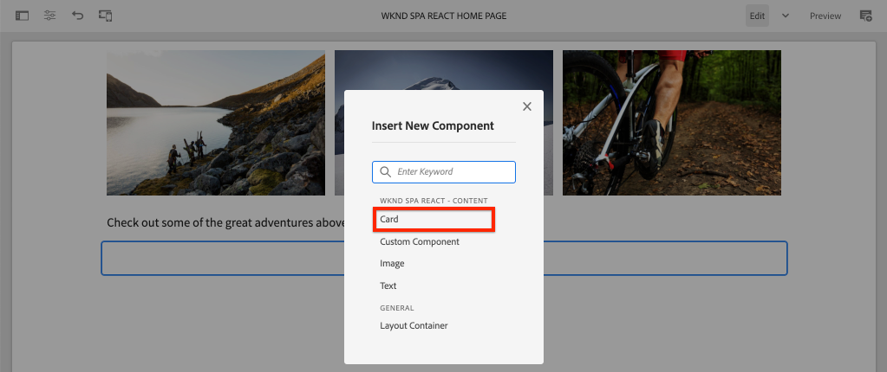
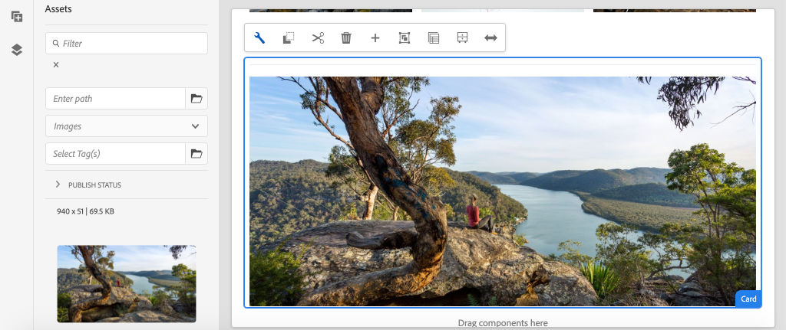
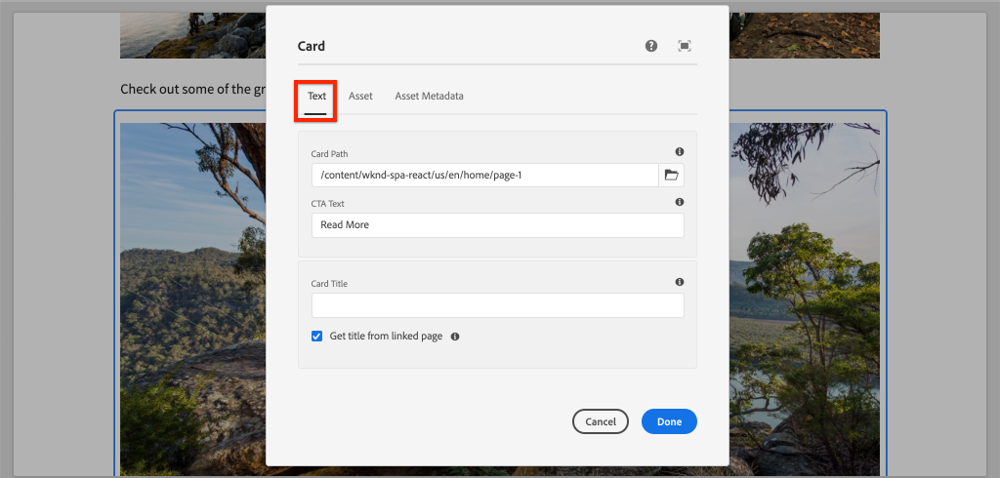

# Ampliar un componente principal {#extend-component}

Obtenga información sobre cómo ampliar un componente principal existente para utilizarlo con el Editor de SPA de AEM. Explicación de cómo ampliar un componente existente es una técnica eficaz para personalizar y expandir las capacidades de una implementación del Editor de SPA de AEM.

## Objetivo

1. Amplíe un componente principal existente con propiedades y contenido adicionales.
2. Comprender los conceptos básicos de la herencia de componentes con el uso de `sling:resourceSuperType`.
3. Aprenda a aprovechar el [Patrón de delegación](https://github.com/adobe/aem-core-wcm-components/wiki/Delegation-Pattern-for-Sling-Models) para los modelos Sling para reutilizar la lógica y la funcionalidad existentes.

## Qué va a generar

En este capítulo se creará un nuevo componente `Card`. El componente `Card` ampliará el [Componente principal de imagen](https://docs.adobe.com/content/help/es-ES/experience-manager-core-components/using/components/image.html) agregando campos de contenido adicionales como un Título y un botón Llamada a acción para realizar la función de un teaser para otro contenido dentro de la SPA.


>[!NOTE]
>
> En una implementación real, puede ser más apropiado simplemente utilizar el [Componente teaser](https://docs.adobe.com/content/help/es-ES/experience-manager-core-components/using/components/teaser.html) y luego ampliar el [Componente principal de imagen](https://docs.adobe.com/content/help/en/experience-manager-core-components/using/components/image.html) para crear un componente `Card` según los requisitos del proyecto. Siempre se recomienda utilizar [Componentes principales](https://docs.adobe.com/content/help/es-ES/experience-manager-core-components/using/introduction.html) directamente cuando sea posible.

## Requisitos previos

Revise las herramientas e instrucciones necesarias para configurar un [entorno de desarrollo local](overview.md#local-dev-environment).

### Obtención del código

1. Descargue el punto de partida para este tutorial mediante Git:

   ```shell
   $ git clone git@github.com:adobe/aem-guides-wknd-spa.git
   $ cd aem-guides-wknd-spa
   $ git checkout React/extend-component-start
   ```

2. Implemente el código base en una instancia local de AEM mediante Maven:

   ```shell
   $ mvn clean install -PautoInstallSinglePackage
   ```

   Si utiliza [AEM 6.x](overview.md#compatibility), añada el perfil `classic`:

   ```shell
   $ mvn clean install -PautoInstallSinglePackage -Pclassic
   ```

3. Instale el paquete terminado para el sitio de referencia tradicional [WKND](https://github.com/adobe/aem-guides-wknd/releases/latest). Las imágenes proporcionadas por [WKND reference site](https://github.com/adobe/aem-guides-wknd/releases/latest) se reutilizarán en el WKND SPA. El paquete se puede instalar utilizando el [Administrador de paquetes de AEM](http://localhost:4502/crx/packmgr/index.jsp).

   

Siempre puede ver el código terminado en [GitHub](https://github.com/adobe/aem-guides-wknd-spa/tree/React/extend-component-solution) o extraer el código localmente cambiando a la rama `React/extend-component-solution`.

## Inspeccionar la implementación inicial de la tarjeta

El código de inicio de capítulo ha proporcionado un componente de tarjeta inicial. Inspeccione el punto de partida para la implementación de la tarjeta.

1. En el IDE de su elección, abra el módulo `ui.apps` .
2. Vaya a `ui.apps/src/main/content/jcr_root/apps/wknd-spa-react/components/card` y vea el archivo `.content.xml`.

   

   ```xml
   <?xml version="1.0" encoding="UTF-8"?>
   <jcr:root xmlns:sling="http://sling.apache.org/jcr/sling/1.0" xmlns:cq="http://www.day.com/jcr/cq/1.0" xmlns:jcr="http://www.jcp.org/jcr/1.0"
       jcr:primaryType="cq:Component"
       jcr:title="Card"
       sling:resourceSuperType="wknd-spa-react/components/image"
       componentGroup="WKND SPA React - Content"/>
   ```

   La propiedad `sling:resourceSuperType` señala a `wknd-spa-react/components/image` indicando que el componente `Card` heredará toda la funcionalidad del componente de imagen SPA de WKND.

3. Inspeccione el archivo `ui.apps/src/main/content/jcr_root/apps/wknd-spa-react/components/image/.content.xml`:

   ```xml
   <?xml version="1.0" encoding="UTF-8"?>
   <jcr:root xmlns:sling="http://sling.apache.org/jcr/sling/1.0" xmlns:cq="http://www.day.com/jcr/cq/1.0" xmlns:jcr="http://www.jcp.org/jcr/1.0"
       jcr:primaryType="cq:Component"
       jcr:title="Image"
       sling:resourceSuperType="core/wcm/components/image/v2/image"
       componentGroup="WKND SPA React - Content"/>
   ```

   Observe que `sling:resourceSuperType` apunta a `core/wcm/components/image/v2/image`. Esto indica que el componente de imagen de WKND SPA hereda toda la funcionalidad de la imagen del componente principal.

   También conocido como [Proxy pattern](https://docs.adobe.com/content/help/en/experience-manager-core-components/using/developing/guidelines.html#proxy-component-pattern) La herencia de recursos de Sling es un potente patrón de diseño para permitir que los componentes secundarios hereden la funcionalidad y amplíen/anulen el comportamiento si lo desean. La herencia de Sling admite varios niveles de herencia, por lo que en última instancia el nuevo componente `Card` hereda la funcionalidad de la imagen del componente principal.

   Muchos equipos de desarrollo se esfuerzan por ser D.R.Y. (no se repitan). La herencia de Sling permite hacerlo con AEM.

4. Debajo de la carpeta `card`, abra el archivo `_cq_dialog/.content.xml`.

   Este archivo es la definición de cuadro de diálogo de componente para el componente `Card`. Si se utiliza la herencia de Sling, es posible utilizar las funciones de [fusión de recursos de Sling](https://docs.adobe.com/content/help/en/experience-manager-65/developing/platform/sling-resource-merger.html) para anular o ampliar partes del cuadro de diálogo. En este ejemplo, se ha añadido una nueva pestaña al cuadro de diálogo para capturar datos adicionales de un autor y rellenar el componente de tarjeta.

   Las propiedades como `sling:orderBefore` permiten a un desarrollador elegir dónde insertar nuevas fichas o campos de formulario. En este caso, la pestaña `Text` se insertará antes de la pestaña `asset`. Para aprovechar al máximo la fusión de recursos de Sling, es importante conocer la estructura de nodos del cuadro de diálogo original para el [cuadro de diálogo del componente Imagen](https://github.com/adobe/aem-core-wcm-components/blob/master/content/src/content/jcr_root/apps/core/wcm/components/image/v2/image/_cq_dialog/.content.xml).

5. Debajo de la carpeta `card`, abra el archivo `_cq_editConfig.xml`. Este archivo dicta el comportamiento de arrastrar y soltar en la interfaz de usuario de creación de AEM. Al ampliar el componente Imagen, es importante que el tipo de recurso coincida con el propio componente. Revise el nodo `<parameters>`:

   ```xml
   <parameters
       jcr:primaryType="nt:unstructured"
       sling:resourceType="wknd-spa-react/components/card"
       imageCrop=""
       imageMap=""
       imageRotate=""/>
   ```

   La mayoría de los componentes no requieren `cq:editConfig`, la imagen y los descendientes secundarios del componente Imagen son excepciones.

6. En el conmutador IDE al módulo `ui.frontend`, vaya a `ui.frontend/src/components/Card`:

   

7. Inspeccione el archivo `Card.js`.

   El componente ya se ha atascado para asignarse al componente AEM `Card` mediante la función estándar `MapTo`.

   ```js
   MapTo('wknd-spa-react/components/card')(Card, CardEditConfig);
   ```

8. Inspeccione el método `get imageContent()`:

   ```js
    get imageContent() {
       return (
           <div className="Card__image">
               <Image {...this.props} />
           </div>)
   }
   ```

   En este ejemplo, hemos elegido reutilizar el componente de imagen de React existente `Image` simplemente pasando el `this.props` del componente `Card`. Más adelante en el tutorial, se implementará el método `get bodyContent()` para mostrar un título, una fecha y un botón de llamada a la acción.

## Actualizar la directiva de plantilla

Con esta implementación `Card` inicial revise la funcionalidad en el Editor de SPA de AEM. Para ver el componente inicial `Card` es necesario actualizar la directiva de plantilla.

1. Implemente el código de inicio en una instancia local de AEM, si aún no lo ha hecho:

   ```shell
   $ cd aem-guides-wknd-spa
   $ mvn clean install -PautoInstallSinglePackage
   ```

2. Vaya a la Plantilla de página de SPA en [http://localhost:4502/editor.html/conf/wknd-spa-react/settings/wcm/templates/spa-page-template/structure.html](http://localhost:4502/editor.html/conf/wknd-spa-react/settings/wcm/templates/spa-page-template/structure.html).
3. Actualice la política del contenedor de diseño para agregar el nuevo componente `Card` como componente permitido:

   

   Guarde los cambios en la directiva y observe el componente `Card` como un componente permitido:

   

## Autor del componente de tarjeta inicial

A continuación, cree el componente `Card` utilizando el Editor de SPA de AEM.

1. Vaya a [http://localhost:4502/editor.html/content/wknd-spa-react/us/en/home.html](http://localhost:4502/editor.html/content/wknd-spa-react/us/en/home.html).
2. En el modo `Edit`, añada el componente `Card` a `Layout Container`:

   

3. Arrastre y suelte una imagen desde el buscador de recursos en el componente `Card`:

   

4. Abra el cuadro de diálogo del componente `Card` y observe la adición de una pestaña **Text**.
5. Introduzca los siguientes valores en la pestaña **Text**:

   

   **Ruta de tarjeta** : elija una página debajo de la página principal de SPA.

   **Texto CTA** : &quot;Más información&quot;

   **Título de tarjeta** : dejar en blanco

   **Obtener título de la página vinculada** : marque la casilla de verificación para indicar &quot;true&quot;.

6. Actualice la pestaña **Metadatos del recurso** para añadir valores para **Texto alternativo** y **Rótulo**.

   Actualmente no aparece ningún cambio adicional después de actualizar el cuadro de diálogo. Para exponer los nuevos campos al componente React, necesitamos actualizar el modelo Sling para el componente `Card`.

7. Abra una pestaña nueva y vaya a [CRXDE-Lite](http://localhost:4502/crx/de/index.jsp#/content/wknd-spa-react/us/en/home/jcr%3Acontent/root/responsivegrid/card). Inspeccione los nodos de contenido debajo de `/content/wknd-spa-react/us/en/home/jcr:content/root/responsivegrid` para encontrar el contenido del componente `Card`.

   

   Observe que las propiedades `cardPath`, `ctaText`, `titleFromPage` se mantienen en el cuadro de diálogo.

## Actualizar modelo de Sling de tarjeta

Para exponer finalmente los valores del cuadro de diálogo del componente al componente React, necesitamos actualizar el modelo de Sling que rellena el JSON para el componente `Card`. También tenemos la oportunidad de implementar dos fragmentos de lógica empresarial:

* Si `titleFromPage` es **true**, devuelve el título de la página especificada por `cardPath` de lo contrario devuelve el valor del campo de texto `cardTitle`.
* Devuelve la última fecha de modificación de la página especificada por `cardPath`.

Vuelva al IDE de su elección y abra el módulo `core` .

1. Abra el archivo `Card.java` en `core/src/main/java/com/adobe/aem/guides/wknd/spa/react/core/models/Card.java`.

   Observe que la interfaz `Card` actualmente extiende `com.adobe.cq.wcm.core.components.models.Image` y, por lo tanto, hereda todos los métodos de la interfaz `Image`. La interfaz `Image` ya amplía la interfaz `ComponentExporter`, lo que permite que el modelo de Sling se exporte como JSON y el editor de SPA lo asigne. Por lo tanto, no es necesario ampliar explícitamente la interfaz `ComponentExporter` como hicimos en el [capítulo del componente personalizado](custom-component.md).

2. Agregue los siguientes métodos a la interfaz:

   ```java
   @ProviderType
   public interface Card extends Image {
   
       /***
       * The URL to populate the CTA button as part of the card.
       * The link should be based on the cardPath property that points to a page.
       * @return String URL
       */
       public String getCtaLinkURL();
   
       /***
       * The text to display on the CTA button of the card.
       * @return String CTA text
       */
       public String getCtaText();
   
   
   
       /***
       * The date to be displayed as part of the card.
       * This is based on the last modified date of the page specified by the cardPath
       * @return
       */
       public Calendar getCardLastModified();
   
   
       /**
       * Return the title of the page specified by cardPath if `titleFromPage` is set to true.
       * Otherwise return the value of `cardTitle`
       * @return
       */
       public String getCardTitle();
   }
   ```

   Estos métodos se exponen mediante la API del modelo JSON y se pasan al componente React.

3. Abra `CardImpl.java`. Esta es la implementación de la interfaz `Card.java`. Esta implementación ya se ha atascado parcialmente para acelerar el tutorial.  Observe el uso de las anotaciones `@Model` y `@Exporter` para asegurarse de que el modelo de Sling se pueda serializar como JSON a través del exportador del modelo Sling.

   `CardImpl.java` también utiliza el patrón de  [delegación para los modelos ](https://github.com/adobe/aem-core-wcm-components/wiki/Delegation-Pattern-for-Sling-Models) Sling para evitar reescribir toda la lógica del componente principal de imagen.

4. Observe las siguientes líneas:

   ```java
   @Self
   @Via(type = ResourceSuperType.class)
   private Image image;
   ```

   La anotación anterior creará una instancia de un objeto de imagen denominado `image` en función de la herencia `sling:resourceSuperType` del componente `Card`.

   ```java
   @Override
   public String getSrc() {
       return null != image ? image.getSrc() : null;
   }
   ```

   A continuación, es posible utilizar el objeto `image` para implementar métodos definidos por la interfaz `Image`, sin tener que escribir la lógica nosotros mismos. Esta técnica se utiliza para `getSrc()`, `getAlt()` y `getTitle()`.

5. A continuación, implemente el método `initModel()` para iniciar una variable privada `cardPage` en función del valor de `cardPath`

   ```java
   @PostConstruct
   public void initModel() {
       if(StringUtils.isNotBlank(cardPath) && pageManager != null) {
           cardPage = pageManager.getPage(this.cardPath);
       }
   }
   ```

   Siempre se llamará a `@PostConstruct initModel()` cuando se inicialice el modelo Sling, por lo que es una buena oportunidad para inicializar objetos que puedan ser utilizados por otros métodos del modelo. El `pageManager` es uno de varios [objetos globales con respaldo de Java](https://docs.adobe.com/content/help/en/experience-manager-htl/using/htl/global-objects.html#java-backed-objects) que están disponibles para los modelos Sling a través de la anotación `@ScriptVariable`. El método [getPage](https://docs.adobe.com/content/help/en/experience-manager-cloud-service/implementing/developing/ref/javadoc/com/day/cq/wcm/api/PageManager.html#getPage-java.lang.String-) toma una ruta y devuelve un objeto [Page](https://docs.adobe.com/content/help/en/experience-manager-cloud-service/implementing/developing/ref/javadoc/com/day/cq/wcm/api/Page.html) de AEM o nulo si la ruta no apunta a una página válida.

   Esto inicializará la variable `cardPage` , que los demás métodos nuevos utilizarán para devolver datos sobre la página vinculada subyacente.

6. Revise las variables globales ya asignadas a las propiedades JCR guardadas en el cuadro de diálogo de autor. La anotación `@ValueMapValue` se utiliza para realizar automáticamente la asignación.

   ```java
   @ValueMapValue
   private String cardPath;
   
   @ValueMapValue
   private String ctaText;
   
   @ValueMapValue
   private boolean titleFromPage;
   
   @ValueMapValue
   private String cardTitle;
   ```

   Estas variables se utilizarán para implementar los métodos adicionales para la interfaz `Card.java`.

7. Implemente los métodos adicionales definidos en la interfaz `Card.java`:

   ```java
   @Override
   public String getCtaLinkURL() {
       if(cardPage != null) {
           return cardPage.getPath() + ".html";
       }
       return null;
   }
   
   @Override
   public String getCtaText() {
       return ctaText;
   }
   
   @Override
   public Calendar getCardLastModified() {
      if(cardPage != null) {
          return cardPage.getLastModified();
      }
      return null;
   }
   
   @Override
   public String getCardTitle() {
       if(titleFromPage) {
           return cardPage != null ? cardPage.getTitle() : null;
       }
       return cardTitle;
   }
   ```

   >[!NOTE]
   >
   > Puede ver el [CardImpl.java terminado aquí](https://github.com/adobe/aem-guides-wknd-spa/blob/React/extend-component-solution/core/src/main/java/com/adobe/aem/guides/wknd/spa/react/core/models/impl/CardImpl.java).

8. Abra una ventana de terminal e implemente solo las actualizaciones del módulo `core` utilizando el perfil Maven `autoInstallBundle` del directorio `core`.

   ```shell
   $ cd core/
   $ mvn clean install -PautoInstallBundle
   ```

   Si utiliza [AEM 6.x](overview.md#compatibility), añada el perfil `classic`.

9. Vea la respuesta del modelo JSON en: [http://localhost:4502/content/wknd-spa-react/us/en.model.json](http://localhost:4502/content/wknd-spa-react/us/en.model.json) y busque `wknd-spa-react/components/card`:

   ```json
   "card": {
       "ctaText": "Read More",
       "cardTitle": "Page 1",
       "title": "Woman chillaxing with river views in Australian bushland",
       "src": "/content/wknd-spa-react/us/en/home/_jcr_content/root/responsivegrid/card.coreimg.jpeg/1595190732886/adobestock-216674449.jpeg",
       "alt": "Female sitting on a large rock relaxing in afternoon dappled light the Australian bushland with views over the river",
       "cardLastModified": 1591360492414,
       "ctaLinkURL": "/content/wknd-spa-react/us/en/home/page-1.html",
       ":type": "wknd-spa-react/components/card"
   }
   ```

   Observe que el modelo JSON se actualiza con pares clave/valor adicionales después de actualizar los métodos en el modelo Sling `CardImpl`.

## Actualizar componente React

Ahora que el modelo JSON se rellena con nuevas propiedades para `ctaLinkURL`, `ctaText`, `cardTitle` y `cardLastModified`, podemos actualizar el componente React para mostrarlas.

1. Vuelva al IDE y abra el módulo `ui.frontend`. Opcionalmente, inicie el servidor de desarrollo de webpack desde una nueva ventana de terminal para ver los cambios en tiempo real:

   ```shell
   $ cd ui.frontend
   $ npm install
   $ npm start
   ```

2. Abra `Card.js` en `ui.frontend/src/components/Card/Card.js`.
3. Agregue el método `get ctaButton()` para procesar la llamada a la acción:

   ```js
   import {Link} from "react-router-dom";
   ...
   
   export default class Card extends Component {
   
       get ctaButton() {
           if(this.props && this.props.ctaLinkURL && this.props.ctaText) {
               return (
                   <div className="Card__action-container">
                       <Link to={this.props.ctaLinkURL} title={this.props.title}
                           className="Card__action-link">
                           {this.props.ctaText}
                       </Link>
                   </div>
               );
           }
   
           return null;
       }
       ...
   }
   ```

4. Agregue un método para `get lastModifiedDisplayDate()` transformar `this.props.cardLastModified` en una cadena localizada que represente la fecha.

   ```js
   export default class Card extends Component {
       ...
       get lastModifiedDisplayDate() {
           const lastModifiedDate = this.props.cardLastModified ? new Date(this.props.cardLastModified) : null;
   
           if (lastModifiedDate) {
               return lastModifiedDate.toLocaleDateString();
           }
           return null;
       }
       ...
   }
   ```

5. Actualice `get bodyContent()` para mostrar `this.props.cardTitle` y utilice los métodos creados en los pasos anteriores:

   ```js
   export default class Card extends Component {
       ...
       get bodyContent() {
          return (<div class="Card__content">
                       <h2 class="Card__title"> {this.props.cardTitle}
                           <span class="Card__lastmod">
                               {this.lastModifiedDisplayDate}
                           </span>
                       </h2>
                       {this.ctaButton}
               </div>);
       }
       ...
   }
   ```

6. Ya se han agregado reglas de sass en `Card.scss` para aplicar estilo al título, la llamada a acción y la fecha de la última modificación. Para incluir estos estilos, agregue la línea siguiente a `Card.js` en la parte superior del archivo:

   ```diff
     import {MapTo} from '@adobe/aem-react-editable-components';
   
   + require('./Card.scss');
   
     export const CardEditConfig = {
   ```

   >[!NOTE]
   >
   > Puede ver el código de componente de la tarjeta React terminado aquí](https://github.com/adobe/aem-guides-wknd-spa/blob/React/extend-component-solution/ui.frontend/src/components/Card/Card.js).[

7. Implemente todos los cambios en AEM desde la raíz del proyecto mediante Maven:

   ```shell
   $ cd aem-guides-wknd-spa
   $ mvn clean install -PautoInstallSinglePackage
   ```

8. Vaya a [http://localhost:4502/editor.html/content/wknd-spa-react/us/en/home.html](http://localhost:4502/editor.html/content/wknd-spa-react/us/en/home.html) para ver el componente actualizado:

   

9. Debe poder volver a crear el contenido existente para crear una página similar a la siguiente:

   

## Felicitaciones! {#congratulations}

Felicidades, ha aprendido a ampliar un componente de AEM utilizando y cómo funcionan los modelos y diálogos de Sling con el modelo JSON.

Siempre puede ver el código terminado en [GitHub](https://github.com/adobe/aem-guides-wknd-spa/tree/React/extend-component-solution) o extraer el código localmente cambiando a la rama `React/extend-component-solution`.
