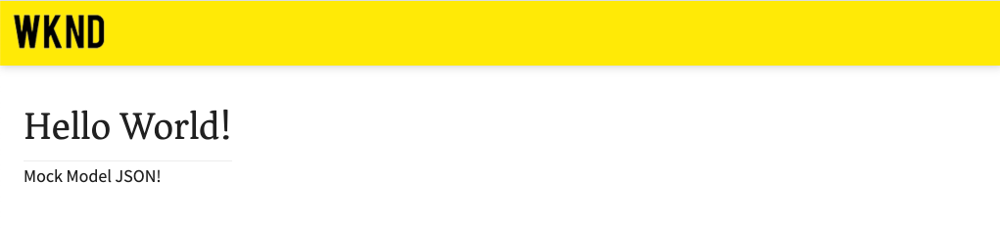
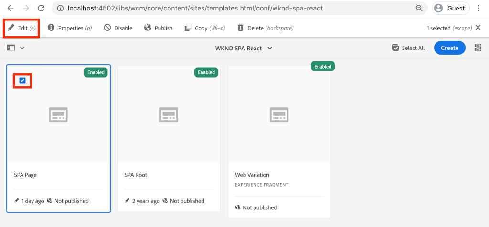
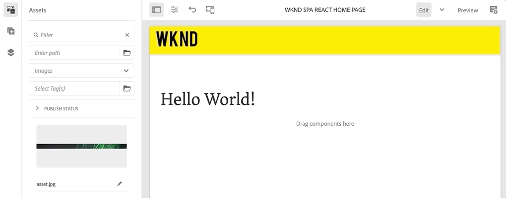

# Asignación de componentes de SPA a componentes de AEM {#map-components}

Obtenga información sobre cómo asignar componentes de React a componentes de Adobe Experience Manager (AEM) con el SDK de JS del Editor de SPA de AEM. La asignación de componentes permite a los usuarios realizar actualizaciones dinámicas de los componentes de SPA dentro del Editor de SPA de AEM, de forma similar a la creación de AEM tradicional.

Este capítulo profundiza en la API del modelo JSON de AEM y en cómo el contenido JSON expuesto por un componente de AEM se puede insertar automáticamente en un componente de React como props.

## Objetivo

1. Aprenda a asignar componentes de AEM a componentes de SPA.
2. Comprenda la diferencia entre los componentes de **Contenedor** y los componentes **de contenido** .
3. Cree un nuevo componente de Reacción que se asigne a un componente de AEM existente.

## Qué va a generar

Este capítulo inspeccionará cómo se asigna el componente `Text` SPA proporcionado al `Text`componente AEM. Se creará un nuevo componente `Image` SPA que se puede utilizar en la SPA y crear en AEM. Las funciones predeterminadas del Contenedor **de** diseño y las directivas del Editor **de** plantillas también se utilizarán para crear una vista con un aspecto un poco más variado.


## Requisitos previos

Revise las herramientas y las instrucciones necesarias para configurar un entorno [de desarrollo](overview.md#local-dev-environment)local.

### Obtener el código

1. Descargue el punto de partida de este tutorial a través de Git:

   ```shell
   $ git clone git@github.com:adobe/aem-guides-wknd-spa.git
   $ cd aem-guides-wknd-spa
   $ git checkout React/map-components-start
   ```

2. Implemente el código base en una instancia de AEM local mediante Maven:

   ```shell
   $ mvn clean install -PautoInstallSinglePackage
   ```

   Si utiliza [AEM 6.x](overview.md#compatibility) , agregue el `classic` perfil:

   ```shell
   $ mvn clean install -PautoInstallSinglePackage -Pclassic
   ```

Siempre puede realizar la vista del código terminado en [GitHub](https://github.com/adobe/aem-guides-wknd-spa/tree/React/map-components-solution) o desproteger el código localmente cambiando a la rama `React/map-components-solution`.

## Enfoque de asignación

El concepto básico es asignar un componente SPA a un componente AEM. AEM componentes, ejecute el servidor y exporte contenido como parte de la API de modelo JSON. El SPA consume el contenido JSON y ejecuta el cliente en el explorador. Se crea una asignación 1:1 entre los componentes de SPA y un componente de AEM.


*Visión general de alto nivel de asignación de un componente de AEM a un componente de reacción*

## Inspect del componente de texto

El [AEM arquetipo](https://github.com/adobe/aem-project-archetype) del proyecto proporciona un `Text` componente que se asigna al componente [AEM](https://docs.adobe.com/content/help/en/experience-manager-core-components/using/components/text.html)Texto. Este es un ejemplo de un componente de **contenido** , en el sentido de que procesa *contenido* de AEM.

Veamos cómo funciona el componente.

### Inspect modelo JSON

1. Antes de pasar al código SPA, es importante comprender el modelo JSON que AEM proporciona. Vaya a la biblioteca [de componentes](https://www.aemcomponents.dev/content/core-components-examples/library/page-authoring/text.html) principales y vista de la página del componente Texto. La biblioteca de componentes principales proporciona ejemplos de todos los componentes principales AEM.
2. Seleccione la ficha **JSON** para uno de los ejemplos:

   

   Debe ver tres propiedades: `text`, `richText`, y `:type`.

   `:type` es una propiedad reservada que lista la `sling:resourceType` (o ruta) del componente AEM. El valor de `:type` es lo que se utiliza para asignar el componente AEM al componente SPA.

   `text` y `richText` son propiedades adicionales que se expondrán al componente SPA.

### Inspect del componente Texto

1. Abra un nuevo terminal y vaya a la `ui.frontend` carpeta dentro del proyecto. Ejecute `npm install` y luego `npm start` para inicio del **webpack-dev-server**:

   ```shell
   $ cd ui.frontend
   $ npm install
   $ npm start
   ```

   El `ui.frontend` módulo está configurado para utilizar el [modelo](./integrate-spa.md#mock-json)JSON de prueba.

2. Debería ver una nueva ventana del explorador abierta a [http://localhost:3000/content/wknd-spa-react/us/en/home.html](http://localhost:3000/content/wknd-spa-react/us/en/home.html)

   

3. En el IDE de su elección abra el proyecto AEM para el WKND SPA. Expanda el `ui.frontend` módulo y abra el archivo `Text.js` en `ui.frontend/src/components/Text/Text.js`:

   

4. El primer área que analizaremos es la `class Text` en ~línea 40:

   ```js
   class Text extends Component {
   
       get richTextContent() {
           return (<div
                   id={extractModelId(this.props.cqPath)}
                   data-rte-editelement
                   dangerouslySetInnerHTML={{__html: DOMPurify.sanitize(this.props.text)}} />
                   );
       }
   
       get textContent() {
           return <div>{this.props.text}</div>;
       }
   
       render() {
           return this.props.richText ? this.richTextContent : this.textContent;
       }
   }
   ```

   `Text` es un componente React estándar. El componente utiliza `this.props.richText` para determinar si el contenido que se va a procesar va a ser texto enriquecido o texto sin formato. El &quot;contenido&quot; real usado viene de `this.props.text`. Para evitar un posible ataque XSS, el texto enriquecido se escapa mediante `DOMPurify` antes de utilizar [peligrosamente SetInnerHTML](https://reactjs.org/docs/dom-elements.html#dangerouslysetinnerhtml) para representar el contenido. Recupere las propiedades `richText` y `text` del modelo JSON anteriormente en el ejercicio.

5. Luego eche un vistazo a la `TextEditConfig` ~línea 29:

   ```js
   const TextEditConfig = {
   emptyLabel: 'Text',
   
       isEmpty: function(props) {
           return !props || !props.text || props.text.trim().length < 1;
       }
   };
   ```

   El código anterior es responsable de determinar cuándo procesar el marcador de posición en el entorno de autor de AEM. Si el `isEmpty` método devuelve **true** , se procesará el marcador de posición.

6. Finalmente echen un vistazo a la `MapTo` llamada en ~line 62:

   ```js
   export default MapTo('wknd-spa-react/components/text')(Text, TextEditConfig);
   ```

   `MapTo` lo proporciona el SDK (`@adobe/aem-react-editable-components`) de JS Editor de SPA de AEM. La ruta `wknd-spa-react/components/text` representa la `sling:resourceType` del componente AEM. Esta ruta se compara con la `:type` expuesta por el modelo JSON observado anteriormente. `MapTo` se encarga de analizar la respuesta del modelo JSON y de pasar los valores correctos en cuanto `props` al componente SPA.

   Puede encontrar la definición de AEM `Text` componente en `ui.apps/src/main/content/jcr_root/apps/wknd-spa-react/components/text`.

7. Experimente modificando el `mock.model.json` archivo en `ui.frontend/public/mock-content/mock.model.json`. En ~line 62, actualice el primer `Text` valor para utilizar una **`H1`** y **`u`** etiquetas:

   ```json
       "text": {
           "text": "<h1><u>Hello World!</u></h1>",
           "richText": true,
           ":type": "wknd-spa-react/components/text"
       }
   ```

   Vaya a [http://localhost:3000](http://localhost:3000) para ver los efectos:

   

   Intente alternar la `richText` propiedad entre **true** / **false** para ver la lógica de procesamiento en acción.

8. Inspect `Text.scss` en `ui.frontend/src/components/Text/Text.scss`.

   Este archivo fue agregado por la base de código de inicio para este capítulo y utiliza la función [Sass](https://sass-lang.com/) agregada en el capítulo anterior. Observe las variables a las que se hace referencia desde `ui.frontend/src/styles/_variables.scss`.

## Creación del componente de imagen

A continuación, cree un componente `Image` React que esté asignado al componente [AEM](https://docs.adobe.com/content/help/es-ES/experience-manager-core-components/using/components/image.html)Imagen. El `Image` componente es otro ejemplo de un componente de **contenido** .

### Inspect el JSON

Antes de saltar al código SPA, revise el modelo JSON proporcionado por AEM.

1. Vaya a los ejemplos de [imagen en la biblioteca](https://www.aemcomponents.dev/content/core-components-examples/library/page-authoring/image.html)de componentes principales.

   

   Las propiedades de `src`, `alt`y `title` se utilizarán para rellenar el componente `Image` SPA.

   >[!NOTE]
   >
   > Hay otras propiedades de imagen expuestas (`lazyEnabled`, `widths`) que permiten a un desarrollador crear un componente adaptable y de carga lenta. El componente integrado en este tutorial será sencillo y **no utilizará** estas propiedades avanzadas.

2. Return to your IDE and open up the `mock.model.json` at `ui.frontend/public/mock-content/mock.model.json`. Dado que este es un nuevo componente para nuestro proyecto, necesitamos &quot;burlarnos&quot; del JSON de imagen.

   En ~line 70, agregue una entrada JSON para el `image` modelo (no olvide la coma final `,` después de la segunda `text_23828680`) y actualice la `:itemsOrder` matriz.

   ```json
   ...
   ":items": {
               ...
               "text_23828680": {
                   "text": "<p>Mock Model JSON!</p>",
                   "richText": true,
                   ":type": "wknd-spa-react/components/text"
               },
               "image": {
                   "alt": "Rock Climber in New Zealand",
                   "title": "Rock Climber in New Zealand",
                   "src": "/mock-content/adobestock-140634652.jpeg",
                   ":type": "wknd-spa-react/components/image"
               }
           },
           ":itemsOrder": [
               "text",
               "text_23828680",
               "image"
           ],
   ```

   El proyecto incluye una imagen de muestra en `/mock-content/adobestock-140634652.jpeg` que se utilizará con el **webpack-dev-server**.

   Puedes vista el [burlón completo.model.json aquí](https://github.com/adobe/aem-guides-wknd-spa/blob/React/map-components-solution/ui.frontend/public/mock-content/mock.model.json).

### Implementación del componente Imagen

1. A continuación, cree una nueva carpeta con el nombre `Image` debajo de `ui.frontend/src/components`.
2. Beneath the `Image` folder create a new file named `Image.js`.

   

3. Añada las siguientes `import` afirmaciones a `Image.js`:

   ```js
   import React, {Component} from 'react';
   import {MapTo} from '@adobe/aem-react-editable-components';
   ```

4. A continuación, agregue el `ImageEditConfig` para determinar cuándo mostrar el marcador de posición en AEM:

   ```js
   export const ImageEditConfig = {
   
       emptyLabel: 'Image',
   
       isEmpty: function(props) {
           return !props || !props.src || props.src.trim().length < 1;
       }
   };
   ```

   El marcador de posición mostrará si no se ha establecido la `src` propiedad.

5. A continuación, implemente la `Image` clase:

   ```js
    export default class Image extends Component {
   
       get content() {
           return ;
       }
   
       render() {
           if(ImageEditConfig.isEmpty(this.props)) {
               return null;
           }
   
           return (
                   <div className="Image">
                       {this.content}
                   </div>
           );
       }
   }
   ```

   El código anterior procesará un `` basado en las props `src`, `alt`y `title` pasado por el modelo JSON.

6. Añada el `MapTo` código para asignar el componente React al componente AEM:

   ```js
   MapTo('wknd-spa-react/components/image')(Image, ImageEditConfig);
   ```

   Tenga en cuenta que la cadena `wknd-spa-react/components/image` corresponde a la ubicación del componente AEM en `ui.apps` : `ui.apps/src/main/content/jcr_root/apps/wknd-spa-react/components/image`.

7. Cree un nuevo archivo denominado `Image.scss` en el mismo directorio y agregue lo siguiente:

   ```scss
   .Image-src {
       margin: 1rem 0;
       width: 100%;
       border: 0;
   }
   ```

8. En `Image.js` adición de una referencia al archivo en la parte superior debajo de las `import` sentencias:

   ```js
   import React, {Component} from 'react';
   import {MapTo} from '@adobe/aem-react-editable-components';
   
   require('./Image.scss');
   ```

   Puede realizar la vista de [Image.js completa aquí](https://github.com/adobe/aem-guides-wknd-spa/blob/React/map-components-solution/ui.frontend/src/components/Image/Image.js).

9. Abra el archivo `ui.frontend/src/components/import-components.js` y agregue una referencia al nuevo `Image` componente:

   ```js
   import './Page/Page';
   import './Text/Text';
   import './Image/Image'; //add reference to Image component
   ```

10. Si aún no se ha iniciado, inicio el **webpack-dev-server**. Vaya a [http://localhost:3000](http://localhost:3000) y verá el procesamiento de la imagen:

   

   >[!NOTE]
   >
   > **Desafío** de bonos: Implemente un nuevo método en `Image.js` para mostrar el valor de `this.props.title` como rótulo debajo de la imagen.

## Actualizar directivas en AEM

El `Image` componente solo está visible en **webpack-dev-server**. A continuación, implemente el SPA actualizado para AEM y actualizar las directivas de plantilla.

1. Detenga **webpack-dev-server** y, desde la raíz del proyecto, implemente los cambios en AEM con sus habilidades con Maven:

   ```shell
   $ cd aem-guides-wknd-spa
   $ mvn clean install -PautoInstallSinglePackage
   ```

2. En la pantalla del Inicio de AEM, vaya a **Herramientas** > **Plantillas** > **[WKND SPA React](http://localhost:4502/libs/wcm/core/content/sites/templates.html/conf/wknd-spa-react)**.

   Seleccione y edite la página **** SPA:

   

3. Seleccione el Contenedor **** Diseño y haga clic en el icono de su **política** para editar la política:

   

4. En Componentes **permitidos** > **WKND SPA React - Content** > compruebe el componente **Imagen** :

   

   En Componentes **** predeterminados > **Añadir asignación** y elija el componente **Imagen - WKND SPA React - Contenido** :

   

   Introduzca un **tipo** de `image/*`.

   Haga clic en **Listo** para guardar las actualizaciones de directivas.

5. En el Contenedor **** Diseño, haga clic en el icono de **política** del componente **Texto** :

   

   Cree una nueva directiva denominada **WKND SPA Text**. En **Complementos** > **Formato** > marque todas las casillas para activar opciones de formato adicionales:

   

   En **Complementos** > Estilos **de** párrafo > marque la casilla de verificación **Activar estilos** de párrafo:

   

   Haga clic en **Listo** para guardar la actualización de la directiva.

6. Vaya a la **página principal** [http://localhost:4502/editor.html/content/wknd-spa-react/us/en/home.html](http://localhost:4502/editor.html/content/wknd-spa-react/us/en/home.html).

   También debería poder editar el `Text` componente y añadir estilos de párrafo adicionales en modo de pantalla **completa** .

   

7. También debería poder arrastrar y soltar una imagen desde el **Buscador** de recursos:

   

8. Añada sus propias imágenes a través de [AEM Assets](http://localhost:4502/assets.html/content/dam) o instale la base de código terminada para el sitio [de referencia](https://github.com/adobe/aem-guides-wknd/releases/latest)WKND estándar. El sitio [de referencia](https://github.com/adobe/aem-guides-wknd/releases/latest) WKND incluye muchas imágenes que se pueden reutilizar en el WKND SPA. El paquete se puede instalar mediante [AEM administrador](http://localhost:4502/crx/packmgr/index.jsp)de paquetes.

   

## Inspect el Contenedor Diseño

El SDK del Editor de SPA de AEM proporciona automáticamente compatibilidad con el Contenedor **** de diseño. El Contenedor **** Diseño, como indica el nombre, es un componente de **contenedor** . Los componentes de contenedor son componentes que aceptan estructuras JSON que representan *otros* componentes y las instancian dinámicamente.

Inspeccionemos más el Contenedor de diseño.

1. En un navegador, vaya a [http://localhost:4502/content/wknd-spa-react/us/en.model.json](http://localhost:4502/content/wknd-spa-react/us/en.model.json)

   

   El componente de Contenedor **** de diseño tiene un carácter `sling:resourceType` de `wcm/foundation/components/responsivegrid` y el Editor de SPA lo reconoce mediante la propiedad `:type` , al igual que los `Text` componentes y `Image` .

   Las mismas funciones de cambio de tamaño de un componente mediante el modo [](https://docs.adobe.com/content/help/en/experience-manager-65/authoring/siteandpage/responsive-layout.html#defining-layouts-layout-mode) Diseño están disponibles con el Editor de SPA.

2. Vuelva a [http://localhost:4502/editor.html/content/wknd-spa-react/us/en/home.html](http://localhost:4502/editor.html/content/wknd-spa-react/us/en/home.html). Añada componentes **de imagen** adicionales e intente cambiarles el tamaño con la opción **Diseño** :

   

3. Vuelva a abrir el modelo JSON [http://localhost:4502/content/wknd-spa-react/us/en.model.json](http://localhost:4502/content/wknd-spa-react/us/en.model.json) y observe el `columnClassNames` como parte del JSON:

   

   El nombre de clase `aem-GridColumn--default--4` indica que el componente debe tener 4 columnas de ancho en función de una cuadrícula de 12 columnas. More details about the [responsive grid can be found here](https://adobe-marketing-cloud.github.io/aem-responsivegrid/).

4. Regresa al IDE y en el `ui.apps` módulo hay una biblioteca del lado del cliente definida en `ui.apps/src/main/content/jcr_root/apps/wknd-spa-react/clientlibs/clientlib-grid`. Abra el archivo `less/grid.less`.

   Este archivo determina los puntos de interrupción (`default`, `tablet`y `phone`) que utiliza el Contenedor **** Diseño. Este archivo está diseñado para ser personalizado según las especificaciones del proyecto. Actualmente, los puntos de interrupción están definidos como `1200px` y `650px`.

5. Debe poder utilizar las funciones interactivas y las directivas de texto enriquecido actualizadas del `Text` componente para crear una vista como la siguiente:

   

## Felicitaciones! {#congratulations}

Enhorabuena, ha aprendido a asignar componentes de SPA a componentes de AEM e implementó un nuevo `Image` componente. También tiene la oportunidad de explorar las capacidades interactivas del Contenedor **de** diseño.

Siempre puede realizar la vista del código terminado en [GitHub](https://github.com/adobe/aem-guides-wknd-spa/tree/React/map-components-solution) o desproteger el código localmente cambiando a la rama `React/map-components-solution`.

### Próximos pasos {#next-steps}

[Navegación y Enrutamiento](navigation-routing.md) : Descubra cómo se pueden admitir varias vistas en el SPA asignando páginas AEM con el SDK del Editor de SPA. La navegación dinámica se implementa mediante el enrutador de reacción y se agrega a un componente de encabezado existente.

## Bonificación: Persista configuraciones para control de código fuente {#bonus}

En muchos casos, especialmente al principio de un proyecto AEM, es valioso mantener configuraciones, como plantillas y políticas de contenido relacionadas, para el control de código fuente. Esto garantiza que todos los desarrolladores trabajen con el mismo conjunto de contenido y configuraciones y puede garantizar una coherencia adicional entre entornos. Una vez que un proyecto alcanza un cierto nivel de madurez, la práctica de administrar plantillas se puede transferir a un grupo especial de usuarios avanzados.

Los siguientes pasos se llevarán a cabo mediante el IDE de código de Visual Studio y [VSCode AEM Sync](https://marketplace.visualstudio.com/items?itemName=yamato-ltd.vscode-aem-sync) , pero podrían estar haciendo uso de cualquier herramienta y de cualquier IDE que haya configurado para **extraer** o **importar** contenido de una instancia local de AEM.

1. En el IDE de código de Visual Studio, asegúrese de tener **VSCode AEM Sync** instalado mediante la extensión Marketplace:

   

2. Expanda el módulo **ui.content** en el explorador de proyectos y vaya a `/conf/wknd-spa-react/settings/wcm/templates`.

3. **Haga clic** con el botón derecho del ratón en la `templates` carpeta y seleccione **Importar desde AEM servidor**:

   

4. Repita los pasos para importar contenido, pero seleccione la carpeta de **directivas** ubicada en `/conf/wknd-spa-react/settings/wcm/templates/policies`.

5. Inspect el `filter.xml` archivo ubicado en `ui.content/src/main/content/META-INF/vault/filter.xml`.

   ```xml
   <!--ui.content filter.xml-->
   <?xml version="1.0" encoding="UTF-8"?>
    <workspaceFilter version="1.0">
        <filter root="/conf/wknd-spa-react" mode="merge"/>
        <filter root="/content/wknd-spa-react" mode="merge"/>
        <filter root="/content/dam/wknd-spa-react" mode="merge"/>
        <filter root="/content/experience-fragments/wknd-spa-react" mode="merge"/>
    </workspaceFilter>
   ```

   El `filter.xml` archivo es responsable de identificar las rutas de los nodos que se instalarán con el paquete. Observe `mode="merge"` en cada uno de los filtros que indica que el contenido existente no se modificará, solo se agregará contenido nuevo. Dado que los autores de contenido pueden estar actualizando estas rutas, es importante que una implementación de código **no sobrescriba** el contenido. Consulte la documentación [de](https://jackrabbit.apache.org/filevault/filter.html) FileVault para obtener más información sobre cómo trabajar con elementos de filtro.

   Compare `ui.content/src/main/content/META-INF/vault/filter.xml` y `ui.apps/src/main/content/META-INF/vault/filter.xml` comprenda los diferentes nodos administrados por cada módulo.
