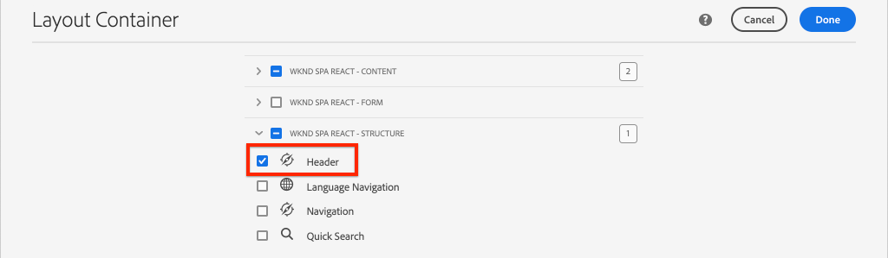
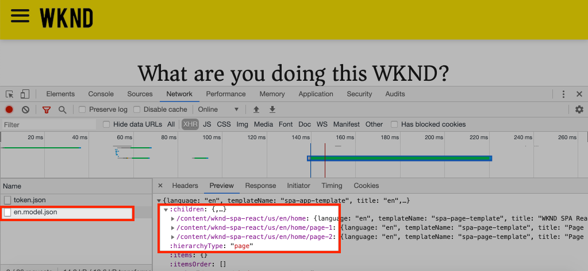

# Añadir navegación y enrutamiento {#navigation-routing}

Descubra cómo se pueden admitir varias vistas en el SPA asignando páginas AEM con el SDK del Editor de SPA. La navegación dinámica se implementa mediante el enrutador de reacción y se agrega a un componente de encabezado existente.

## Objetivo

1. Conozca las opciones de enrutamiento del modelo SPA disponibles al utilizar el Editor de SPA.
2. Aprenda a utilizar [React Router](https://reacttraining.com/react-router/) para navegar entre diferentes vistas del SPA.
3. Implemente una navegación dinámica impulsada por la jerarquía de páginas de AEM.

## Qué va a generar

Este capítulo agregará un menú de navegación a un `Header` componente existente. El menú de navegación estará impulsado por la jerarquía de páginas AEM y utilizará el modelo JSON proporcionado por el componente [principal de](https://docs.adobe.com/content/help/en/experience-manager-core-components/using/components/navigation.html)navegación.


## Requisitos previos

Revise las herramientas y las instrucciones necesarias para configurar un entorno [de desarrollo](overview.md#local-dev-environment)local.

### Obtener el código

1. Descargue el punto de partida de este tutorial a través de Git:

   ```shell
   $ git clone git@github.com:adobe/aem-guides-wknd-spa.git
   $ cd aem-guides-wknd-spa
   $ git checkout React/navigation-routing-start
   ```

2. Implemente el código base en una instancia de AEM local mediante Maven:

   ```shell
   $ mvn clean install -PautoInstallSinglePackage
   ```

   Si utiliza [AEM 6.x](overview.md#compatibility) , agregue el `classic` perfil:

   ```shell
   $ mvn clean install -PautoInstallSinglePackage -Pclassic
   ```

3. Instale el paquete terminado para el sitio [de referencia](https://github.com/adobe/aem-guides-wknd/releases/latest)WKND tradicional. Las imágenes proporcionadas por el sitio [de referencia](https://github.com/adobe/aem-guides-wknd/releases/latest) WKND se reutilizarán en el WKND SPA. El paquete se puede instalar mediante [AEM administrador](http://localhost:4502/crx/packmgr/index.jsp)de paquetes.

   

Siempre puede realizar la vista del código terminado en [GitHub](https://github.com/adobe/aem-guides-wknd-spa/tree/React/navigation-routing-solution) o desproteger el código localmente cambiando a la rama `React/navigation-routing-solution`.

## Actualizaciones de encabezados de Inspect {#inspect-header}

En capítulos anteriores, el `Header` componente se añadió como un componente Reacción pura incluido mediante `App.js`. En este capítulo, se ha eliminado el `Header` componente y se agregará mediante el Editor [de](https://docs.adobe.com/content/help/en/experience-manager-learn/sites/page-authoring/template-editor-feature-video-use.html)plantillas. Esto permitirá a los usuarios configurar el menú de navegación del `Header` desde dentro de AEM.

>[!NOTE]
>
> Ya se han realizado varias actualizaciones de CSS y JavaScript en la base de código para inicio de este capítulo. Para centrarse en los conceptos principales, no se analizan **todos** los cambios en el código. Puede vista de los cambios completos [aquí](https://github.com/adobe/aem-guides-wknd-spa/compare/React/map-components-solution...React/navigation-routing-start).

1. En el IDE de su elección, abra el proyecto de inicio de SPA para este capítulo.
2. Debajo del `ui.frontend` módulo, inspeccione el archivo `Header.js` en: `ui.frontend/src/components/Header/Header.js`.

   Se han realizado varias actualizaciones, incluida la adición de un `HeaderEditConfig` y un `MapTo` para permitir que el componente se asigne a un componente AEM `wknd-spa-react/components/header`.

   ```js
   /* Header.js */
   ...
   export const HeaderEditConfig = {
       ...
   }
   ...
   MapTo('wknd-spa-react/components/header')(withRouter(Header), HeaderEditConfig);
   ```

3. En el `ui.apps` módulo, inspeccione la definición del componente AEM `Header` : `ui.apps/src/main/content/jcr_root/apps/wknd-spa-react/components/header/.content.xml`::

   ```xml
   <?xml version="1.0" encoding="UTF-8"?>
   <jcr:root xmlns:sling="http://sling.apache.org/jcr/sling/1.0" xmlns:cq="http://www.day.com/jcr/cq/1.0"
       xmlns:jcr="http://www.jcp.org/jcr/1.0"
       jcr:primaryType="cq:Component"
       jcr:title="Header"
       sling:resourceSuperType="wknd-spa-react/components/navigation"
       componentGroup="WKND SPA React - Structure"/>
   ```

   El componente AEM `Header` heredará toda la funcionalidad del componente [principal de](https://docs.adobe.com/content/help/en/experience-manager-core-components/using/components/navigation.html) navegación mediante la `sling:resourceSuperType` propiedad .

## Añadir el encabezado a la plantilla {#add-header-template}

1. Abra un navegador e inicie sesión en AEM, [http://localhost:4502/](http://localhost:4502/). La base de código de inicio ya debe implementarse.
2. Vaya a la plantilla **de página de** SPA: [http://localhost:4502/editor.html/conf/wknd-spa-react/settings/wcm/templates/spa-page-template/structure.html](http://localhost:4502/editor.html/conf/wknd-spa-react/settings/wcm/templates/spa-page-template/structure.html).
3. Seleccione el Contenedor **de diseño** raíz más externo y haga clic en su icono **de directiva** . Tenga cuidado de **no** seleccionar el Contenedor **** Diseño desbloqueado para la creación.

   

4. Cree una nueva directiva denominada Estructura **** SPA:

   

   En Componentes **permitidos** > **General** > seleccione el componente de Contenedor **de** diseño.

   En Componentes **permitidos** > **WKND SPA REACT - ESTRUCTURA** > seleccione el componente **Encabezado** :

   

   En Componentes **** permitidos > **WKND SPA REACT - Contenido** > seleccione los componentes **Imagen** y **Texto** . Debe tener 4 componentes en total seleccionados.

   Click **Done** to save the changes.

5. Actualice la página y agregue el componente **Encabezado** encima del Contenedor **de** diseño sin bloquear:

   

6. Seleccione el componente **Encabezado** y haga clic en el icono de su **directiva** para editar la directiva.
7. Cree una nueva directiva con un Título **de** directiva del encabezado **** WKND SPA.

   En **Propiedades**:

   * Establezca la raíz **** de navegación en `/content/wknd-spa-react/us/en`.
   * Establezca el valor **Excluir niveles** raíz en **1**.
   * Uncheck **Collect all child pages**.
   * Defina la profundidad **de la estructura de** navegación en **3**.

   

   Esto recopilará los dos niveles de navegación que hay debajo `/content/wknd-spa-react/us/en`.

8. Después de guardar los cambios, debe ver el relleno `Header` como parte de la plantilla:

   

## Crear páginas secundarias

A continuación, cree páginas adicionales en AEM que sirvan como las distintas vistas en el SPA. También inspeccionaremos la estructura jerárquica del modelo JSON proporcionado por AEM.

1. Vaya a la consola **Sitios** : [http://localhost:4502/sites.html/content/wknd-spa-react/us/en/home](http://localhost:4502/sites.html/content/wknd-spa-react/us/en/home). Seleccione la Página de inicio **Reacción de** WKND SPA y haga clic en **Crear** > **Página**:

   

2. En **Plantilla** , seleccione Página **** SPA. En **Propiedades** , escriba **Página 1** para el **Título** y **página 1** como nombre.

   

   Haga clic en **Crear** y, en el cuadro de diálogo emergente, haga clic en **Abrir** para abrir la página en el Editor de SPA de AEM.

3. Añada un nuevo componente **Texto** al Contenedor **principal** Diseño. Edite el componente e introduzca el texto: **Página 1** que utiliza el elemento RTE y **H1** (deberá entrar al modo de pantalla completa para cambiar los elementos de párrafo)

   

   No dude en añadir contenido adicional, como una imagen.

4. Vuelva a la consola de AEM Sites y repita los pasos anteriores para crear una segunda página denominada **Página 2** como elemento secundario de la **Página 1**.
5. Por último, cree una tercera página, **Página 3** , pero como **elemento secundario** de la **Página 2**. Una vez completada la jerarquía del sitio, debe tener el siguiente aspecto:

   

6. En una nueva ficha, abra la API de modelo JSON proporcionada por AEM: [http://localhost:4502/content/wknd-spa-react/us/en.model.json](http://localhost:4502/content/wknd-spa-react/us/en.model.json). Este contenido JSON se solicita cuando se carga por primera vez el SPA. La estructura exterior es similar a la siguiente:

   ```json
   {
   "language": "en",
   "title": "en",
   "templateName": "spa-app-template",
   "designPath": "/libs/settings/wcm/designs/default",
   "cssClassNames": "spa page basicpage",
   ":type": "wknd-spa-react/components/spa",
   ":items": {},
   ":itemsOrder": [],
   ":hierarchyType": "page",
   ":path": "/content/wknd-spa-react/us/en",
   ":children": {
       "/content/wknd-spa-react/us/en/home": {},
       "/content/wknd-spa-react/us/en/home/page-1": {},
       "/content/wknd-spa-react/us/en/home/page-2": {},
       "/content/wknd-spa-react/us/en/home/page-2/page-3": {}
       }
   }
   ```

   Debajo `:children` debe ver una entrada para cada una de las páginas creadas. El contenido de todas las páginas se encuentra en esta solicitud JSON inicial. Una vez implementado el enrutamiento de navegación, las vistas posteriores del SPA se cargarán rápidamente, ya que el contenido ya está disponible en el cliente.

   No es aconsejable cargar **TODO** el contenido de una SPA en la solicitud JSON inicial, ya que esto ralentizaría la carga inicial de la página. A continuación, veamos cómo se recopila la profundidad de jerarquía de las páginas.

7. Vaya a la plantilla raíz **de** SPA en: [http://localhost:4502/editor.html/conf/wknd-spa-react/settings/wcm/templates/spa-app-template/structure.html](http://localhost:4502/editor.html/conf/wknd-spa-react/settings/wcm/templates/spa-app-template/structure.html).

   Haga clic en el menú **Propiedades de la** página > Directiva **de página**:

   

8. La plantilla raíz **de** SPA tiene una ficha Estructura **** jerárquica adicional para controlar el contenido de JSON recopilado. La profundidad **de** estructura determina la profundidad de la jerarquía del sitio para recopilar páginas secundarias debajo de la **raíz**. También puede utilizar el campo Patrones **de** estructura para filtrar páginas adicionales basadas en una expresión normal.

   Actualice la profundidad **de** estructura a **2**:

   

   Haga clic en **Listo** para guardar los cambios en la directiva.

9. Vuelva a abrir el modelo JSON [http://localhost:4502/content/wknd-spa-react/us/en.model.json](http://localhost:4502/content/wknd-spa-react/us/en.model.json).

   ```json
   {
   "language": "en",
   "title": "en",
   "templateName": "spa-app-template",
   "designPath": "/libs/settings/wcm/designs/default",
   "cssClassNames": "spa page basicpage",
   ":type": "wknd-spa-react/components/spa",
   ":items": {},
   ":itemsOrder": [],
   ":hierarchyType": "page",
   ":path": "/content/wknd-spa-react/us/en",
   ":children": {
       "/content/wknd-spa-react/us/en/home": {},
       "/content/wknd-spa-react/us/en/home/page-1": {},
       "/content/wknd-spa-react/us/en/home/page-2": {}
       }
   }
   ```

   Observe que se ha eliminado la ruta de acceso a la **página 3** : `/content/wknd-spa-react/us/en/home/page-2/page-3` desde el modelo JSON inicial.

   Posteriormente, observaremos cómo el SDK del Editor de SPA de AEM puede cargar dinámicamente contenido adicional.

## Implementar la navegación

A continuación, implemente el menú de navegación como parte del `Header`. Podríamos agregar el código directamente en `Header.js` pero una mejor práctica con es evitar los componentes grandes. En cambio, implementaremos un componente `Navigation` SPA que podría reutilizarse más adelante.

1. Revise el JSON expuesto por el componente AEM `Header` en [http://localhost:4502/content/wknd-spa-react/us/en.model.json](http://localhost:4502/content/wknd-spa-react/us/en.model.json):

   ```json
   ...
   "header": {
       "items": [
       {
       "level": 0,
       "active": true,
       "path": "/content/wknd-spa-react/us/en/home",
       "description": null,
       "url": "/content/wknd-spa-react/us/en/home.html",
       "lastModified": 1589062597083,
       "title": "WKND SPA React Home Page",
       "children": [
               {
               "children": [],
               "level": 1,
               "active": false,
               "path": "/content/wknd-spa-react/us/en/home/page-1",
               "description": null,
               "url": "/content/wknd-spa-react/us/en/home/page-1.html",
               "lastModified": 1589429385100,
               "title": "Page 1"
               },
               {
               "level": 1,
               "active": true,
               "path": "/content/wknd-spa-react/us/en/home/page-2",
               "description": null,
               "url": "/content/wknd-spa-react/us/en/home/page-2.html",
               "lastModified": 1589429603507,
               "title": "Page 2",
               "children": [
                   {
                   "children": [],
                   "level": 2,
                   "active": false,
                   "path": "/content/wknd-spa-react/us/en/home/page-2/page-3",
                   "description": null,
                   "url": "/content/wknd-spa-react/us/en/home/page-2/page-3.html",
                   "lastModified": 1589430413831,
                   "title": "Page 3"
                   }
               ],
               }
           ]
           }
       ],
   ":type": "wknd-spa-react/components/header"
   ```

   La naturaleza jerárquica de las páginas AEM se modela en el JSON y se puede utilizar para rellenar un menú de navegación. Recuerde que el `Header` componente hereda toda la funcionalidad del componente [principal de](https://docs.adobe.com/content/help/en/experience-manager-core-components/using/components/navigation.html) navegación y que el contenido expuesto a través del JSON se asignará automáticamente a las props de Reacción.

2. Abra una nueva ventana de terminal y vaya a la `ui.frontend` carpeta del proyecto SPA. Inicio el **webpack-dev-server** con el comando `npm start`.

   ```shell
   $ cd ui.frontend
   $ npm start
   ```

3. Abra una nueva ficha del explorador y vaya a [http://localhost:3000/](http://localhost:3000/).

   El **webpack-dev-server** debe configurarse para proxy del modelo JSON desde una instancia local de AEM (`ui.frontend/.env.development`). Esto nos permitirá codificar directamente con el contenido creado en AEM en el ejercicio anterior. Asegúrese de que está autenticado en AEM en la misma sesión de navegación.

   

   La funcionalidad de alternancia de menús ya está implementada `Header` actualmente. A continuación, implemente el menú de navegación.

4. Vuelva al IDE de su elección y abra el `Header.js` en `ui.frontend/src/components/Header/Header.js`.
5. Actualice el `homeLink()` método para quitar la cadena codificada y utilice las propiedades dinámicas pasadas por el componente AEM:

   ```js
   /* Header.js */
   ...
   get homeLink() {
        //expect a single root defined as part of the navigation
       if(!this.props.items || this.props.items.length !== 1) {
           return null;
       }
   
       return this.props.items[0].url;
   }
   ...
   ```

   El código anterior rellenará una dirección URL basada en el elemento de navegación raíz configurado por el componente. `homeLink()` se utiliza para rellenar el logotipo en el `logo()` método y para determinar si el botón Atrás debe mostrarse en `backButton()`.

   Save changes to `Header.js`.

6. Añada una línea en la parte superior de `Header.js` para importar el `Navigation` componente debajo de las demás importaciones:

   ```js
   /* Header.js */
   ...
   import Navigation from '../Navigation/Navigation';
   ```

7. A continuación, actualice el `get navigation()` método para crear instancias del `Navigation` componente:

   ```js
   /* Header.js */
   ...
   get navigation() {
       //pass all the props to Navigation component
       return <Navigation {...this.props} />;
   }
   ...
   ```

   Como se mencionó anteriormente, en lugar de implementar la navegación dentro del `Header` componente, implementaremos la mayoría de la lógica en el `Navigation` componente.  Las props del `Header` incluyen la estructura JSON necesaria para crear el menú, pasamos todas las props.
8. Open the file `Navigation.js` at `ui.frontend/src/components/Navigation/Navigation.js`.
9. Implementar el `renderGroupNav(children)` método:

   ```js
   /* Navigation.js */
   ...
   renderGroupNav(children) {
   
       if(children === null || children.length < 1 ) {
           return null;
       }
       return (<ul className={this.baseCss + '__group'}>
                   {children.map(
                       (item,index) => { return this.renderNavItem(item,index)}
                   )}
               </ul>
       );
   }
   ...
   ```

   Este método toma una matriz de elementos de navegación `children`y crea una lista sin ordenar. A continuación, se repite sobre la matriz y pasa el elemento al `renderNavItem`, que se implementará a continuación.

10. Implemente el `renderNavItem`:

   ```js
   /* Navigation.js */
   ...
   renderNavItem(item, index) {
       const cssClass = this.baseCss + '__item ' + 
                        this.baseCss + '__item--level-' + item.level + ' ' +
                        (item.active ? ' ' + this.baseCss + '__item--active' : '');
       return (
           <li key={this.baseCss + '__item-' + index} className={cssClass}>
                   { this.renderLink(item) }
                   { this.renderGroupNav(item.children) }
           </li>
       );
   }
   ...
   ```

   Este método procesa un elemento de lista, con clases CSS basadas en propiedades `level` y `active`. A continuación, el método llama `renderLink` para crear la etiqueta de anclaje. Dado que el `Navigation` contenido es jerárquico, se utiliza una estrategia recursiva para llamar a los elementos secundarios `renderGroupNav` del elemento actual.

11. Implementar el `renderLink` método:

   Añada un método de importación para el componente [Vínculo](https://reacttraining.com/react-router/web/api/Link) , que forma parte del router React, en la parte superior del archivo con las demás importaciones:

   ```js
   import {Link} from "react-router-dom";
   ```

   A continuación, finalice la implementación del `renderLink` método:

   ```js
   renderLink(item){
       return (
           <Link to={item.url} title={item.title} aria-current={item.active && 'page'}
              className={this.baseCss + '__item-link'}>{item.title}</Link>
       );
   }
   ```

   Tenga en cuenta que en lugar de utilizar una etiqueta de anclaje normal, `<a>`se utiliza el componente [Vínculo](https://reacttraining.com/react-router/web/api/Link) . Esto garantiza que no se active una actualización completa de la página y, en su lugar, aprovecha el enrutador de React proporcionado por el SDK de JS del Editor de SPA de AEM.

12. Guarde los cambios en `Navigation.js` y vuelva al **webpack-dev-server**: [http://localhost:3000](http://localhost:3000)

   

   Para abrir la navegación, haga clic en el botón de alternancia del menú y verá los vínculos de navegación rellenados. Debería poder navegar a diferentes vistas del SPA.

## Inspect el Enrutamiento SPA

Ahora que la navegación se ha implementado, inspeccione el enrutamiento en AEM.

1. En el IDE, abra el archivo `index.js` en `ui.frontend/src/index.js`.

   ```js
   /* index.js */
   import { Router } from 'react-router-dom';
   ...
   ...
    ModelManager.initialize().then(pageModel => {
       const history = createBrowserHistory();
       render(
       <Router history={history}>
           <App
           history={history}
           cqChildren={pageModel[Constants.CHILDREN_PROP]}
           cqItems={pageModel[Constants.ITEMS_PROP]}
           cqItemsOrder={pageModel[Constants.ITEMS_ORDER_PROP]}
           cqPath={pageModel[Constants.PATH_PROP]}
           locationPathname={window.location.pathname}
           />
       </Router>,
       document.getElementById('spa-root')
       );
   });
   ```

   Observe que el `App` se envuelve en el `Router` componente desde el router [React](https://reacttraining.com/react-router/). El `ModelManager`, proporcionado por el SDK de JS del Editor de SPA de AEM, agrega las rutas dinámicas a AEM páginas basadas en la API del modelo JSON.

2. Abra un terminal, desplácese hasta la raíz del proyecto e implemente el proyecto para AEM con sus conocimientos Maven:

   ```shell
   $ cd aem-guides-wknd-spa
   $ mvn clean install -PautoInstallSinglePackage
   ```

3. Vaya a la página principal de SPA en AEM: [http://localhost:4502/content/wknd-spa-react/us/en/home.html](http://localhost:4502/content/wknd-spa-react/us/en/home.html) y abra las herramientas para desarrolladores de su navegador. Las capturas de pantalla siguientes se obtienen del navegador Google Chrome.

   Actualice la página y debe ver una solicitud XHR a `/content/wknd-spa-react/us/en.model.json`, que es la raíz de SPA. Tenga en cuenta que solo se incluyen tres páginas secundarias en función de la configuración de profundidad de jerarquía de la plantilla raíz de SPA que se realizó anteriormente en el tutorial. Esto no incluye **la página 3**.

   

4. Con las herramientas de desarrollador abiertas, utilice la `Header` navegación para desplazarse a la **página 3**:

   

   Observe que se realiza una nueva solicitud XHR a: `/content/wknd-spa-react/us/en/home/page-2/page-3.model.json`

   

   El Administrador de modelos de AEM entiende que el contenido JSON de la **página 3** no está disponible y activa automáticamente la solicitud XHR adicional.

5. Continúe navegando por el SPA mediante los distintos vínculos de navegación del `Header` componente. Observe que no se realizan solicitudes XHR adicionales y que no se actualiza la página completa. Esto hace que el SPA sea más rápido para el usuario final y reduce las solicitudes innecesarias a AEM.

   

6. Experimente con vínculos profundos navegando directamente a: [http://localhost:4502/content/wknd-spa-react/us/en/home/page-2.html](http://localhost:4502/content/wknd-spa-react/us/en/home/page-2.html). Observe que el botón Atrás del explorador sigue funcionando.

## Felicitaciones! {#congratulations}

Enhorabuena, ha aprendido cómo se pueden admitir varias vistas en la SPA asignando páginas AEM con el SDK del Editor de SPA. La navegación dinámica se ha implementado mediante el enrutador de reacción y se ha agregado al `Header` componente.

Siempre puede realizar la vista del código terminado en [GitHub](https://github.com/adobe/aem-guides-wknd-spa/tree/React/navigation-routing-solution) o desproteger el código localmente cambiando a la rama `React/navigation-routing-solution`.
